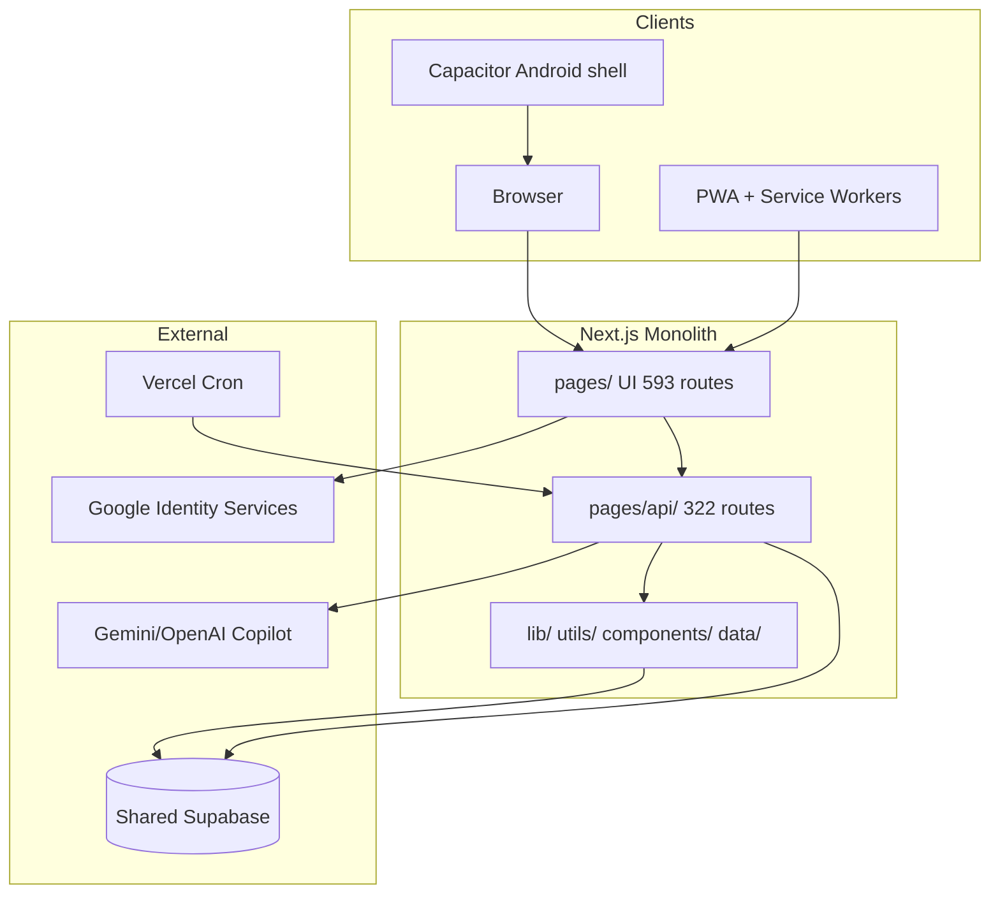

# Leo Kids Global — Globalization Audit & Implementation Plan

**Audit date:** 2026-07-15  
**Revision:** 2026-07-16 — **Fast Track A** owner decision: physical subject cleanup (4 keep / full delete of IL-only subjects); science kept; games out of scope; no Supabase change this round  
**Audit scope (only):** `C:\Users\ERAN YOSEF\Desktop\final projects\FINAL-WEB\LEO-KIDS-FINAL\LEO-KIDS-GLOBAL`  
**Audit type:** Living implementation plan (execution in progress)  
**Target product:** International Leo Kids (`leokids_global`) — English default locale, dynamic direction, **four learning subjects: Math, Geometry, English, Science**  
**Israeli product remains:** Separate site at `leokids.co.il` (`leokids_il`) — never treated as a language variant  
**Do not touch this round:** games/arcade/solo/educational-games, Supabase/migrations/SQL/`product_id`, Vercel/deploy/push, sibling `LEO-KIDS` / `LEO-KIDS-WEB-TRY`

---

## 1. Executive Summary

`LEO-KIDS-GLOBAL` is a **filesystem copy** of the Israeli Leo Kids monolith, prepared as the starting point for a new international product. At audit time it is **identical in structure and content to the Israeli codebase**: Hebrew-first, RTL-first, eight learning subjects, shared Supabase configuration in `.env.example`.

| Dimension | Finding |
|-----------|---------|
| UI route files (`pages/`) | **593** |
| API route files (`pages/api/`) | **322** |
| Total route endpoints | **~915** |
| Files with Hebrew (`js/jsx/ts/tsx/json`) | **1,361** |
| Files with `dir="rtl"` | **~220** |
| SQL migrations | **98** |
| DB tables (approx.) | **~120** |
| Named RLS policies in SQL | **33** |
| Test files under `tests/` | **278** |
| i18n infrastructure | **None** (26 ad-hoc `*.he.js` modules + inline Hebrew) |
| `product_id` in code/DB | **Absent** |
| Git repository in GLOBAL | **None** — expected at project start |
| Active Vercel project for global | **None configured** — expected at project start |
| Supabase | Same project URL as Israel in `.env.example` (shared DB planned) |

**Strategic recommendation (Fast Track A — owner 2026-07-16):**

1. **Fast Track A (NOW):** **Physical deletion** of non-global learning subjects — not feature flags, not hide-via-config.
   - **KEEP:** `math`, `geometry`, `english`, `science`
   - **DELETE completely:** `hebrew`, `history`, `moledet`, `geography`, `moledet_geography` / `moledet-geography`
   - **Games are out of scope** — do not delete, edit, clean, or translate arcade/solo/educational games this round
   - **No Supabase / migrations / SQL / `product_id` changes this round**
2. **Wave 0 (ops):** Finish Git remote + new Vercel project + env separation when owner requests (no push/deploy in subject-cleanup commit).
3. **Wave 1:** Basic `product_id` + memberships in DB — **before any global user creates data** (later; not this round).
4. **Wave 3:** Locale + dynamic direction foundation.
5. **Wave 4:** i18n infrastructure (keys, ICU, CI gates).
6. **Waves 5–9:** English UI, content, reports (report engines only stripped of deleted-subject branches for now).
7. **Wave 10:** Games/online/PWA — separate track; untouched by subject cleanup.
8. **Wave 11:** SEO, legal, security QA, launch.
9. **Repository strategy:** Separate GitHub repo `LEOKID2026/LEOKIDS` — defer monorepo.

**Five highest risks:**

1. Creating global rows in shared Supabase **without** `product_id` (deferred until Wave 1).
2. Hardcoded `https://www.leokids.co.il` in auth/email/canonical URLs.
3. Hardcoding LTR globally — blocks Arabic/Persian/Urdu without rewrite.
4. Remaining Hebrew UI/copy in kept subjects (translation waves — not subject cleanup).
5. Stale copied `.vercel/project.json` (if present) — delete before global link.

**Decisions confirmed — Fast Track A:**

- **Four subjects only:** Math, Geometry, English, Science — physical full delete of Hebrew, History, Moledet, Geography.
- Not temporary hiding; not feature flags; not “keep for later.”
- Games system is **not** part of subject cleanup — leave untouched even if filenames mention Hebrew/Science/History/Geography.
- No monorepo now; separate Git + Vercel project.
- Delete copied `.vercel/` before linking.
- Same Supabase phase 1 deferred; **no Supabase edits in Fast Track A**.
- Israeli site is **not** `/he` on global domain.
- Keep math bidi utilities for future RTL interface locales.
- Separate `interface_language` vs `learning_language`.
- No realtime translation of word problems.

---

## 2. Git & Deployment — Current State

### 2.1 Pre-flight checklist

| # | Check | Result |
|---|-------|--------|
| 1 | Working path | `C:\Users\ERAN YOSEF\Desktop\final projects\FINAL-WEB\LEO-KIDS-FINAL\LEO-KIDS-GLOBAL` |
| 2 | Git repository | **No `.git` folder** — **expected** for a fresh copy; not a defect |
| 3 | Branch / HEAD | N/A until `git init` |
| 4 | `git status` | N/A |
| 5 | Remote | **None** — Wave 0 will create new repo (e.g. `LEOKID2026/LEO-KIDS-GLOBAL`) |
| 6 | Remote pointing to Israeli repo | **No** — sibling `LEO-KIDS-WEB-TRY` uses `https://github.com/LEOKID2026/LIOSH-WEBSITE.git`; GLOBAL is outside that tree |
| 7 | Local `.env` files | `.env.local`, `.env.e2e.local`, `.env.vercel.prod.check`, `.env.vercel.local` exist — **do not commit** |
| 8 | Accidental deploy to Israeli site | **Possible** if env vars keep `leokids.co.il` or stale Vercel link used |
| 9 | Active Vercel project for global | **Not configured by owner** — correct for day 1 |
| 10 | `.vercel/` folder | **May exist as copy artifact** from Israeli project (`projectName: "leo-kid"`). This is **not** an active global setup; **delete before linking global Vercel** |
| 11 | Push/deploy risk to Israeli site | Low while no git/remote; rises after Wave 0 if wrong Vercel project linked |

### 2.2 Interpretation (owner clarification incorporated)

- **No Git** = normal starting state. Wave 0 creates repo.
- **No Vercel for global** = normal starting state. Wave 0 creates new project.
- If `.vercel/project.json` exists from the copy, treat it as **stale artifact**, not as "you already have Vercel."

### 2.3 Wave 0 actions (planned, not executed in this audit)

1. `git init` in `LEO-KIDS-GLOBAL`
2. New GitHub remote (separate from `LIOSH-WEBSITE`)
3. Remove any copied `.vercel/` before `vercel link`
4. Create **new** Vercel project for global domain
5. Set env: `NEXT_PUBLIC_PRODUCT_ID=leokids_global`, `NEXT_PUBLIC_SITE_URL=<global-domain>`, `NEXT_PUBLIC_DEFAULT_LOCALE=en`
6. Add build guard: fail if `NEXT_PUBLIC_PRODUCT_ID !== leokids_global` in global Vercel project
7. Update `lib/site/canonical-public-site-origin.js` to read from env (Wave 5+)
8. **Do not** set a permanent `NEXT_PUBLIC_SITE_DIRECTION=ltr` — direction comes from locale config (Wave 3)

---

## 3. Architecture Map

### 3.1 Technology stack

| Layer | Technology | Source |
|-------|------------|--------|
| Framework | Next.js **15.5.18** | `package.json` |
| Router | **Pages Router only** — no `app/` | 593 files in `pages/` |
| React | 18.2.0 | `package.json` |
| Node | Not pinned (no `engines`) | — |
| Styling | Tailwind 4.1.17 | `package.json` |
| Database/Auth | Supabase JS 2.105.1 | `lib/learning-supabase/` |
| PWA | SW + manifests (student/parent/teacher) | `public/`, `next.config.js` headers |
| Native | Capacitor Android 8.3.4 | `capacitor.config.ts`, `android/` |
| Analytics | `@vercel/analytics` | `package.json` |
| TTS | `node-edge-tts` | server-side |
| PDF | jspdf, html2pdf | worksheets/reports |
| Games | chess.js, solo/arcade/edu engines | `components/solo-games/`, `components/arcade/` |
| Testing | Playwright, custom `.mjs` tests | `tests/`, `playwright.config.ts` |
| Payments | **Schema only** — no Stripe/webhooks in code | `041_parent_account_settings.sql` |
| Cron | 1 Vercel cron | `vercel.json` → `monthly-persistence-award` |

### 3.2 System layers



### 3.3 Personas

| Persona | Login | Session |
|---------|-------|---------|
| Parent | Email/password, Google GIS | Supabase JWT |
| Student | Username + PIN | Cookie `liosh_student_session` |
| Guest student | Device binding | Guest tables + cookie |
| Teacher | Email/password | Supabase + entitlements |
| School staff | Code + PIN | `school_staff_sessions` |
| Admin | Supabase `app_metadata.role=admin` | JWT + `account_persona_entitlements` |
| Guardian | Limited view | Separate login |

---

## 4. Routes Map

**Total:** 593 UI + 322 API = **915 route files**

### 4.1 Public & marketing

| Route | File | Global? | Translate? | RTL? | Israeli content? | Remove subject? |
|-------|------|---------|------------|------|------------------|-----------------|
| `/` | `pages/index.js` | Yes | Yes | Yes | Yes (copy) | No |
| `/about`, `/contact`, `/gallery` | `pages/about.js` etc. | Yes | Yes | Yes | Yes | No |
| `/kids`, `/parents`, `/teachers` | marketing | Yes | Yes | Yes | Yes | No |
| `/privacy`, `/terms`, `/legal`, `/accessibility`, `/security`, `/ai-disclosure`, `/data-deletion` | legal | Yes | New legal text | Yes | Yes (IL law refs) | No |
| `/games`, `/game` | public games landing | Partial MVP | Yes | Yes | Some | No |

### 4.2 SEO practice (`lib/seo/seo-public-paths.js`)

| Route | Global? | Action |
|-------|---------|--------|
| `/practice/math` | **Yes** | Translate |
| `/practice/geometry` | **Yes** | Translate |
| `/practice/english` | **Yes** | Translate |
| `/practice/hebrew`, `/practice/reading` | **No** | Remove/redirect 410 |
| `/practice/science`, `/practice/moledet`, `/practice/geography`, `/practice/history` | **No** | Remove |
| `/practice/games`, `/practice/no-print`, `/practice/parent-reports` | Partial | Rewrite EN |

### 4.3 SEO guides

| Route | Global? |
|-------|---------|
| `/guides/math-practice-at-home`, `/guides/math-games-for-kids` | Yes |
| `/guides/english-vocabulary-practice` | Yes |
| `/guides/reading-*`, `/guides/home-practice-routine` (Hebrew-centric) | Rewrite or drop |
| All others | Review case-by-case |

### 4.4 Auth

| Route | Global? | Notes |
|-------|---------|-------|
| `/parent/login`, `/parent/auth/google-callback` | Yes | New OAuth redirect URLs |
| `/student/login` | Yes | Translate |
| `/auth/forgot-password`, `/auth/reset-password` | Yes | Links must use global domain |
| `/teacher/login`, `/school/staff/login`, `/guardian/login` | Defer MVP | Hide or disable global MVP |

### 4.5 Learning (student + parent mirrors)

| Route pattern | Global? |
|---------------|---------|
| `/learning/math-master`, `/student/learning/math-master` | **Yes** |
| `/learning/geometry-master`, mirrors | **Yes** |
| `/learning/english-master`, mirrors | **Yes** |
| `/learning/hebrew-master` | **No** — disable |
| `/learning/science-master` | **No** |
| `/learning/history-master` | **No** |
| `/learning/moledet-geography-master`, `/learning/moledet-master`, `/learning/geography-master` | **No** |
| `/learning/parent-report`, `/learning/parent-report-detailed` | Yes — English report layer |
| `/learning/curriculum`, `/learning/geometry-curriculum` | Partial — strip IL subjects |
| `/learning/book/[subject]/[grade]/[pageId]` | Keep math/geometry/english books only |

### 4.6 Parent portal

| Route | Global MVP |
|-------|------------|
| `/parent/dashboard`, `/parent/home` | Yes |
| `/parent/worksheets/*` | Yes (math/geometry/english) |
| `/parent/parent-report*` | Yes |
| `/parent/install-app` | Yes — new manifest |

### 4.7 Student portal (selected)

| Area | Routes | Global MVP |
|------|--------|------------|
| Home/learning hub | `/student/home`, `/student/learning` | Yes |
| Subject masters | 9 mirrors | 3 only |
| Worksheets | `/student/worksheet/[id]` | Yes |
| Solo games | `/student/solo-games/*` | Subset |
| Educational games | `/student/educational-games/*` | Subset (EN/math) |
| Arcade/multiplayer | `/student/games/*`, `/student/arcade` | Defer social MVP |
| Offline | `/student/offline/*` | Phase 9 |
| Dev | `/dev/*`, `/learning/dev-*` | Disable production |

### 4.8 Teacher / school / admin

| Area | Global MVP recommendation |
|------|---------------------------|
| Teacher portal (26 routes) | **Out of MVP** — hide nav + 404 |
| School portal (14 routes) | **Out of MVP** |
| Admin (14 routes) | Yes — product-scoped admins only |

### 4.9 API namespaces (322 files)

| Namespace | Count | Global filter needed |
|-----------|-------|---------------------|
| `/api/admin/*` | 69 | product_id filter |
| `/api/teacher/*` | 62 | disable MVP |
| `/api/school/*` | 59 | disable MVP |
| `/api/student/*` | 46 | product via student |
| `/api/arcade/*` | 33 | defer/s subset |
| `/api/parent/*` | 25 | product via parent |
| `/api/learning/*` | 5 | subject allowlist |
| `/api/guardian/*` | 8 | defer |
| Top-level | ~13 | review each |

### 4.10 Redirects (`next.config.js`)

- `/learning/book/:path*` → `/student/learning/book/:path*`
- `/offline/:path*` → `/student/offline/:path*`

### 4.11 Dangerous to remove without gating

- `/api/learning/answer`, `session/start`, `session/finish` — core loop
- `/api/parent/students/[id]/report-data` — reports
- `/api/student/login` — auth
- Subject masters still referenced from `pages/learning/index.js` `LEARNING_GAMES` until Wave 1

---

## 5. Subjects Map

### 5.1 Canonical IDs

| Layer | Keys | File |
|-------|------|------|
| Permissions | `math`, `geometry`, `hebrew`, `english`, `science`, `history`, `moledet`, `geography` | `lib/learning/subject-permissions/subject-key-map.js` |
| Engine/DB | + `moledet_geography` combined | `lib/learning-supabase/learning-activity.js` |
| Diagnostics | + `moledet-geography` hyphen | `utils/diagnostic-engine-v2/subject-ids.js` |
| Worksheets enabled | math, geometry, hebrew, english | `lib/worksheets/worksheet-print-allowlist.js` |
| Hub tiles | 8 subjects | `pages/learning/index.js` `LEARNING_GAMES` |

**`mixed`** = worksheet topic key only (`"תרגול מעורב"`), not a subject.

### 5.2 Per-subject removal plan

#### KEEP (final): math, geometry, english, science

| Subject | Key paths | Global work |
|---------|-----------|-------------|
| math | `utils/math-question-generator.js`, `pages/learning/math-master.js`, `lib/learning-book/math-g*-registry.js`, `lib/worksheets/worksheet-math-*` | English word problems, units, labels |
| geometry | `utils/geometry-question-generator.js`, `utils/geometry-diagram-spec.js`, `lib/worksheets/worksheet-geometry-*` | English stems, diagram labels |
| english | `data/english-curriculum.js`, `data/english-questions/`, `utils/english-question-generator.js` | Split interface vs learning language |
| science | `data/science-*`, `pages/learning/science-master.js`, science books/taxonomy | Keep fully active; translate later |

#### DELETE (physical, Fast Track A — not hide): hebrew, history, moledet, geography / moledet_geography

| Subject | Est. files | Own directories | Shared dependencies | Delete now? |
|---------|------------|-----------------|---------------------|-------------|
| hebrew | ~337 | `data/hebrew-*`, `data/hebrew-literacy-g*`, `pages/learning/hebrew-master.js`, `pages/api/hebrew-audio-*`, `pages/api/hebrew-nakdan.js` | Subject hub, permissions matrix, reports | **YES — physical delete** |
| history | ~33 | `data/history-*`, `pages/learning/history-master.js` | g6 only, copilot scope | **YES — physical delete** |
| moledet | ~92 | `data/moledet-*`, combined master | Shares `moledet_geography` engine with geography | **YES — physical delete** |
| geography | ~91 | `data/geography-questions/g*.js` | Same engine as moledet | **YES — physical delete** |
| science | — | — | — | **KEEP** (owner decision 2026-07-16) |

### 5.3 Central gating files (Wave 1)

1. `lib/learning/subject-permissions/subject-key-map.js` — new env-driven `GLOBAL_SUBJECT_ALLOWLIST`
2. `pages/learning/index.js` — filter `LEARNING_GAMES`
3. `lib/seo/seo-public-paths.js` — remove IL-only paths
4. `data/subject-permissions/subject-grade-defaults.matrix.json`
5. `hooks/useStudentSubjectAccess.js`
6. `components/parent/ChildSubjectPermissionsPanel.jsx`
7. `utils/diagnostic-engine-v2/taxonomy-*.js` — skip disabled subjects
8. `lib/worksheets/worksheet-print-allowlist.js` — drop hebrew for global

### 5.4 What breaks if subjects deleted immediately

- Student hub empty/error for removed slugs
- Report engine references withheld subjects
- Permission seed/matrix orphan keys
- 40+ worksheet/hebrew tests fail
- SEO 404s for indexed paths
- Guest playable topics include all subjects

---

## 6. Hebrew Hardcoded Strings Map

**Count: 1,361 files** with Hebrew Unicode in `js/jsx/ts/tsx/json`

| Category | Est. files | Est. strings | Key paths |
|----------|------------|--------------|-----------|
| UI / shell | ~80 | ~2,000 | `components/Layout.js`, `lib/site-nav.js`, `pages/_app.js` |
| Learning content | ~200+ | **50,000+** | `utils/*-question-generator.js`, `data/*-questions*`, `data/geography-questions/g*.js`, `data/science-questions.js` |
| Learning books | ~60 | ~15,000 | `lib/learning-book/*-registry.js` |
| Reports | ~60 | ~5,000 | `utils/parent-report-language/` (20 files), `utils/parent-copilot/` (35+) |
| API / errors | ~30 | ~500 | `lib/parent-server/parent-api-errors.he.js` |
| SEO / marketing | ~15 | ~1,500 | `data/seo/*.he.js`, `data/home/homepage-copy.he.js` |
| Emails | ~2 | minimal | Supabase templates external; `lib/contact/contact-form.he.js` |
| Games | ~80 | ~3,000 | `lib/game-audio/game-audio-manifest.js` (`nameHe`), edu game components |
| Worksheets | ~25 | ~800 | `lib/worksheets/worksheet-ui.he.js`, meta labels |
| Tests | ~19 | — | Hebrew assertions |
| Admin/teacher/school | ~15 | ~2,000 | `lib/admin-portal/admin-ui.he.js`, etc. |

**Ad-hoc i18n pattern:** 26 `*.he.js` files — not a locale system.

**Highest-density files:**

- `data/curriculum-oracle/v1/ministry-matrix.draft.json` — Israel-only, exclude from global build
- `data/geography-questions/g*.js` — 2,700–3,200 Hebrew matches each
- `utils/hebrew-question-generator.js` — 1,458 matches
- `utils/geometry-question-generator.js` — 882 matches
- `pages/learning/math-master.js` — 416 matches (UI strings)

---

## 7. i18n Plan

### 7.1 Current state

- No `next-i18next`, `react-intl`, `locales/` folder, or `useTranslation`.
- Hebrew is the implicit only language.

### 7.2 Recommended architecture

```text
locales/
  en/                    # source of truth
    ui.json
    reports.json
    emails.json
    seo.json
    legal.json
    worksheets.json
    games.json
    validation.json
  es/ fr/ ...            # future interface locales only
content/
  en/
    math/
    geometry/
    english/             # learning content — NOT machine-translated
```

**Library:** `next-intl` or lightweight custom `useLocale()` + JSON catalogs (Pages Router compatible).

### 7.3 Requirements checklist

| Requirement | Approach |
|-------------|----------|
| English source | `en` locale files; no Hebrew in global UI |
| Add languages without component edits | key-based strings only |
| `interface_language` ≠ `learning_language` | separate settings (see §6) |
| Reports by parent language | `preferred_report_language` |
| English subject stays English | `learning_language=en` even if UI is `es` |
| Pluralization | ICU MessageFormat in JSON |
| Variables in sentences | `{studentName}`, `{topic}` placeholders |
| Numbers/dates/currency | `Intl.NumberFormat`, `Intl.DateTimeFormat` per locale |
| Fallback | `en` always; dev warns on missing keys |
| Missing key detection | CI script + unit test |
| No realtime learning translation | content locale files only |
| Word problems | template pools per locale, not direct translation |

### 7.4 Namespace split

| Namespace | Content |
|-----------|---------|
| `ui` | buttons, nav, modals, errors |
| `learning` | instructions (not question banks) |
| `reports` | parent report copy from engine contracts |
| `emails` | auth/notification templates |
| `seo` | titles, descriptions |
| `legal` | policy pages |
| `worksheets` | hub, print headers |
| `games` | instructions, HUD |
| `validation` | form errors |

### 7.5 Mandatory Pass/Fail gates (from Wave 4 onward — CI enforced)

These are **not** optional recommendations. Global CI must fail when violated.

| # | Gate | Pass | Fail |
|---|------|------|------|
| G1 | No new hardcoded English in JSX | All new UI strings use `t('key')` or equivalent | Literal user-facing string in component |
| G2 | Translation keys | Every new key exists in `locales/en/` | Missing key at runtime or in CI |
| G3 | Missing-key CI | Build/test fails on missing keys | Silent fallback only in dev |
| G4 | Hebrew detection CI | No new `[\u0590-\u05FF]` in global app code (exempt: legacy content dirs until migrated) | New Hebrew in `components/`, `pages/`, `lib/` |
| G5 | Pluralization | ICU MessageFormat for countable strings | Manual `if (n === 1)` concatenation |
| G6 | Intl formatting | Dates/numbers/currency via `Intl.*` | Hardcoded `$` or `DD/MM/YYYY` |
| G7 | Pseudo-locale | `en-XA` (or similar) stretches strings 30–50% in QA builds | No overflow testing |
| G8 | Pseudo-RTL | Test locale forces RTL layout without Arabic content | RTL bugs discovered only in production |
| G9 | Image text | No locale-specific text baked into images | Text in PNG/SVG without per-locale asset |
| G10 | Math direction | Math expressions wrapped in direction-isolated spans (`dir="ltr"` or bidi isolate) | Math flips in RTL interface |
| G11 | DB codes | Store `math`, `long_division`, `vertical_addition` — never translated labels | Translated topic names in DB |
| G12 | language vs locale | `language` (`es`) separate from `locale` (`es-MX`) where regional formats differ | Single conflated code |
| G13 | Font fallback | CSS stack covers Latin, Arabic, Cyrillic, CJK | Tofu boxes in non-Latin UI |

**Wave 4 is not complete until G1–G6 CI scripts exist and pass on a pilot page.**

---

## 8. English Subject vs Interface Language

### 8.1 Current assumptions (found in code)

| Area | Current behavior | File |
|------|------------------|------|
| Site UI | Hebrew everywhere | `pages/_document.js`, all pages |
| English subject | Taught in English within Hebrew UI | `pages/learning/english-master.js` |
| Phonics audio | English content | `utils/english-phonics-practice-audio.js` |
| Hebrew audio APIs | Hebrew TTS/nikud | `pages/api/hebrew-audio-ensure.js` |
| Registration | `preferred_language: "he"` hardcoded | `lib/auth/auth-registration-request.server.js` |
| Teacher | `preferred_language` column exists | `001_learning_core_foundation.sql`, teacher onboard |
| Reports | Hebrew copy layer | `utils/parent-report-language/*-he.js` |
| Games | `nameHe` in manifest | `lib/game-audio/game-audio-manifest.js` |

### 8.2 Target data model

| Field | Storage | Required in DB? |
|-------|---------|-----------------|
| `product_id` | `parent_profiles`, `students`, memberships | **Yes (Wave 1)** |
| `interface_language` | `user_product_memberships` + cookie | Yes |
| `learning_language` | `students.metadata` or column | Yes (for English subject) |
| `preferred_report_language` | extend `parent_profiles.preferred_language` semantics | Yes |
| `content_locale` | derived: `en` for global learning | Client/config |

**Do not add redundant fields.** `preferred_language` on `parent_profiles` can evolve to mean `preferred_report_language` with migration note.

### 8.3 Example scenario

Spanish-speaking parent (`interface_language=es`), child learning English (`learning_language=en`):
- Dashboard in Spanish
- English master instructions/audio in English
- Reports in Spanish (translated from engine contract)
- Math word problems in English (or es templates if added later — separate decision)

---

## 9. RTL & Dynamic Direction Map

### 9.0 Design principle (revised — do NOT hardcode LTR)

The global site **defaults to English + LTR**, but the document root must be **dynamic from day one**:

```jsx
// pages/_document.js (target — Wave 3)
<Html lang={locale} dir={localeConfig[locale].direction}>
```

```js
// lib/i18n/locale-config.js (new — Wave 3)
export const localeConfig = {
  en: { direction: "ltr", language: "en" },
  es: { direction: "ltr", language: "es" },
  ar: { direction: "rtl", language: "ar" },
  fa: { direction: "rtl", language: "fa" },
  ur: { direction: "rtl", language: "ur" },
  // future: ru, zh, ja — each with explicit direction
};
```

**Anti-pattern (do not ship):** `<Html lang="en" dir="ltr">` as permanent global fix.

**Correct pattern:** English is default locale; direction is a property of locale; math stays in isolated LTR runs regardless of UI direction.

### 9.1 Current anchors (to replace in Wave 3)

| File | RTL mechanism | Risk |
|------|---------------|------|
| `pages/_document.js` | `<Html lang="he" dir="rtl">` | **Critical** |
| `components/Layout.js` | conditional `dir="rtl"` | **Critical** |
| `lib/site-nav.js` | `shouldLayoutUseRtl()` — default true | **Critical** |

### 9.2 Counts

| Pattern | Files |
|---------|-------|
| `dir="rtl"` | **~220** |
| `direction: rtl` (CSS/inline) | ~39 |
| `text-align: right` | ~11 |
| Physical `margin-left/right`, `padding-left/right` | **4 only** |

Physical CSS files: `styles/worksheet-print.css`, `styles/globals.css`, `components/solo-games/smart-blocks-layout.module.css`

### 9.3 Special cases

| Area | Notes |
|------|-------|
| Math LTR islands | `lib/worksheets/worksheet-math-ltr-display.js`, `lib/bidi/*` — **keep** for future RTL locales |
| Print | `styles/worksheet-print.css` — flip to LTR global |
| PWA offline HTML | `public/sw.js`, `public/student/offline.html` — Hebrew RTL |
| Learning masters | 17–28 `dir="rtl"` each — replace with locale-driven direction |

### 9.4 Locale + direction migration (Wave 3 — before bulk translation)

1. Introduce `localeConfig` + `LocaleProvider` / `_app.js` context
2. `_document.js`: `lang={locale}` `dir={localeConfig[locale].direction}`
3. Replace `shouldLayoutUseRtl()` with `shouldLayoutUseRtl(locale)` reading config — **not** env `SITE_DIRECTION=ltr`
4. Migrate 4 physical CSS files to **logical properties** (`margin-inline-start`, `text-align: start`)
5. Remove redundant per-page hardcoded `dir="rtl"` incrementally
6. Keep `lib/bidi/*` and `worksheet-math-ltr-display.js` for math islands in RTL interface locales
7. Add pseudo-RTL test locale for QA (Gate G8)

### 9.5 Risk tiers

| Tier | Files |
|------|-------|
| Critical | `_document.js`, `Layout.js`, `site-nav.js`, `worksheet-print.css` |
| High | learning masters, parent-report surfaces, print payload builder |
| Medium | games, PWA shells, help center |
| Low | 4 physical CSS files |

---

## 10. Database Map

### 10.1 Migrations

- **98 files** (`001`–`099`, no `039`)
- **~120** `CREATE TABLE` across 28 migration files
- **33** explicit `CREATE POLICY` in 6 files

### 10.2 Domain tables

| Domain | Tables |
|--------|--------|
| Core learning | `parent_profiles`, `students`, `student_access_codes`, `student_sessions`, `learning_sessions`, `answers`, `parent_reports` |
| Economy | `student_coin_balances`, `coin_transactions`, `student_diamond_balances`, `reward_cards` |
| Permissions | `student_subject_permissions`, `subject_permission_catalog` (097, 098) |
| Guest | `guest_mode_settings`, `guest_device_bindings`, `guest_learning_access`, `guest_link_events` |
| Teacher/school | `teacher_*`, `school_*` (19–053) |
| Worksheets | `worksheet_activities`, `worksheet_questions`, `worksheet_student_assignments` |
| Arcade/games | `arcade_*`, `solo_game_sessions`, `educational_game_sessions`, `leo_miners_*` |
| Billing-ready | `parent_account_settings`, `account_persona_entitlements` |
| Analytics | `analytics_events`, `admin_audit_log`, `parent_copilot_usage_log` |

### 10.3 RLS reality

Many tables enable RLS but rely on **service-role API access** without user policies. Product separation **must not rely on client-only filtering**.

### 10.4 Existing language fields

- `parent_profiles.preferred_language` (nullable text) — migration 001
- `teacher_profiles.preferred_language` — migration 019
- **No `product_id` anywhere**

---

## 11. Shared Supabase Risks

| Risk | Description | Mitigation |
|------|-------------|------------|
| Cross-product students | Parent API queries by `parent_id` only | `product_id` filter on all parent/student queries |
| Same email, two products | One `auth.users` row | `user_product_memberships` table |
| Guest system parent | Single `guest-system@liosh.invalid` | Separate guest parent per product |
| Admin analytics | Scans all rows | Filter by product + QA account exclusion |
| Cron award | `monthly-persistence-award` global | Filter students by product |
| OAuth redirects | Supabase allowed URLs | Add global domain |
| Cleanup scripts | May delete both products | Product guard in scripts |
| Service-role APIs | No product filter today | Wave 1 app writes; Wave 11+ RLS hardening |
| Arcade matchmaking | N/A | **Intentionally cross-product** — see §12.5 |

---

## 12. Product Separation Schema (recommended)

### 12.0 Table isolation tiers (mandatory classification before migrations)

Not every table gets the same treatment. Classify **before** writing SQL:

| Tier | Description | Examples | Isolation rule |
|------|-------------|----------|----------------|
| **A — Product-private** | Parent/account data | `parent_profiles`, `students`, `parent_reports`, `parent_account_settings`, `parent_copilot_usage_log` | **Full** `product_id` filter on all reads/writes |
| **B — Derived via student** | Learning telemetry | `learning_sessions`, `answers`, `coin_transactions`, `worksheet_student_assignments` | No column; join `students.product_id` |
| **C — Product-scoped config** | Per-product settings | `guest_mode_settings`, `student_subject_permissions` (defaults), `subject_permission_catalog` (if product-specific) | Explicit `product_id` |
| **D — Shared by design** | Cross-product social/play | `arcade_rooms`, `arcade_room_players`, `arcade_friendships`, `arcade_invites`, matchmaking queues | **No automatic product filter** |

**Owner decision (confirmed direction):** An Israeli child **may** play online with a Spanish child. Therefore:

- Parent IL report **must not** show global student data (Tier A).
- IL admin **must not** see global parent accounts (Tier A).
- Arcade matchmaking **may** search players across products (Tier D).
- Safe chat/emotes: store **message keys** (e.g. `emote.wave`) → render in each child's `interface_language`.
- Presence, game rooms, friendships: **shared intentionally** — document in privacy policy.

**Anti-pattern:** Adding `WHERE product_id = X` to every arcade query — breaks cross-product play.

**Correct pattern:** Tier A/B/C filtered; Tier D explicitly documented and API-reviewed per endpoint.

### 12.1 Tables requiring explicit `product_id`

| Table | Reason |
|-------|--------|
| `parent_profiles` | Account origin |
| `students` | Direct product scope |
| `parent_account_settings` | Per-product subscription |
| `guest_mode_settings` | Per-product guest config |
| `user_product_memberships` (new) | Same email, multiple products |

### 12.2 Tables deriving product via join (no column)

`learning_sessions`, `answers`, `coin_transactions`, `parent_reports`, `worksheet_*`, most game sessions → via `student_id → students.product_id`

### 12.3 New table

```sql
CREATE TABLE public.user_product_memberships (
  user_id                  uuid NOT NULL REFERENCES auth.users(id) ON DELETE CASCADE,
  product_id               text NOT NULL CHECK (product_id IN ('leokids_il', 'leokids_global')),
  status                   text NOT NULL DEFAULT 'active',
  interface_language       text,
  preferred_report_language text,
  created_at               timestamptz NOT NULL DEFAULT now(),
  updated_at               timestamptz NOT NULL DEFAULT now(),
  PRIMARY KEY (user_id, product_id)
);
```

### 12.4 Same email scenario

- **Same `auth.users` record** — OK
- Login on global site → check membership for `leokids_global`
- No membership → registration flow for global only
- IL user logging into global → offer "create global account" not auto-merge students
- Emails: template selected by `product_id` + language

---

## 13. Migration Plan (no execution)

### 13.1 Phase 1 — Wave 1 (mandatory before global beta testing)

Must complete **before** global site creates parents, students, guests, sessions, or reports.

| Step | Migration / app change | IL impact |
|------|------------------------|-----------|
| 1 | `100_add_product_id_nullable.sql` — `parent_profiles`, `students` | None |
| 2 | `101_user_product_memberships.sql` | None |
| 3 | Backfill **all existing rows** → `product_id = 'leokids_il'` | None |
| 4 | IL app (`LEO-KIDS-WEB-TRY`): set `leokids_il` on new signups (compatible deploy) | None if default applied |
| 5 | GLOBAL app: **every write** sets `product_id = 'leokids_global'` from `NEXT_PUBLIC_PRODUCT_ID` | None on IL |
| 6 | Guest: separate `GUEST_SYSTEM_PARENT_EMAIL` or guest parent per product | None until global guest enabled |

**Wave 1 Pass:** No row created by global app has `product_id IS NULL` or `leokids_il`.  
**Wave 1 Fail:** Any global signup/student/guest/session without `leokids_global`.

### 13.2 Phase 2 — RLS hardening (Wave 11 or pre-launch)

| Step | Migration | IL impact |
|------|-----------|-----------|
| 7 | `102_rls_product_filters.sql` — Tier A/B/C only | Must not block IL |
| 8 | `103_guest_product_split.sql` | Separate guest parents |
| 9 | NOT NULL constraints on `product_id` | After both apps deployed |
| 10 | Admin analytics product filter | IL admin unchanged |

**RLS is not required for Wave 1** if app layer enforces product on writes and parent/student reads — but **labeling must exist from first global row**.

### 13.3 Rollback

- Each migration file includes documented reverse SQL
- Feature flag `ENABLE_PRODUCT_RLS=false` on IL during RLS phase
- Wave 1 rollback: nullable columns remain; stop global writes until fixed
- **Early migration dangers:** NOT NULL before backfill; RLS blocking IL; cron cross-awarding

---

## 14. Auth, Domains & External Services

### 14.1 Auth flows

| Flow | Files | Global change |
|------|-------|---------------|
| Parent email | `pages/parent/login.js`, `lib/learning-supabase/client.js` | English UI; product on signup |
| Google OAuth | `lib/auth/parent-google-oauth.client.js`, `pages/parent/auth/google-callback.js` | New redirect URIs |
| Password reset | `lib/auth/auth-password-setup.server.js` | `getPublicSiteOrigin()` → global domain |
| Student PIN | `lib/learning-supabase/student-auth.js` | Translate errors |
| Guest | `lib/guest/*`, `pages/api/student/guest/*` | Product-scoped guest parent |
| Admin | `lib/admin-server/admin-request.server.js` | Global admin list |

### 14.2 Shared vs separate

| Item | Shared | Separate |
|------|--------|----------|
| Supabase project | Yes (phase 1) | Later optional |
| `auth.users` | Yes | Membership per product |
| Google OAuth client | Optional shared | Recommended separate for clarity |
| Cookie domain | — | Per domain |
| Supabase redirect URLs | — | Both domains listed |
| PWA scope | — | Per product origin |

---

## 15. Environment Variables

### 15.1 Classification

| Variable | Shared | IL only | Global only |
|----------|--------|---------|-------------|
| `NEXT_PUBLIC_LEARNING_SUPABASE_URL` | ✓ (phase 1) | | |
| `NEXT_PUBLIC_LEARNING_SUPABASE_ANON_KEY` | ✓ | | |
| `LEARNING_SUPABASE_SERVICE_ROLE_KEY` | ✓ | | |
| `NEXT_PUBLIC_PRODUCT_ID` | | `leokids_il` | `leokids_global` |
| `NEXT_PUBLIC_SITE_URL` | | `leokids.co.il` | global domain |
| `NEXT_PUBLIC_DEFAULT_LOCALE` | | `he` | `en` |
| Locale direction | From `localeConfig[locale].direction` | `rtl` (he) | `ltr` (en default) |
| `NEXT_PUBLIC_GOOGLE_CLIENT_ID` | | possibly same | possibly new |
| `CRON_SECRET` | | per Vercel project | per Vercel project |
| `MAIN_ADMIN_EMAILS` | | IL admins | global admins |
| Copilot/LLM keys | can share | | |
| `CONTACT_FORM_WEBHOOK_URL` | | optional | optional |

### 15.2 Secrets — never client-side

`LEARNING_SUPABASE_SERVICE_ROLE_KEY`, `LEARNING_STUDENT_ACCESS_SECRET`, `CRON_SECRET`, `PARENT_COPILOT_LLM_API_KEY`, `GEMINI_API_KEY`

---

## 16. Emails & Notifications

| Channel | Implementation | Global action |
|---------|------------------|---------------|
| Auth emails | Supabase `/auth/v1/recover` via `auth-password-setup.server.js` | English templates in Supabase dashboard; global redirect URL |
| Contact form | `lib/contact/contact-form.server.js` | Optional webhook; English copy |
| Report/copilot | In-app only — not email | N/A |
| Weekly reports | Not found as automated email sender | Future: template by product_id + language |

**Selection rule:** `product_id` + `preferred_report_language` → template set.

---

## 17. Payments & Subscriptions

- Tables: `parent_account_settings` (plan_code, subscription_status, billing_provider, provider_*_id)
- **No Stripe/PayPal code** in repository
- Global must use **separate** provider price IDs and currency (USD/EUR vs ILS)
- Entitlements via `account_persona_entitlements.approval_source='payment'` — scope by product before enabling billing

---

## 18. SEO, Public Content & Legal

### 18.1 SEO

| Item | Current | Global |
|------|---------|--------|
| Canonical | `lib/site/canonical-public-site-origin.js` → leokids.co.il | env-driven global domain |
| Sitemap | implicit from routes | English-only paths |
| hreflang | none | future `/es/` etc. — **not** `/he` on global |
| Forbidden phrases | `FORBIDDEN_SEO_PHRASES` in `seo-public-paths.js` (ministry refs) | keep + add global equivalents |
| Open Graph | `components/seo/PageSeo.jsx` | English metadata |
| Manifest | `public/manifest.json` — Hebrew description | new global manifest |

**Critical:** Israeli site is **not** `global.com/he` — separate domains entirely.

### 18.2 Legal pages

Pages: `privacy`, `terms`, `accessibility`, `ai-disclosure`, `data-deletion`, `security` via `components/legal/UnifiedLegalPolicyPage.js`

**Require professional global legal draft** — not in scope of code waves. Technical: new English placeholder pages, jurisdiction TBD (owner decision).

---

## 19. Games

### 19.1 Inventory

| Category | Examples | MVP global |
|----------|----------|------------|
| Solo engines | memory, maze, sort-shapes, target-tap, balloons, catcher, flyer, jump, puzzle, fruit-slice, smart-blocks, picture-puzzle | **Include** (translate UI) |
| Educational | leo-number-path, leo-pizzeria, leo-bakery, leo-supermarket, leo-gifts, leo-word-detective, leo-word-train | **Partial** — EN/math only |
| Educational (heavy Hebrew) | recycling-factory, leo-lab | Defer |
| Leo Miners | 294 Hebrew strings in component | **Defer** |
| Arcade multiplayer | chess, checkers, ludo, bingo, dominoes, fourline, snakes-ladders | Defer social/moderation |
| Offline legacy | memory-match, tap-battle, RPS, tic-tac-toe | Subset |

### 19.2 Classification tags

| Tag | Games |
|-----|-------|
| Minimal change | chess, checkers, ludo, memory, maze |
| Hebrew UI | most edu games, arcade screens, leo-miners |
| Hebrew assets | some TTS prompts |
| Subject-dependent | word-detective (English OK), recycling (science/Hebrew) |
| Israeli context | moledet-tied content — exclude |
| Audio | all via `game-audio-manifest.js` |

### 19.3 Cross-product online play (Tier D — owner confirmed)

Arcade/multiplayer is **not** automatically product-scoped:

| Concern | Rule |
|---------|------|
| Matchmaking | May pair `leokids_il` + `leokids_global` students |
| Chat/emotes | Store keys, render per `interface_language` |
| Friendships / rooms | Shared by design — privacy policy must disclose |
| Parent reports | **Never** mix products (Tier A) |
| Admin analytics | Filter by product for account metrics; optional cross-product game metrics |

**Files to review (no blanket product filter):** `pages/api/arcade/*`, `lib/arcade/server/*`, `components/arcade/club/*`

---

## 20. Audio & TTS

| Component | Path | Global |
|-----------|------|--------|
| Game SFX manifest | `lib/game-audio/game-audio-manifest.js` — 56 assets, `nameHe` | Rename to `nameKey` + locale |
| Hebrew TTS | `pages/api/hebrew-audio-ensure.js`, `pages/api/hebrew-nakdan.js` | Disable global |
| English phonics | `utils/english-phonics-practice-audio.js` | Keep — voice by `learning_language` |
| Edge TTS | `node-edge-tts` | English voices for global |
| Learning book audio | `components/learning-book/LearningBookAudioPlayer.jsx` | Re-record/replace EN |
| Sanitizer | `lib/game-audio/sanitize-hebrew-speech-text.js` | Generalize or English-only path |

**Rule:** Voice/language follows **content being learned**, not interface language.

---

## 21. PWA & Offline

| Asset | Current | Global action |
|-------|---------|---------------|
| `public/manifest.json` | Hebrew, `/student/login` | New name, EN description, global scope |
| `public/manifest-student.webmanifest` | student PWA | Separate cache prefix `lk-global-` |
| `public/student/sw.js` | Hebrew offline shell | LTR English fallback |
| `public/sw.js` | RTL offline page | Update |
| Capacitor | points to leokids.co.il | Defer Android global |

**Conflict prevention:** distinct cache names, manifest IDs, and scope paths so IL and global PWAs never share storage on same device testing.

---

## 22. Worksheets & Print

| Component | Path |
|-----------|------|
| Allowlist | `lib/worksheets/worksheet-print-allowlist.js` |
| Print CSS | `styles/worksheet-print.css` (RTL) |
| Payload | `lib/worksheets/worksheet-payload-build.server.js` |
| Math LTR | `lib/worksheets/worksheet-math-ltr-display.js` |
| Subject selectors | `worksheet-math/geometry/english/hebrew-*-selector.server.js` |

**Global MVP worksheets:** math, geometry, english only.

**Transferable formats:** vertical add/sub, long multiplication/division, fractions, geometry diagrams.

**Needs new English content:** word problems in generators, worksheet hub labels, print headers/footers.

**Tests to adapt:** `tests/worksheets/*.test.mjs` (27 files) — drop hebrew-specific, keep math/geometry/english.

---

## 23. Reports, Diagnostics & Curriculum

### 23.1 Report engine — mixed logic + Hebrew

Engine returns structured decisions (`topic_needs_strengthening`, `mastery_stable`) in `utils/learning-pattern-decision/build-parent-report-engine-decision-contract.js` **but** also builds Hebrew strings inline (`"הנושא"`, Hebrew regex cleanup).

**Copy layer:** entire `utils/parent-report-language/` directory (20 files) — Hebrew templates.

**Copilot:** `utils/parent-copilot/truth-packet-v1.js` — Hebrew prompts.

**Surfaces:** `pages/learning/parent-report.js`, `parent-report-detailed.js`, `components/parent-report-detailed-surface.jsx`

**Target architecture:**

```json
{
  "type": "topic_needs_strengthening",
  "subject": "math",
  "topic": "vertical_addition",
  "metrics": { "questions": 12, "accuracy": 58, "wrong": 5 },
  "recommendedAction": "remediate_same_level"
}
```

→ `locales/{preferred_report_language}/reports.json` renders text.

### 23.2 Grades & curriculum

- Grades: `g1`–`g6` throughout codebase
- Display: Israeli grade names in parent UI → relabel **Grade 1–6**
- `data/curriculum-oracle/v1/ministry-matrix.draft.json` — **Israel only** — exclude from global
- Future: nullable `students.curriculum` (`international` | `us` | `uk`) — no engine rewrite in MVP

---

## 24. Security Audit (read-only)

| Area | Finding |
|------|---------|
| Secrets in repo | `.env.local` exists — gitignore required on init |
| Service role | Used in admin/parent APIs — must add product filter |
| RLS | Sparse user policies — defense in API layer today |
| CSRF | Some grants guarded — `tests/security/achievement-grants-csrf-guard.test.mjs` |
| Guest linking | `pages/api/parent/guest/link.js` — product scope needed |
| Admin | JWT role check — add product-scoped admin flag |
| CSP | Strong headers in `next.config.js` |
| Cross-domain Supabase | New risk: two origins, one DB — RLS mandatory |

---

## 25. Performance & Costs

| Resource | Duplicated with 2 Vercel projects | Shared |
|----------|-----------------------------------|--------|
| Vercel builds | Yes — 2× build minutes | — |
| Serverless invocations | 2× at traffic level | — |
| Supabase connections | 2× app pools | Same DB |
| Storage/bandwidth | 2× for assets | DB storage shared |
| Cron | 2 jobs if both enabled | Filter by product |
| LLM copilot | 2× potential usage | Same API keys |

**When to split Supabase:** regulatory requirement, billing isolation, or RLS complexity exceeds maintenance — not merely because of two sites.

---

## 26. Future Shared Code Strategy

### Option A — Two repositories (recommended now)

| Aspect | Approach |
|--------|----------|
| Structure | `LEO-KIDS-WEB-TRY` (IL) + `LEO-KIDS-GLOBAL` |
| Shared fixes | Cherry-pick, patch files, `[shared]` commit tags |
| Parallel files | engines in `utils/`, `lib/learning-book/`, report contracts |
| Risk | Drift, double maintenance |
| Benefit | Clean separation; no translation overwrites |

### Option B — Monorepo (future)

| Trigger | ≥3 stable shared packages |
| Structure | `packages/{math-engine,geometry-engine,report-contract,supabase-types}`, `apps/{israel,global}` |
| Vercel | Two projects, different `rootDirectory` |
| Risk | Large migration mid-launch |

**Recommendation:** **Option A** until global MVP ships; extract packages when same file is cherry-picked 5+ times.

---

## 27. Tests & QA

### 27.1 Existing tests (~278 files)

| Area | Count | Global action |
|------|-------|---------------|
| Worksheets | 27 | Keep math/geometry/english; drop hebrew |
| Learning/time | 15+ | Keep — product-agnostic logic |
| Parent report language | 5+ | Rewrite for English contracts |
| E2E Hebrew/RTL | 5+ | IL-only CI job |
| Guest | 1+ | Extend product isolation |
| Auth | 1+ | Keep + global domain |
| Security | 1+ | Keep |
| Arcade | 3+ | Defer |
| PWA | 1+ | Update manifest assertions |

### 27.2 QA matrix (launch)

Dimensions: Desktop/Mobile/Tablet × Chrome/Edge/Safari × LTR × English × auth flows × parent/student/guest × math/geometry/english × worksheets × reports × audio × offline × SEO × a11y × **product isolation** × same-email-two-products × product-specific emails/links/subscriptions/admin.

### 27.3 New tests required

- `product_id` enforced on parent/student APIs (Wave 1)
- Global subject allowlist — removed routes 404
- Dynamic direction: pseudo-RTL locale layout tests (Wave 3)
- i18n CI gates G1–G6 (Wave 4)
- Engine contract JSON schema — no Hebrew in engine output (Wave 9)
- Email link domain assertions
- Arcade cross-product matchmaking smoke test (Wave 10)
- Tier A isolation: IL parent cannot fetch global student (Wave 11)

---

## 28. Phased Implementation — Revised Wave Order (0–11)

> **Revision note:** Supabase `product_id` moved to Wave 1. Locale+direction (Wave 3) precedes i18n infra (Wave 4). No hardcoded global LTR.

### Wave 0 — Safety (Git, Vercel, env)

| | |
|--|--|
| **Goal** | Isolated repo and deployment |
| **Complexity** | Low–Medium |
| **Migration** | No |
| **IL impact** | None |
| **Changes** | `git init`, new remote, `.gitignore`, delete copied `.vercel/`, new Vercel project, env template, build guard |
| **Key files** | `.env.example`, delete `.vercel/project.json` if present |
| **Commands** | `git init`, `npm run build`, env validation script |
| **Pass** | New repo pushed; Vercel preview builds; `NEXT_PUBLIC_PRODUCT_ID=leokids_global`; no deploy to `leokids.co.il` |
| **Fail** | Linked to Israeli Vercel project or wrong product env |

### Wave 1 — Product identity in database

| | |
|--|--|
| **Goal** | Every row tagged; no unlabeled global data |
| **Complexity** | High |
| **Migration** | **Yes** (100, 101, backfill) |
| **IL impact** | Backward-compatible only |
| **Changes** | `product_id` on `parent_profiles`, `students`; `user_product_memberships`; IL backfill `leokids_il`; global writes `leokids_global` |
| **Key files** | `supabase/migrations/100_*.sql`, `101_*.sql`, `lib/learning-supabase/*`, signup APIs, `pages/api/parent/*`, `pages/api/student/login.js` |
| **Pass** | All existing = `leokids_il`; global creates only `leokids_global`; memberships work for same email |
| **Fail** | NULL product_id; global student under IL parent |

### Fast Track A / Wave 2 — Product scope (subjects) — PHYSICAL CLEANUP

| | |
|--|--|
| **Goal** | **Four subjects only:** math, geometry, english, science — full physical removal of hebrew/history/moledet/geography |
| **Complexity** | High |
| **Migration** | No (historical Supabase migrations that mention deleted subjects **stay**; do not edit) |
| **IL impact** | None (sibling IL trees untouched) |
| **Changes** | Delete subject pages, banks, generators, books, worksheets, APIs, tests; strip registries/allowlists/nav/SEO; strip report/diagnostic subject branches only |
| **Out of scope** | Games/arcade/solo/educational-games; Supabase; push/deploy/Vercel; i18n/translation; RTL foundation |
| **Key files** | `learning-activity.js` allowlist, `subject-key-map.js`, `pages/learning/index.js`, learning-book catalogs, worksheet allowlists, SEO paths |
| **Pass** | Only 4 subjects remain active; deleted subject routes gone; build green; games untouched; science still full |
| **Fail** | Soft-hide / feature-flag leftovers; science removed; any game file changed; Supabase touched |

### Wave 3 — Locale + direction foundation

| | |
|--|--|
| **Goal** | Dynamic `lang` + `dir`; English default; future RTL locales ready |
| **Complexity** | High |
| **Migration** | No |
| **IL impact** | None |
| **Changes** | `localeConfig`, dynamic `_document.js`, `shouldLayoutUseRtl(locale)`, logical CSS properties, pseudo-RTL QA locale |
| **Key files** | `pages/_document.js`, `pages/_app.js`, `components/Layout.js`, `lib/site-nav.js`, `styles/globals.css`, `styles/worksheet-print.css` |
| **Pass** | `en` → LTR; pseudo-RTL locale flips layout; math islands stable in RTL UI |
| **Fail** | Hardcoded `<Html lang="en" dir="ltr">`; broken arrows in pseudo-RTL |

### Wave 4 — i18n foundation

| | |
|--|--|
| **Goal** | Translation keys, ICU, CI gates (§7.5 G1–G6) |
| **Complexity** | High |
| **Migration** | No |
| **IL impact** | None |
| **Changes** | `locales/en/`, `useTranslation`, missing-key CI, Hebrew-in-code CI, pseudo-locale `en-XA` |
| **Key files** | New `lib/i18n/`, `locales/`, `scripts/ci/check-i18n.mjs`, pilot: `Layout.js`, `site-nav.js` |
| **Pass** | G1–G6 green; no new hardcoded UI strings in pilot scope |
| **Fail** | Strings added directly to JSX after this wave |

### Wave 5 — Public + auth translation (English)

| | |
|--|--|
| **Goal** | Marketing, login, password reset, errors |
| **Complexity** | High |
| **Key files** | `pages/index.js`, `pages/parent/login.js`, `pages/student/login.js`, `data/home/homepage-copy.he.js` → keys |
| **Pass** | Public pages English via keys; auth links use global domain |

### Wave 6 — Student + parent application (English UI)

| | |
|--|--|
| **Goal** | Dashboards, settings, navigation, permissions UI |
| **Complexity** | High |
| **Key files** | `pages/parent/dashboard.js`, `pages/student/home.js`, parent/student components |
| **Pass** | Core flows English; G4 Hebrew CI passes |

### Wave 7 — Math + geometry content (English)

| | |
|--|--|
| **Goal** | Generators, books, worksheets, word problems |
| **Complexity** | Very High |
| **Key files** | `utils/math-question-generator.js`, `utils/geometry-question-generator.js`, `lib/learning-book/math-g*-registry.js`, worksheet pipeline |
| **Pass** | G10 math bidi; G11 DB codes unchanged; printable EN worksheets |

### Wave 8 — English subject + learning/interface language split

| | |
|--|--|
| **Goal** | `interface_language` ≠ `learning_language` for English subject |
| **Complexity** | High |
| **Key files** | `pages/learning/english-master.js`, `utils/english-phonics-practice-audio.js`, student settings |
| **Pass** | Spanish UI + English learning content works |

### Wave 9 — Reports + narrative engine

| | |
|--|--|
| **Goal** | Structured engine contracts; localized copy layer |
| **Complexity** | Very High |
| **Key files** | `utils/learning-pattern-decision/*`, `utils/parent-report-language/*`, report pages |
| **Pass** | Engine output has zero Hebrew; reports render from `locales/{lang}/reports.json` |

### Wave 10 — Games, online, PWA, offline

| | |
|--|--|
| **Goal** | MVP games; cross-product arcade where intended (Tier D) |
| **Complexity** | High |
| **Key files** | `components/arcade/*`, `components/solo-games/*`, `public/manifest.json`, `public/student/sw.js` |
| **Pass** | Cross-product matchmaking works; Tier A data still isolated; emote keys localized |
| **Fail** | Blanket product filter on all arcade tables |

### Wave 11 — SEO, legal, security RLS, launch QA

| | |
|--|--|
| **Goal** | Production readiness |
| **Complexity** | High |
| **Migration** | Optional RLS phase 2 (§13.2) |
| **Changes** | English SEO, legal placeholders, Tier A/B/C RLS, full QA matrix §27.2, G1–G13 |
| **Pass** | Launch checklist green; rollback tested |

---

## 29. Priority Order (revised)

1. Wave 0 — safety  
2. Wave 1 — **product_id before any global data**  
3. Wave 2 — subject allowlist  
4. Wave 3 — locale + dynamic direction  
5. Wave 4 — i18n infra + CI gates  
6. Waves 5–6 — English UI  
7. Waves 7–8 — learning content + language split  
8. Wave 9 — reports  
9. Wave 10 — games/online  
10. Wave 11 — SEO, legal, RLS hardening, QA  

---

## 30. Risks & Blockers (revised)

| Risk | Severity | Mitigation |
|------|----------|------------|
| Global data without product_id | **Critical** | Wave 1 before beta |
| Hardcoded LTR | **High** | Wave 3 dynamic direction |
| Cross-product parent data leak | **Critical** | Tier A filters; RLS Wave 11 |
| Cross-product play blocked by mistake | **High** | Tier D documented; no blanket filters |
| Report Hebrew coupling | High | Wave 9 contract refactor |
| Stale `.vercel` artifact | High | Delete Wave 0 |
| Scope creep (teacher/school) | Medium | MVP cut |

---

## 31. Owner Decisions Required

(Unchanged — see prior list; add: **confirm Tier D shared arcade scope** for cross-country play.)

---

## 32. Rollback Plan

(Unchanged — feature flag `ENABLE_PRODUCT_RLS`; Wave 1 migrations reversible.)

---

## 33. How to Start (recommended first 3 waves)

1. **Wave 0** — Git, remote, delete copied `.vercel/`, new Vercel, env + build guard  
2. **Wave 1** — Migrations 100/101, backfill IL, global app writes `leokids_global` — **before parents/students test on shared Supabase**  
3. **Wave 2** — Subject allowlist (3 subjects, no deletion)  

**Do not** hardcode LTR in Wave 2 — wait for Wave 3 locale foundation.

---

## Appendix A — Audit Methodology

- Read-only scans within `LEO-KIDS-GLOBAL` only
- No modifications to `LEO-KIDS-WEB-TRY` or `LEO-KIDS`
- Counts: `pages/` 593, `pages/api/` 322, Hebrew 1361 files (rg), RTL ~220 files (ripgrep workspace), migrations 98, tests 278
- Subagent + direct grep verification of subjects, auth, Supabase, RTL

## Appendix B — Explicit Non-Actions (original audit)

- No git commit, push, or init (at audit time)
- No Vercel link or deploy (at audit time)
- No Supabase migration execution
- No code production changes
- No npm install

## Appendix C — Revision log

| Date | Change |
|------|--------|
| 2026-07-15 | Initial audit report |
| 2026-07-15 | Owner review: Wave 1 = product_id; Wave 3 = dynamic locale/direction; Wave 4 = i18n; §7.5 CI gates; §12.0 table tiers; Tier D cross-product arcade; revised waves 0–11 |

---

*End of audit report.*
