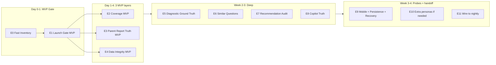

# Launch Readiness QA Master Plan — Fast-Track Revision

> **מצב מסמך:** approved by owner. **E0–E8 מאושרים ומיושמים (2026-05-23).** E9–E11 ממתינות לאישור.
> **שפה:** עברית.
> **גישה:** MVP-first. כל שכבה מקבלת גרסת MVP שעובדת היום + גרסת Full שמתווספת אחר כך.
> **מסמך קנוני (פרוט מלא):** [.cursor/plans/launch_readiness_qa_master_plan_9756f606.plan.md](.cursor/plans/launch_readiness_qa_master_plan_9756f606.plan.md)

---

## תקציר

הופך את ה-nightly virtual-student runner מ"רץ" ל-"מוכיח מוכנות להשקה" ע"י aggregation read-only של artifacts קיימים. בסוף התהליך פקודה אחת — `npm run qa:launch:daily-gate` — מייצרת `LAUNCH_READINESS_DAILY.{md,json}` עם פסיקה אחת מבין `READY` / `NOT READY` / `BLOCKED` / `PARTIAL`.

---

## אסטרטגיית Fast-Track

**עקרונות:**
1. ה-gate קודם — לא אחרון. גם אם 11 מ-13 שכבות `not_run`, ה-gate חי.
2. כל שכבה = MVP → Full.
3. AAA1-12 + ERAN רק נקראים, לא נכתב.
4. לא לחכות ל-Supabase ב-MVP.
5. `not_run` ≠ `fail`.

---

## פאזות

| Phase | מטרה | פלט עיקרי | סטטוס |
|-------|------|-----------|--------|
| **E0** | Fast inventory | [docs/launch-readiness/E0-INVENTORY.md](launch-readiness/E0-INVENTORY.md) | approved, יום 0 |
| **E1** | Launch Gate MVP | `reports/launch-readiness/<date>/LAUNCH_READINESS_DAILY.{md,json}` | approved, יום 0-1 |
| **E2** | Coverage Matrix MVP | `coverage-summary.{md,json}` | **approved** (2026-05-23) |
| **E3** | Parent Report Truth MVP | `parent-report-truth-audit.{md,json}` | **approved** (2026-05-23) |
| **E4** | Data Integrity MVP | `data-integrity-audit.{md,json}` | **approved** (2026-05-23) |
| **E5** | Diagnostic Ground Truth MVP | `diagnostic-ground-truth-report.{md,json}` | **approved** (2026-05-23) |
| **E5.1** | Parent Report Snapshot Capture | `parent-report-snapshots/*-after.json` | **approved** (2026-05-23) |
| **E5.2** | Diagnostic Evidence Guard + Backfill | evidence guard in diagnostic-ground-truth.mjs | **approved** (2026-05-23) |
| **E6** | Similar Questions / Adaptive Follow-up | `similar-question-audit.{md,json}` | **approved** (2026-05-23) |
| **E7** | Parent Recommendation Audit | `parent-recommendation-audit.{md,json}` | **approved** (2026-05-23) |
| **E8** | Parent Copilot Truth | `parent-copilot-truth-audit.{md,json}` | **approved** (2026-05-23) — 40 turns, 0 blockers |
| E9 | Mobile + Cross-device + Failure recovery | 3 probes + reports | **ממתין לאישור** |
| E10 | Extra personas (only if needed) | persona table update | על פי דרישה |
| E11 | Wire gate ל-laptop nightly | עדכון run-nightly.ps1 | סוף תהליך |

---

## MVP vs Full לכל שכבה

| שכבה | MVP (יום-שבוע 1) | Full (שבוע 2-4) |
|------|-------------------|------------------|
| **Launch Gate** | קובץ JSON+MD aggregator עם `not_run` markers | + per-layer history graph, trend over 14 ימים |
| **Coverage Matrix** | student×grade×subject×question-count | + topic×level×skill×shape השוואה ל-`qa-question-inventory-matrix` |
| **Parent Report Truth** | report exists + opens + 0 raw keys + student name + activity | + numeric accuracy ±2%, recommendation-grade matching, narrative safety |
| **Data Integrity** | start=finish + 0 fail/blocked מ-run-summary בלבד | + read-only Supabase scan ל-orphans + cross-student rows + duplicate finishes |
| **Diagnostic Ground Truth** | match/partial/miss per persona×subject | + skill-level, false-positive on strong, multi-weakness |
| **Similar Questions** | follow-up בתוך session | + cross-session 7-day window |
| **Recommendation Audit** | tied to wrong-rate subject | + grade-aware vocabulary, practical-action check, Hebrew style |
| **Copilot Truth** | 10 prompts × 5 personas deterministic | + 12 personas, LLM live, scope-collision tests |
| **Mobile + RTL** | iPhone 12 viewport scroll/buttons probe | + full mobile session, Galaxy + tablet viewports |
| **Cross-device Persistence** | manual check, 1 student | + automated 2-context Playwright probe |
| **Failure Recovery** | event-counting מ-nightly log | + injection scenarios |
| **PDF Export** | reuse `qa:parent-pdf-export` as-is | + per-persona PDF QA |
| **Question Quality** | reuse `qa:question-metadata` as-is | + nightly diff alerting |

---

## P0 Blockers / P1 Warnings

### P0 — חוסמי השקה (gate=`BLOCKED` או `NOT READY`)

- Login failure (parent או student) — מקור: nightly preflight
- Student cannot answer questions — מקור: nightly run
- `session/finish` לא נשמר — מקור: nightly + data-integrity
- Parent report missing/broken — מקור: parent-report-truth
- **Cross-student bleed** (פרסונה רואה נתונים של אחרת) — מקור: data-integrity / nightly bleedFindings
- Raw keys בדוח להורה או ב-Copilot — מקור: parent-report-truth / copilot-truth
- Parent recommendation לא קשור לחולשה אמת — מקור: recommendation-audit
- Diagnostic false-positive על strong persona — מקור: diagnostic-ground-truth
- Copilot hallucination / טענה רפואית — מקור: copilot-truth
- Mobile: שאלת הקלדה לא ניתנת לענייה — מקור: mobile-rtl
- Multi-device persistence loss — מקור: cross-device-persistence
- PDF export נכשל — מקור: pdf-export

### P1 — אזהרות (gate=`PARTIAL`, לא חוסם)

- Coverage gap בודד
- Thin-data warning טבעי
- ניסוח המלצה כללי מדי
- Mobile layout מינורי / חיתוך
- Latency >10s ב-cross-device
- Partial nightly run אם הסיבה זוהתה ב-[KNOWN-ISSUES.md](../scripts/virtual-student-qa/KNOWN-ISSUES.md)
- PDF layout מינורי
- שכבה `not_run` בשבוע 1 (חזויה)

### gate verdict rules

- **BLOCKED:** כל P0 פתוח
- **NOT READY:** ≥1 P0 פתוח + nightly partial/fail
- **PARTIAL:** 0 P0, יש P1, או יש `not_run` ב-core layer (coverage / parent-report-truth / data-integrity)
- **READY:** 0 P0, ≤3 P1, 7 לילות רצופים PASS, ו-all 4 MVP layers (E1-E4) `pass`

---

## מה לא ייגע

- שום `pages/` (product code)
- שום תוכן עברי / שאלות
- שום `utils/diagnostic-engine-v2/`
- שום `utils/parent-report-v2.js`
- שום supabase schema / migration
- שום supabase WRITE (גם לא בשכבה 12)
- שום laptop scheduler עד E11
- שום פרסונה קיימת — רק קריאה
- שום חשבון תלמיד / הורה אמת — אין יצירה / מחיקה / PIN reset
- אין LLM live ב-MVP
- אין mutation tests מחוץ ל-nightly הקיים
- אין commit / push בלי אישור מפורש

---

לפירוט מלא של כל שלב (acceptance criteria, runtime, PASS/WARN/BLOCKED, קבצים, blockers), ראה את [המסמך הקנוני](../.cursor/plans/launch_readiness_qa_master_plan_9756f606.plan.md).
