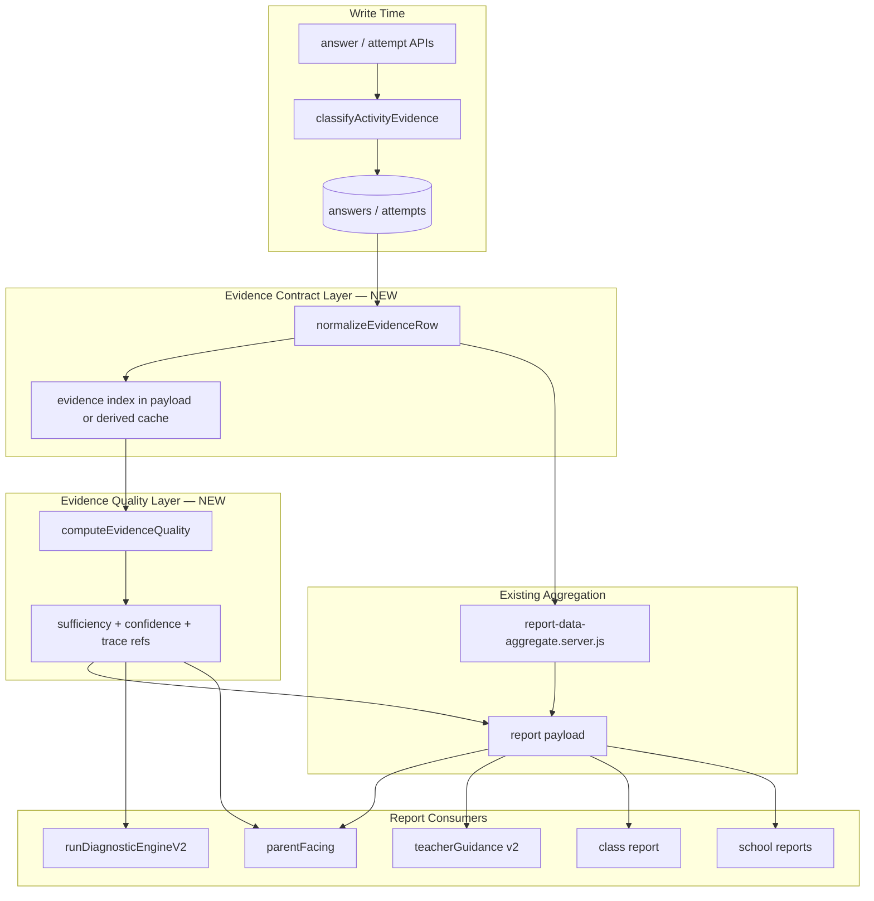

# Diagnostic Engine Quality — Master Plan

**File:** `docs/diagnostics/DIAGNOSTIC_ENGINE_QUALITY_MASTER_PLAN.md`  
**Date:** 2026-06-06  
**Status:** PLAN ONLY — no implementation until owner approves Phase 1 scope  
**Prerequisite:** Phases 4–10 closed; current-state audit complete  
**Companion:** `DIAGNOSTIC_ENGINE_CURRENT_STATE_AUDIT.md`

---

## Explicit No-Change Declaration

> This document does not change code, database schema, UI, Hebrew product copy, report behavior, coins/monthly logic, or authorization. It defines architecture and phased delivery only.

---

## 1. Vision

Upgrade the diagnostic/reporting engine from **basic correctness and topic aggregation** into a **reliable evidence-based diagnostic system** where:

- Every human-facing diagnosis is **traceable** to classified answer evidence.
- **Confidence and sufficiency** are computed once per **context** (parent, private-teacher, school) and consumed consistently **within that context's surfaces**.
- **Non-diagnostic activity** (discussion, step-by-step, book, guided practice) never drives mastery or weakness conclusions.
- **Low-confidence findings** are labeled preliminary or withheld from strong parent-facing diagnosis sections.

This plan **does not rewrite** `runDiagnosticEngineV2` or report UIs in early phases. It layers quality infrastructure on top of the Phase 4–10 truth baseline.

---

## 2. Design Principles

| Principle | Meaning |
|-----------|---------|
| **Context isolation (mandatory)** | Evidence may only be consumed inside the context that owns it, unless a separate future sharing feature is explicitly designed and approved. Parent, private-teacher, and school are separate diagnostic worlds — no merge, compare, hint, or sync across them. |
| **Classification first** | `activity-classification.js` remains write-time SSOT; quality layer reads stored fields |
| **Diagnostic independence** | Mastery/weakness claims require `diagnostic_independent` or approved `diagnostic_guided` evidence |
| **Competitive isolation** | Competitive evidence informs `competitiveContext`, not standard weakness |
| **Single quality truth per context** | One Evidence Quality Layer output per context payload — parent, private-teacher, and school each compute quality from their own source policy only |
| **No AI diagnoses** | Recommendations stay deterministic; no LLM-generated diagnostic labels in scope |
| **Progressive enhancement** | Metadata and telemetry fields are optional until populated |
| **Fail closed on parent** | When sufficiency is insufficient, parent-facing strong diagnosis is hidden, not hedged with generic text |

---

## 3. Target Architecture



---

## A. Diagnostic Evidence Contract

### A.1 Purpose

Normalize every answer/attempt into a comparable evidence row so aggregation, quality, and diagnosis use the same fields.

### A.2 Core fields (Phase 1+)

| Field | Type | Source today | Required |
|-------|------|--------------|----------|
| `studentId` | uuid | answer / attempt row | Yes |
| `subject` | string | `answer_payload.subject` | Yes |
| `grade` | string | `students.grade_level` at report time | Yes |
| `topic` | string | `answer_payload.topic` | Yes |
| `subSkill` | string | `questionEngine.skillId`, `skill_key` | Phase 2 |
| `questionMode` | string | `gameMode` / activity `mode` | Yes |
| `difficulty` | string | activity `difficulty_level` | When present |
| `difficultyDepth` | enum | *not stored* | Phase 3 |
| `sourceType` | enum | `free_practice`, `assigned_parent`, `assigned_class`, `assigned_individual` | Yes |
| `isCorrect` | boolean | `is_correct` | Yes |
| `answerTimeMs` | number | timing fields on payload | When present |
| `diagnosticWeight` | number 0–1 | Derived from `evidenceCategory` | Phase 1 |
| `questionQuality` | number 0–1 | Engine metadata confidence | Phase 3 |
| `evidenceCategory` | string | classification SSOT | Yes |
| `isDiagnosticEligible` | boolean | classification SSOT | Yes |
| `contextFlags` | object | `afterStepByStep`, `contextAfterBookReading`, `hasHints` | Yes |
| `evidenceId` | string | answer id or attempt id | Yes (traceability) |
| `answeredAt` | iso | `answered_at` | Yes |

### A.3 Future optional fields (telemetry — Section D)

`audioUsed`, `draftUsed`, `answerChanged`, `errorPattern`, `activeSolvingMs`, `inactiveMs`, `beforeAfterLearningContext`

### A.4 Weight defaults (proposed)

| `evidenceCategory` | `diagnosticWeight` | Counts toward mastery/weakness? |
|--------------------|--------------------|---------------------------------|
| `diagnostic_independent` | 1.0 | Yes |
| `diagnostic_guided` | 0.7 | Yes (with context note) |
| `diagnostic_competitive` | 0.5 | Separate competitive signals only |
| `learning_guided` | 0 | No |
| `learning_review` | 0 | No |
| `learning_book` | 0 | No |
| `learning_context` | 0 | No |
| `unclassified` | 0 | No |

### A.5 Implementation shape (no schema change in Phase 1)

- Add `lib/learning/diagnostic-evidence-contract.js` with `normalizeEvidenceRow(answerOrAttempt, student, sourceType)`.
- Aggregator calls normalizer once per row; stores lightweight `evidenceIndex` summary on payload meta (internal, stripped from public API).
- Do **not** duplicate rows in DB in Phase 1 — derive at aggregation time.

---

## B. Evidence Quality Layer

### B.1 Purpose

Single module that answers: “How much evidence supports a claim at student / subject / topic / subSkill scope?”

Proposed module: `lib/learning/evidence-quality.js`

### B.2 Outputs per scope

```typescript
interface EvidenceQualitySnapshot {
  evidenceCount: number;           // weighted diagnostic count
  rawDiagnosticCount: number;      // unweighted diagnostic answers
  sourceBreakdown: Record<string, number>; // by sourceType
  recurrence: {
    distinctDays: number;
    wrongRecurrence: number;
    patternFamilies: number;
  };
  dataSufficiency: DataSufficiencyLevel;
  confidenceLevel: ConfidenceLevel;
  confidenceReason: string;        // machine-readable code
  supportingEvidenceIds: string[]; // traceability cap e.g. 50 ids
  excludedEvidenceIds?: string[];  // step-by-step, discussion, etc.
}
```

### B.3 Sufficiency levels

| Level | Code | Criteria (proposed defaults) | Consumer behavior |
|-------|------|------------------------------|-------------------|
| No data | `no_data` | 0 diagnostic-weighted evidence in range | Hide diagnosis; show activity encouragement only |
| Insufficient | `insufficient_data` | 1–4 independent diagnostic answers at topic; or < 5 at subject | No strong diagnosis; teacher may see “needs more data” |
| Preliminary | `preliminary_signal` | 5–11 weighted evidence OR recurrence not met | Label “ממצא ראשוני”; no intervention plan in parent strong sections |
| Supported | `supported_diagnosis` | ≥ 12 weighted evidence AND recurrence rules pass AND confidence ≥ moderate | Full diagnosis allowed |
| Contradictory | `contradictory` | Stable mastery tag vs needsPractice conflict | Suppress both directions; flag for teacher |

**Align with existing DE2:** Map `resolveConfidenceLevel` outputs into this enum; do not fork logic long-term.

### B.4 Confidence reason codes (examples)

`too_few_questions`, `too_few_wrongs`, `no_recurrence`, `hints_invalidate`, `step_by_step_only`, `discussion_only`, `competitive_only`, `mixed_sources_thin`, `book_context_only`, `contradictory_signals`, `supported`

### B.5 Rules summary

1. **Discussion** evidence never increments `evidenceCount` for diagnosis.
2. **Step-by-step** rows increment `learningAnswers` only; listed in `excludedEvidenceIds`.
3. **Competitive** rows contribute to `competitiveContext`, not standard weakness unless explicitly tagged competitive diagnosis.
4. **Book** time never affects diagnostic sufficiency.
5. **`sourceBreakdown`** lists source types **only when that source is allowed by the current context's source policy**. No parent-facing payload may include classroom/school `sourceBreakdown` entries, hints, flags, or presence signals. Private-teacher and school payloads may include breakdown entries only for sources owned by that context (private-teacher-owned individual/group rollups — not school classrooms — vs school classroom rollups respectively).
6. **Within-context source mix:** supported diagnosis requires ≥ 60% of weighted evidence from `diagnostic_independent` among sources **allowed in that context's policy** (e.g. school may be quiz/homework-heavy; parent may be free-practice-heavy). No cross-context blending.

---

## C. Question Metadata Upgrade Plan

### C.1 Phase 2 — Skill graph

| Field | Source | Use |
|-------|--------|-----|
| `skillId` / `subSkill` | Expand `question-engine-metadata.js` | Topic → subSkill rollup |
| `questionType` | MCQ contract | technical vs word problem routing |
| `problemClass` | New enum on engine metadata | `conceptual` \| `procedural` \| `mixed` |
| `requiresVisual` | Item manifest | Downgrade confidence if visual required but not tracked |
| `requiresAudio` | Item manifest | Downgrade when audio assist detected (Phase 4 telemetry) |

### C.2 Phase 3 — Diagnostic quality score

`questionQuality` (0–1) composed from:

- Metadata confidence (Phase 8)
- Distractor family validity
- Stem leakage audit result
- Taxonomy mapping confidence

Low-quality questions contribute reduced `diagnosticWeight`.

### C.3 Phase 3 — Error pattern support

- Extend `questionEngine` / mistake events with `errorPattern` enum (e.g. `operation_swap`, `place_value`, `sign_error`).
- DE2 recurrence uses pattern families (already partially present) — link to stored pattern on row.

### C.4 Deliverables

- Metadata contract doc: `docs/diagnostics/QUESTION_METADATA_CONTRACT.md` (Phase 2)
- Validator script: `scripts/tests/question-metadata-coverage.mjs`
- No Hebrew copy changes until metadata stable

---

## D. Event Telemetry Plan

### D.1 Goals

Capture aid usage and effort signals to adjust `diagnosticWeight` and confidence — **without** changing gameplay UX in early phases.

### D.2 Events (client → answer_payload extensions)

| Event | Payload field | Effect on quality |
|-------|---------------|-------------------|
| Audio play count | `telemetry.audioPlayCount` | Reduce weight if > 0 on independent mode |
| Draft / scratchpad used | `telemetry.draftUsed` | Flag `early_signal_only` |
| Active solving ms | `telemetry.activeSolvingMs` | Detect rush/guess (very low time + wrong) |
| Inactive ms | `telemetry.inactiveMs` | Exclude from time-based signals |
| Answer changes | `telemetry.answerChangeCount` | Instability signal |
| Before/after learning | `contextFlags` (existing) | Already handled |

### D.3 Phasing

| Phase | Scope |
|-------|-------|
| **D0 (audit)** | Document which masters already track explanation viewed / step-by-step |
| **D1** | Persist optional `telemetry` object on `answer_payload` (JSON — no migration if JSON column exists) |
| **D2** | Quality layer reads telemetry; confidence downgrade rules |
| **D3** | Teacher report shows effort context (machine IDs only first) |

**Constraint:** No new UI in D1–D2; masters append telemetry silently.

---

## E. Report Integration Plan

Ensure every surface consumes `EvidenceQualitySnapshot` before emitting human-facing diagnosis.

### E.1 Parent report

| Component | Current | Target |
|-----------|---------|--------|
| API `report-data` | Aggregation + `parentFacing` | Attach `evidenceQuality` block (internal meta stripped; sufficiency drives copy tier) |
| `parent-report-parent-facing.server.js` | Ad-hoc thresholds | Read quality layer; suppress strong insights when `< preliminary` |
| Client DE2 | Independent confidence | Receive quality snapshot per topic; **gate** `applyOutputGating` inputs |
| `parent-facing-report-authority.js` | Thin data on `totalAnswers` | Switch to `diagnosticWeightedCount` + sufficiency enum |
| Detailed report | Pattern contracts | Inherit gating from base report |

### E.2 Teacher student report

| Component | Current | Target |
|-----------|---------|--------|
| `buildTeacherStudentReportPayload` | Guidance v2 after sanitize | Inject quality snapshot before `buildStudentTeacherGuidanceV2` |
| `teacher-guidance-v2.server.js` | Mixed insufficient checks | Use `dataSufficiency` for `insufficientData` |
| Weakness units | `diagnosticWrong` | Require `preliminary_signal` minimum |
| Strength units | 3-answer bar | Raise to quality-layer threshold |

### E.3 Teacher dashboard cards

| Card | Target |
|------|--------|
| Student attention / risk chips | Use `diagnosticAnswers` + sufficiency, not mixed totals |
| Class health | Cohort diagnostic weighted counts |
| Activity badges | Distinguish `no_data` vs `low_activity` vs `insufficient_diagnostic` |

### E.4 Class report

| Component | Current | Target |
|-----------|---------|--------|
| `weaknessTopics` | `diagnosticWrong` counts | Add min weighted evidence per topic before listing |
| `cohortSummary.accuracy` | Mixed rollup | Expose `diagnosticAccuracy` alongside; guidance uses diagnostic only |
| `attentionList` | Mixed accuracy | Use diagnostic accuracy for low-accuracy reason |

### E.5 School report

| Component | Target |
|-----------|--------|
| `filterReportByPermittedSubjects` | Recompute quality after filter |
| School browse status chips | Align thresholds with quality layer |
| Physical class report | Same class rules as E.4 |

### E.6 Consistency rules (within context only)

Consistency applies **only within the same context, same source policy, and same date range**. Do **not** compare parent vs private-teacher vs school as if they are one diagnostic surface.

1. **Parent context:** Same `studentId + from + to` + parent source policy → stable `diagnosticAnswers` and `evidenceQuality` on parent API and parent UI path.
2. **Private-teacher context:** Same inputs + teacher source policy (including classroom merge when applicable) → stable counts on teacher student/class APIs and guidance blocks.
3. **School context:** Same inputs + school permitted-subject filter → stable counts after `filterReportByPermittedSubjects`.
4. **No cross-context parity:** Parent omitting classroom data is correct. Private teacher omitting parent-assigned data is correct. School omitting private/parent-only sources is correct.
5. **No cross-context contradiction checks:** Tests and QA must not assert that parent and teacher reports “match” for the same student — they measure different evidence sets by design.

---

## F. QA and Acceptance Criteria

### F.1 Global acceptance criteria

| ID | Criterion | Verification |
|----|-----------|--------------|
| **AC1** | Every diagnosis traceable to `supportingEvidenceIds` | Unit test + API meta audit |
| **AC2** | No diagnosis from < 5 independent diagnostic answers at topic | Quality layer tests |
| **AC3** | Discussion never in diagnostic conclusions | Phase 4 regression + new discussion fixtures |
| **AC4** | Step-by-step / book / guided practice excluded from mastery | Bucket + quality tests |
| **AC5** | Same context + same source policy + same date range → consistent diagnostic counts | Per-context fixture tests (not cross-context) |
| **AC6** | Date-range behavior documented and tested per API | `report-date-range` regression |
| **AC7** | Low confidence → preliminary label or hidden from parent strong sections | Parent-facing gating tests |
| **AC8** | No raw `accuracy` in public APIs | Phase 10 regression |
| **AC9** | `competitiveContext` / `positiveEvidence` preserved through gating | Phase 6–7 regression |
| **AC10** | No LLM-generated diagnostic labels | Code search gate |

### F.2 Test gate files (cumulative)

| File | Phase |
|------|-------|
| `tests/learning/phase4–phase10` | Baseline regressions |
| `tests/reports/diagnostic-truth-consumer-verification.test.mjs` | Consumer truth |
| `tests/learning/evidence-quality-layer.test.mjs` | **New — Phase 1** |
| `tests/learning/evidence-sufficiency-parent-facing.test.mjs` | **New — Phase 1** |
| `tests/learning/diagnosis-traceability.test.mjs` | **New — Phase 1** |

### F.3 Manual QA scenarios (Phase 1)

1. Student with 3 practice answers only → parent strong diagnosis suppressed (`insufficient_data` within parent context).
2. Student with 10 practice + 20 learning mode → diagnostic count 10 only; no mastery from learning rows.
3. Discussion-only classroom → teacher class report shows no diagnostic weakness from discussion.
4. Competitive-only wrongs → no weakness topic; competitive signals present.
5. Parent remote report → server `parentFacing` matches quality gating; client pattern diagnostics empty when insufficient.

---

## 4. Phased Roadmap

| Phase | Name | Scope | Schema | UI/Hebrew |
|-------|------|-------|--------|-----------|
| **Q1** | Evidence sufficiency + confidence + traceability | Sections B + partial A/E parent/teacher | No | No |
| **Q2** | Question metadata + subSkill rollup | Section C Phase 2 | Optional JSON fields | No |
| **Q3** | Telemetry ingestion | Section D Phase 1–2 | Optional JSON | No |
| **Q4** | Class/school/dashboard alignment | Section E full | No | Minimal labels only |
| **Q5** | DE2 consolidation | Merge DE2 gating into quality layer | No | Copy tier review |

**Explicitly out of scope for Q1–Q5:** coins/monthly, authorization, AI recommendations, report UI redesign, Hebrew copy overhaul, **cross-context evidence sharing/parity** (parent ↔ private-teacher ↔ school merge, hints, or synchronization).

**Permanent out of scope unless separately approved:** Any feature that merges, compares, or surfaces activity from one context inside another context's diagnostic conclusions.

---

## 5. Phase 1 Implementation Proposal (Safe First Step)

**Owner approval required before coding.**

### 5.1 Phase 1 goal

Introduce **evidence sufficiency**, **confidence level**, and **diagnosis traceability** on the server path, and **prevent weak/unsupported diagnoses in parent-facing reports** — without rewriting DE2, changing schema, or changing UI.

### 5.2 Phase 1 deliverables

| # | Deliverable | Files (proposed) |
|---|-------------|------------------|
| 1 | Evidence contract normalizer | `lib/learning/diagnostic-evidence-contract.js` |
| 2 | Evidence quality computer | `lib/learning/evidence-quality.js` |
| 3 | Aggregator hook | `report-data-aggregate.server.js` — build `meta._evidenceQuality` during aggregation (internal) |
| 4 | Parent-facing gating | `parent-report-parent-facing.server.js`, `parent-facing-report-authority.js` — use sufficiency enum |
| 5 | Teacher guidance gating | `teacher-guidance-v2.server.js` — `insufficientData` from quality layer |
| 6 | DE2 input bridge | `report-data-adapter.js` — pass quality snapshot to seeded meta for client gating |
| 7 | Tests | `tests/learning/evidence-quality-layer.test.mjs`, extend consumer verification |
| 8 | Docs | Update audit with Phase 1 closure note when done |

### 5.3 Phase 1 behavior changes (intentional, minimal)

| Change | User-visible? |
|--------|---------------|
| Parent strong insights suppressed when topic sufficiency `< preliminary_signal` | Yes — fewer aggressive Hebrew insights (safer) |
| Client `patternDiagnostics` cleared when server quality says `insufficient_data` (extend thin-data rule) | Yes — fewer false diagnoses |
| Teacher guidance `insufficientData` uses diagnostic-weighted counts | Possibly — more accurate “not enough data” |
| Internal `supportingEvidenceIds` on meta (stripped from API) | No |

### 5.4 Phase 1 non-goals

- No SQL migrations
- No new API endpoints
- No Hebrew copy rewrite (only suppression of unsupported lines)
- No cross-context evidence sharing, merge, parity, hints, or flags (parent ↔ private-teacher ↔ school)
- No classroom merge into parent API (remains out of scope permanently unless separately approved)
- No parent/teacher/school parity work or cross-context comparison tests
- No telemetry collection
- No `subSkill` rollup yet
- No change to coin/monthly/diagnostic formulas for accuracy %

### 5.5 Phase 1 acceptance

- All AC1–AC7 satisfied for parent + teacher student paths
- Phase 4–10 + consumer verification tests green
- `npm run build` green
- Implementation report only — no commit unless owner requests

### 5.6 Phase 1 task breakdown

```
Q1.1  diagnostic-evidence-contract.js + unit tests
Q1.2  evidence-quality.js (student/subject/topic scopes)
Q1.3  Wire into aggregateReportPayloadFromActivityRows
Q1.4  parent-report-parent-facing — gate insights by sufficiency
Q1.5  parent-facing-report-authority — extend thin/insufficient logic
Q1.6  teacher-guidance-v2 — insufficientData from quality snapshot
Q1.7  report-data-adapter — attach quality meta for client DE2
Q1.8  tests + regression run + short closure doc
```

**Estimated touch surface:** 6–8 server files, 2–3 test files, 0 UI files.

---

## 6. Risk Register (Plan-Level)

| Risk | Mitigation |
|------|------------|
| DE2/client path bypasses server quality | Pass snapshot through adapter; extend `applyServerParentFacingAuthorityToClientReport` |
| Threshold change surprises teachers | Phase 1 changes teacher block only where currently `insufficientData`; document in release notes |
| Performance on large answer sets | Cap `supportingEvidenceIds` at 50; compute quality in same loop as aggregation |
| Accidental cross-context merge in code/tests | AC5 and review gate: tests scoped per context only; no parity assertions across worlds |
| Scope creep into UI/Hebrew | Phase gates require owner sign-off per phase |

---

## 7. Related Documents

| Document | Relationship |
|----------|--------------|
| `DIAGNOSTIC_ENGINE_CURRENT_STATE_AUDIT.md` | Baseline for this plan |
| `DIAGNOSTIC_REPORT_ENGINE_DATA_FLOW_AUDIT.md` | Historical; pre-Phase 4–10 |
| `DIAGNOSTIC_REPORT_TRUTH_AUDIT.md` | Truth fix origin |
| Phases 4–10 plans | Completed prerequisites |
| `tests/reports/diagnostic-truth-consumer-verification.test.mjs` | Consumer regression gate |

---

## 8. Owner Decision Points (Before Phase 1)

1. **Approve Phase 1 scope** as defined in §5 (sufficiency + confidence + traceability + parent gating only — **within parent context only** for parent-facing changes).
2. **Default thresholds** — confirm proposed 5 / 12 weighted evidence cutoffs or adjust.
3. **Hebrew preliminary label** — defer (suppress only) or allow one existing template string in Q1?

---

## 9. Summary

The diagnostic engine has a **strong classification and aggregation foundation** after Phases 4–10. The Quality Master Plan adds an **Evidence Contract and Quality Layer per context** so diagnoses are **evidence-backed, confidence-scored, and traceable within each diagnostic world** (parent, private-teacher, school). Cross-context sharing is **explicitly out of scope**. **Phase 1** is deliberately narrow: server-side sufficiency and gating for parent-facing strong diagnosis within the parent context, with no schema, UI, or cross-context work — the safest on-ramp to a reliable evidence-based system.
