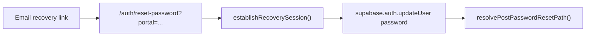

# Email Delivery Audit — Hebrew Learning Site

**Date:** 2026-05-31  
**Scope:** External Email Delivery (Resend via Supabase Custom SMTP)  
**Mode:** Read-only audit — no code, SQL, dashboard, or env changes

---

## Executive Summary

| Finding | Result |
|---------|--------|
| Custom email transport in app code | **None** |
| Third-party mailer libraries (Resend, SendGrid, nodemailer) | **None in production code** |
| Supabase Edge Functions for email | **None** |
| Email templates in repository | **None** (managed in Supabase Dashboard) |
| App code changes required for Resend SMTP | **None expected** |
| Non-Auth transactional email flows | **None found** |

**Conclusion:** All outbound Auth email is delegated to Supabase Auth. Moving delivery to Resend requires **owner-only Supabase Dashboard Custom SMTP configuration** — no application code changes.

---

## Active Auth Email Flows (3)

These flows trigger Supabase Auth to send email. After owner configures Resend Custom SMTP, delivery path changes; trigger logic stays the same.

### Flow 1 — User-initiated password reset (forgot password)

| Item | Detail |
|------|--------|
| **Entry points** | `/auth/forgot-password?portal=parent`, `/auth/forgot-password?portal=teacher` |
| **Trigger** | `supabase.auth.resetPasswordForEmail(email, { redirectTo })` |
| **Source file** | [`pages/auth/forgot-password.js`](../../pages/auth/forgot-password.js) |
| **Redirect URL** | `{origin}/auth/reset-password?portal={parent\|teacher}` |
| **Email type** | Supabase Auth recovery / password reset |
| **Hebrew UI copy** | [`lib/auth/auth-reset.he.js`](../../lib/auth/auth-reset.he.js) |

### Flow 2 — Admin / approval password-setup recovery

| Item | Detail |
|------|--------|
| **Trigger** | `POST {SUPABASE_URL}/auth/v1/recover` with `email` + `redirect_to` |
| **Core function** | `sendPasswordSetupRecoveryEmail()` in [`lib/auth/auth-password-setup.server.js`](../../lib/auth/auth-password-setup.server.js) |
| **Redirect URL** | `{getPublicSiteOrigin()}/auth/reset-password?portal={portal}` |
| **Email type** | Supabase Auth recovery (same template as password reset) |

**Call sites:**

| Trigger | Source file |
|---------|-------------|
| Admin resend password-setup for user | [`pages/api/admin/users/[userId]/send-password-setup.js`](../../pages/api/admin/users/[userId]/send-password-setup.js) |
| Admin send password-setup for school contact | [`pages/api/admin/schools/[schoolId]/send-password-setup.js`](../../pages/api/admin/schools/[schoolId]/send-password-setup.js) |
| Teacher reactivate from pending (auto-send) | [`lib/admin-server/admin-lifecycle.server.js`](../../lib/admin-server/admin-lifecycle.server.js) |
| School registration approval (auto-send) | [`lib/auth/auth-registration-request.server.js`](../../lib/auth/auth-registration-request.server.js) |

**Status tracking:** `password_setup_sent_at` / `password_setup_last_error` on `teacher_registration_requests` and `school_registration_requests` (migration 052).

### Flow 3 — Parent signup email confirmation

| Item | Detail |
|------|--------|
| **Entry point** | `/parent/login` (signup mode) |
| **Trigger** | `supabase.auth.signUp({ email, password })` |
| **Source file** | [`pages/parent/login.js`](../../pages/parent/login.js) |
| **Email type** | Supabase Auth signup confirmation (only if `email_confirm` is enabled in Supabase project settings) |
| **UI handling** | Shows Hebrew message when session is not returned: *"ההרשמה הושלמה. לאחר אימות האימייל — התחברו…"* |
| **Error mapping** | [`lib/parent-client/parent-auth-errors.he.js`](../../lib/parent-client/parent-auth-errors.he.js) — maps `Email not confirmed`, rate limits, etc. |

**Note:** Teacher and school registration flows use `auth.admin.createUser` with `email_confirm: true` — they do **not** send a signup confirmation email. Admin may send a recovery email separately via Flow 2.

---

## Non-Email Flows (3)

These involve email addresses or auth but do **not** send outbound email.

### Non-flow A — School staff invite by email

| Item | Detail |
|------|--------|
| **Behavior** | Resolves existing `auth.users` record by email via `listUsers` |
| **Source file** | [`lib/school-server/school-staff-invite.server.js`](../../lib/school-server/school-staff-invite.server.js) |
| **UI** | [`components/school-portal/SchoolStaffEmailInviteForm.jsx`](../../components/school-portal/SchoolStaffEmailInviteForm.jsx) |
| **Email sent?** | **No** — membership assignment only |

### Non-flow B — PIN / code login (staff, guardian, student)

| Item | Detail |
|------|--------|
| **Portals** | `/school/staff/login`, `/guardian/login`, `/student/login` |
| **Auth model** | Custom session cookies; no Supabase Auth email |
| **Email sent?** | **No** |

### Non-flow C — Internal synthetic staff addresses

| Item | Detail |
|------|--------|
| **Pattern** | `staff-{uuid}@staff.noreply.liosh` |
| **Source file** | [`lib/school-server/school-staff-crypto.server.js`](../../lib/school-server/school-staff-crypto.server.js) |
| **Created via** | `auth.admin.createUser` with `email_confirm: true` in [`lib/school-server/school-staff-provision.server.js`](../../lib/school-server/school-staff-provision.server.js) |
| **Email sent?** | **No** — addresses are synthetic; no inbox exists |

---

## Password Reset Completion Flow

After user clicks the email link:



| Step | Source file |
|------|-------------|
| Recovery session establishment | [`lib/auth/auth-recovery-session.client.js`](../../lib/auth/auth-recovery-session.client.js) |
| Password update UI | [`pages/auth/reset-password.js`](../../pages/auth/reset-password.js) |
| Post-reset redirect | [`lib/auth/auth-post-reset-redirect.js`](../../lib/auth/auth-post-reset-redirect.js) |
| Error mapping (Hebrew) | [`lib/auth/auth-reset-errors.js`](../../lib/auth/auth-reset-errors.js) |

---

## Redirect URL Derivation

Server-side password-setup emails use `getPublicSiteOrigin()`:

```javascript
// lib/auth/auth-password-setup.server.js
process.env.NEXT_PUBLIC_SITE_URL
  || process.env.NEXT_PUBLIC_APP_URL
  || (process.env.VERCEL_URL ? `https://${process.env.VERCEL_URL}` : "")
  || "https://www.leokids.co.il"
```

Browser forgot-password uses `window.location.origin` at request time.

**Owner action:** Supabase Auth redirect URL allowlist must include all origins that may appear in `redirect_to`. See [`SUPABASE_CUSTOM_SMTP_CONFIG.md`](./SUPABASE_CUSTOM_SMTP_CONFIG.md).

---

## Hebrew UI Copy Locations (reference only — no changes)

| File | Purpose |
|------|---------|
| [`lib/auth/auth-reset.he.js`](../../lib/auth/auth-reset.he.js) | Forgot-password and reset-password page strings |
| [`lib/auth/auth-reset-errors.js`](../../lib/auth/auth-reset-errors.js) | Recovery/password update error mapping |
| [`lib/parent-client/parent-auth-errors.he.js`](../../lib/parent-client/parent-auth-errors.he.js) | Parent login/signup error mapping |
| [`lib/auth/auth-registration.he.js`](../../lib/auth/auth-registration.he.js) | Registration request form copy |
| [`lib/auth/auth-password.he.js`](../../lib/auth/auth-password.he.js) | Password field labels |

Email **body** templates (subject, HTML) are **not in this repository**. They live in Supabase Dashboard → Authentication → Email Templates.

---

## Environment Variables (Auth-related, no SMTP keys)

| Variable | Used for | In `.env.example`? |
|----------|----------|-------------------|
| `NEXT_PUBLIC_LEARNING_SUPABASE_URL` | Supabase project URL; recover endpoint base | Yes (URL only, no secret) |
| `NEXT_PUBLIC_LEARNING_SUPABASE_ANON_KEY` | Client auth + server recover POST | Yes (empty placeholder) |
| `LEARNING_SUPABASE_SERVICE_ROLE_KEY` | Server `auth.admin.*` | Yes (empty placeholder) |
| `NEXT_PUBLIC_SITE_URL` | Password-setup redirect origin (optional) | No |
| `NEXT_PUBLIC_APP_URL` | Redirect origin fallback (optional) | No |
| `VERCEL_URL` | Vercel-injected redirect fallback | N/A (platform) |

**No SMTP, Resend, or email-provider keys exist in app env.** Resend credentials are entered only in Supabase Dashboard.

---

## Infrastructure Inventory

| Item | Status |
|------|--------|
| `supabase/config.toml` | **Does not exist** — local Supabase stack not versioned |
| `supabase/functions/` | **Does not exist** — no Edge Functions |
| Email templates in repo | **None** |
| Custom SMTP client code | **None** |
| DB triggers that send email | **None** — only `on_auth_user_created_parent_profile` (creates profile row, no email) |
| Migrations for email/SMTP | **None** |

---

## Static Test Coverage (existing)

| Test file | What it verifies |
|-----------|------------------|
| [`tests/auth/password-reset-matrix.mjs`](../../tests/auth/password-reset-matrix.mjs) | Forgot-password uses `resetPasswordForEmail`; Hebrew UI guard |
| [`tests/auth/registration-password-setup-matrix.mjs`](../../tests/auth/registration-password-setup-matrix.mjs) | Recover endpoint + redirect URL in password-setup flow |
| [`tests/auth/auth-recovery-session.test.mjs`](../../tests/auth/auth-recovery-session.test.mjs) | Recovery session establishment |
| [`tests/auth/auth-reset-errors.test.mjs`](../../tests/auth/auth-reset-errors.test.mjs) | Error mapping |

---

## Recommendation

1. Owner completes Resend domain verification and Supabase Custom SMTP configuration (see checklists in this folder).
2. No application code changes are required or planned.
3. If a future non-Auth transactional email flow is identified, it requires a **separate owner-approved implementation** — out of scope for this delivery path change.
