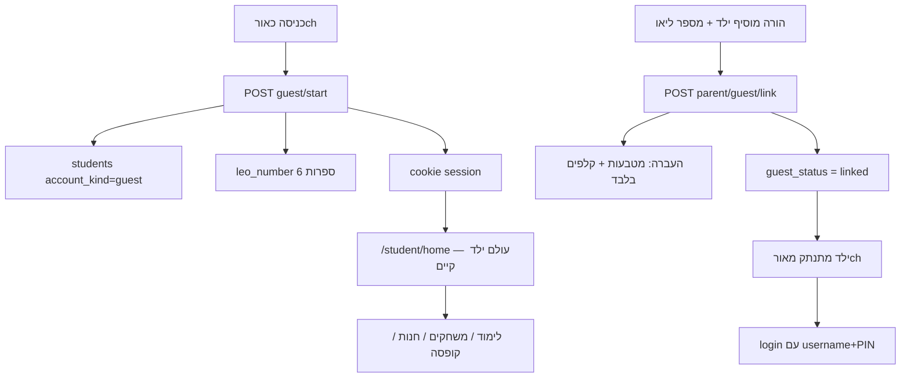
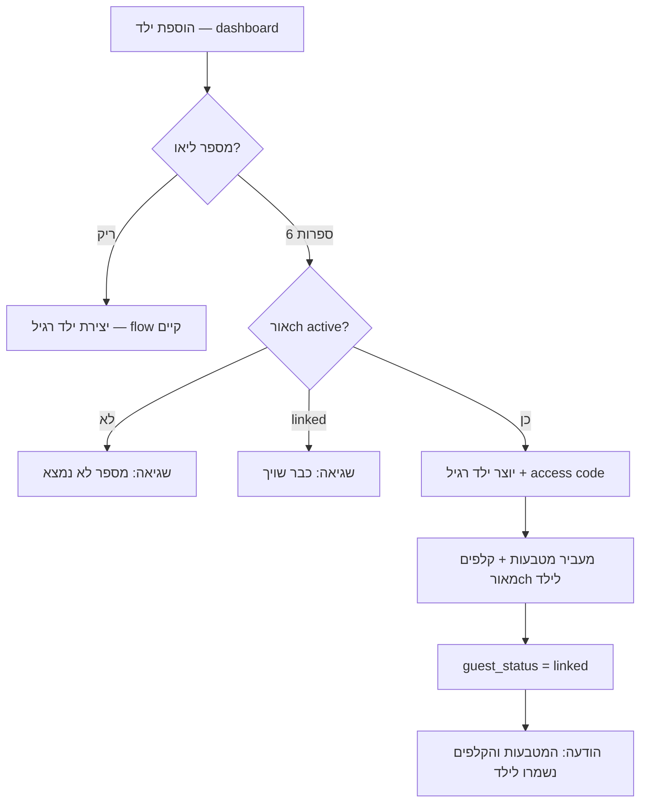

# תוכנית עבודה — מצב אורח לילדים (גרסה פשוטה)

**סטטוס:** תוכנית לאישור בלבד  
**תאריך:** 2026-06-23  
**גרסה:** 2.0 (פשוטה)

---

## הצהרה

**לא בוצע פיתוח. לא הורץ SQL. זו תוכנית פשוטה לאישור בלבד.**

אין לבצע שינוי קוד או SQL עד אישור מפורש.  
כל migration — **רק הבעלים מריץ**, גם בשלב הביצוע.

---

## 1. מה בונים (בקצרה)

ילד לוחץ **"כניסה כאורח"** → השרת יוצר חשבון אורch → מחזיר **מספר בן 6 ספרות** (ייחודי).

הילד רואה בעולם הילד הרגיל, למשל:

> **שלום אורח 482913**

הילד יכול להראות/לשלוח את המספר להורה.

כשההורה מוסיף ילד — שדה אופציונלי **"מספר ליאו של אורch"**.  
אם מוזן מספר תקף → המערכת מעבירה לילד החדש **רק מטבעות וקלפים**, מסמנת את האורch כ-**linked**, והילד מתחבר מחדש עם username+PIN רגיל.

---

## 2. מה לא בונים

| לא | הסבר |
|----|------|
| Recovery מתקדם | אין API שחזור לפי מספר+כיתה |
| QR | — |
| העברת התקדמות לימודית | — |
| העברת sessions / answers | — |
| Merge מורכב | רק coins + cards |
| בחירת כיתה לאורch | — |
| המשך שימוש באורch אחרי שיוך | האורch נסגר; login רגיל |
| עולם UI נפרד | — |
| שינוי לילדים רשומים | — |

---

## 3. עקרון ארכיטקטוני



**Guest = שורת `students` רגילה** עם `account_kind = 'guest'`, תחת **System Guest Parent** (כי `parent_id NOT NULL` היום).

**הרשאות מרכזיות:** `lib/guest/guest-access-policy.server.js` — כל המסכים וה-APIs שואבים ממנו.

---

## 4. זרימת ילד אורch

### 4.1 כניסה ראשונה

1. `/student/login` → כפתור **"כניסה כאורch"**
2. אם Admin כיבה מצב אורch → הודעה, לא יוצרים
3. `POST /api/student/guest/start` → יוצר guest + session + resume token
4. שומר ב-localStorage: `liosh_guest_resume_token`
5. מעביר ל-`/student/home`
6. בבית: **"שלום אורch {leo_number}"** (במקום/ליד שם)

### 4.2 כניסה חוזרת (אותו מכשיר)

1. יש cookie session תקף → `/student/home` (כרגיל)
2. אין cookie, יש `liosh_guest_resume_token` → `POST /api/student/guest/resume`
3. **אין סיסמה. אין recovery API.**

### 4.3 localStorage נמחק

- יוצרים **אורch חדש** — זה מספיק לשלב זה
- אין שחזור לפי מספר בלבד

### 4.4 לחיצה חוזרת על "כניסה כאורch"

- אם יש resume token / session פעיל → חוזר לאותו אורch
- לא יוצר duplicate על אותו מכשיר

### 4.5 אורch שכבר linked

- resume נחסם
- הודעה: "המספר כבר שויך להורה — התחבר/י עם שם משתמש ו-PIN"

---

## 5. זרימת הורה



**לא מעבירים:** התקדמות, sessions, נושאים, אבחון, דוחות, מנוע, המלצות, פעילויות, זמן/דיוק — **שום דבר** שיכול להשפיע על דוח הורה.

**אחרי שיוך:** הילד במכשיר מתנתק מהאורch ומתחבר עם פרטי כניסה שההורה הגדיר.

---

## 6. מספר אורch (מספר ליאו)

| כלל | ערך |
|-----|-----|
| פורמats | **6 ספרות** (למשל `482913`) |
| ייצור | אוטומטי בשרת |
| ייחודיות | unique בין אורchים `active` / לא משויכים |
| תצוגה | `שלום אורch 482913` |
| הילד לא בוחר | אין username לאורch |

---

## 7. חוויית אורch בעולם הילד

אותם מסכים כמו ילד רשום — **עם הגבלות**, לא עולם חדש.

### 7.1 פתוח (ברירת מחדל)

| תחום | ברירת מחדל |
|------|------------|
| מטבעות | פעיל |
| קלפים | פתוח |
| חנות | פתוחה |
| קופסת הפתעה | **1** צבירה/הפתעה (לא 3) |
| משחקים | **2** פתוחים לכל קטגוריה, השאר **נעולים** (מוצגים) |
| לימודים | **2** נושאים פתוחים לכל מקצוע, השאר **נעולים** (מוצגים) |

### 7.2 נעול (מוצג, לא נפתח)

כרטיסי בית (`HOME_PANELS` ב-[`pages/student/home.js`](pages/student/home.js)):

- הנתונים שלי
- ההתקדמות שלי
- המשימות שלי
- פעילויות אישיות
- דפי עבודה
- המלצות להמשך

דפוס UI: כמו [`GameHubCard`](components/games/GameHubCard.jsx) עם `locked` — 🔒 + הודעה.

### 7.3 ילד רשום

**ללא שינוי.** קופסה 3, משחקים מלאים, panels פתוחים — כמו היום.

---

## 8. Admin

Route חדש: `/admin/guest` (פריט בתפריט Admin).

| # | שליטה |
|---|--------|
| 1 | מצb אורch פעיל / כבוי |
| 2 | כמה משחקים פתוחים (ברירת מחדל: 2) |
| 3 | אילו משחקים פתוחים (allowlist) |
| 4 | כמה נושאים פתוחים (ברירת מחדל: 2) |
| 5 | אילו נושאים פתוחים (allowlist לפי מקצוע) |
| 6 | קופסת הפתעה לאורch (ברירת מחדל: max 1) |
| 7 | חנות פתוחה/סגורה |
| 8 | קלפים פתוחים/סגורים |
| 9 | רשימת אורchים |
| 10 | חיפוש לפי 6 ספרות |
| 11 | סטטוס: `active` / `linked` |
| 12 | מטבעות + מספר קלפים |

---

## 9. SQL נדרש (רק הבעלים מריץ)

קובץ מוצע: `supabase/migrations/NNN_guest_child_mode.sql`

### 9.1 `students` — שדות חדשים

```sql
alter table public.students
  add column if not exists account_kind text not null default 'registered'
    check (account_kind in ('registered', 'guest'));

alter table public.students
  add column if not exists leo_number text null
    check (leo_number is null or leo_number ~ '^[0-9]{6}$');

alter table public.students
  add column if not exists guest_status text not null default 'active'
    check (guest_status in ('active', 'linked'));

alter table public.students
  add column if not exists guest_linked_at timestamptz null;

alter table public.students
  add column if not exists guest_linked_to_student_id uuid null
    references public.students (id) on delete set null;

create unique index if not exists students_leo_number_active_uidx
  on public.students (leo_number)
  where account_kind = 'guest' and guest_status = 'active' and leo_number is not null;
```

### 9.2 `guest_device_bindings` — resume במכשיר

```sql
create table if not exists public.guest_device_bindings (
  id uuid primary key default gen_random_uuid(),
  student_id uuid not null references public.students (id) on delete cascade,
  resume_token_hash text not null,
  last_used_at timestamptz not null default now(),
  revoked_at timestamptz null
);
create unique index if not exists guest_device_bindings_token_idx
  on public.guest_device_bindings (resume_token_hash) where revoked_at is null;
```

### 9.3 הגדרות Admin

```sql
create table if not exists public.guest_mode_settings (
  setting_key text primary key,
  setting_value_json jsonb not null default '{}'::jsonb,
  updated_at timestamptz not null default now()
);
-- keys: guest_mode_enabled, guest_defaults, guest_economy, surprise_box_guest_settings

create table if not exists public.guest_game_access (
  game_key text primary key references public.site_game_catalog (game_key),
  guest_playable boolean not null default false,
  sort_priority int not null default 0
);

create table if not exists public.guest_learning_access (
  id uuid primary key default gen_random_uuid(),
  subject text not null,
  topic text not null,
  guest_playable boolean not null default false,
  sort_priority int not null default 0,
  unique (subject, topic)
);
```

> **הערה:** allowlist לימוד לפי `(subject, topic)` בלבד — **בלי כיתה**, בהתאם לדרישה.

### 9.4 Session אורch

```sql
alter table public.student_sessions
  add column if not exists session_kind text not null default 'registered'
    check (session_kind in ('registered', 'guest'));
```

הרחבה ב-[`lib/learning-supabase/student-auth.js`](lib/learning-supabase/student-auth.js): session אורch — `access_code_id` יכול להיות NULL.

### 9.5 System Guest Parent

חובה לפני deploy — `parent_profiles` + `auth.users` ייעודיים (דפוס כמו [`TEACHER_CLASSROOM_SIM_PARENT_EMAIL`](lib/teacher-server/teacher-student-manage.server.js)).

### 9.6 RLS

טבלאות guest — service role בלבד (כמו רוב תשתית הילד היום).

---

## 10. API

### 10.1 חדשים

| Method | Route | תפקיד |
|--------|-------|--------|
| POST | `/api/student/guest/start` | יצירת אורch + session + resume token |
| POST | `/api/student/guest/resume` | חזרה לפי resume token |
| POST | `/api/parent/guest/link` | שיוך מספר ליאו לילד חדש — **coins + cards בלבד** |
| GET/PUT | `/api/admin/guest/*` | settings, games, learning, רשימה + חיפוש |

**לא:** `/api/student/guest/recover`, `/api/parent/guest/preview` (אופציונלי — אפשר inline ב-link).

### 10.2 עדכונים

| Route | שינוי |
|-------|--------|
| `GET /api/student/me` | `accountKind`, `leoNumber`, `displayNameHe` ("אורch 482913"), `guestPolicy` |
| `GET /api/student/game-access` | `guest_locked` |
| surprise-box / shop / cards APIs | guest limits + ON/OFF |
| learning session APIs | guest topic guard |
| parent report APIs | exclude `account_kind = guest` |

---

## 11. העברת מטבעות וקלפים (פשוט)

פונקציה אחת: `transferGuestCoinsAndCards(guestStudentId, targetStudentId)`

1. **מטבעות:** `student_coin_balances` — הוספת balance אורch ל-target (transaction log)
2. **קלפים:** העברת שורות `student_card_inventory` (או merge duplicates לפי כללים קיימים)
3. **אפס** balance אורch / סגור inventory אורch
4. `guest_status = 'linked'`, `guest_linked_to_student_id`, `guest_linked_at`
5. revoke כל sessions + bindings של האורch

**לא נוגעים ב:** `student_learning_state`, `learning_sessions`, `answers`, `parent_reports`.

---

## 12. חסימת דוחות / מנוע

מינימום — **סינון וחסימה**, לא migration:

- `aggregateParentReportPayload` — רק `account_kind = 'registered'`
- אין `parent_reports` לאורch
- guest לא מופיע ברשימת ילדי הורה
- APIs אבחון — `assertNotGuest` → 403

אורch יכול לתרגל לימוד (לחוויה) — הנתונים **נשארים על שורת האורch** ו**לא** עוברים לילד / דוח.

---

## 13. מסכים שישתנו

| מסך | שינוי |
|-----|--------|
| [`pages/student/login.js`](pages/student/login.js) | כפתור "כניסה כאורch" |
| [`pages/student/home.js`](pages/student/home.js) | "שלום אורch XXXXXX"; tiles נעולים |
| [`pages/games.js`](pages/games.js) + hubs | guest_locked |
| master pages | 2 נושאים פתוחים, השאר נעולים |
| [`pages/parent/dashboard.js`](pages/parent/dashboard.js) | שדה "מספר ליאו של אורch" |
| `/admin/guest` | חדש |

---

## 14. localStorage

| מפתח | תוכן |
|------|------|
| `liosh_guest_resume_token` | UUID — resume במכשיר |
| `liosh_active_student_id` | קיים — sync אחרי login |

אין `liosh_guest_leo_number` חובה — המספר מגיע מ-`/me`.

---

## 15. שלבי ביצוע

| # | שלב | עצירה |
|---|------|--------|
| 0 | אישור תוכנית v2 | כן |
| 1 | SQL + System Guest Parent | **כן — SQL (בעלים)** |
| 2 | guest/start + resume + student-auth | |
| 3 | guest-access-policy + /me | |
| 4 | Admin /admin/guest | |
| 5 | login + home UI | |
| 6 | games + learning locks | |
| 7 | economy (box=1, shop, cards) | |
| 8 | parent link — coins+cards only | **כן — לפני merge** |
| 9 | report guards | |
| 10 | QA + רגרסיה ילדים רשומים | **כן** |

**הערכת מאמץ:** ~2–3 שבועות (פשוט יותר מהגרסה הקודמת).

---

## 16. בדיקות

### אורch

- [ ] start → מספר 6 ספרות + "שלום אורch ..."
- [ ] resume במכשיר בלי סיסמה
- [ ] localStorage נמחק → אורch חדש
- [ ] box max 1; משחקים 2+נעול; לימוד 2+נעול
- [ ] panels נעולים
- [ ] parent link → רק coins+cards; guest=linked
- [ ] אחרי link → logout → login רגיל

### רגרסיה

- [ ] ילד רשום — ללא שינוי (login, home, box×3, דוח הורה)

---

## 17. קבצים עיקריים

**חדש:** `lib/guest/*`, `pages/api/student/guest/*`, `pages/api/parent/guest/link.js`, `pages/admin/guest/*`, migration SQL

**עדכון:** `student-auth.js`, `game-access.server.js`, `student/me.js`, `student/login.js`, `student/home.js`, `parent/dashboard.js`, `surprise-box*.js`, `report-data-aggregate.server.js`

---

**לא בוצע פיתוח. לא הורץ SQL. זו תוכנית פשוטה לאישור בלבד.**
