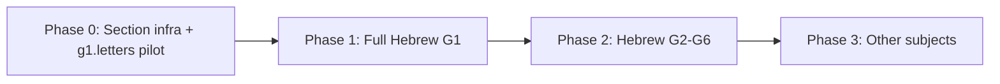

# Learning Book Audio — Full Rollout Plan

**Current phase:** Two pilots only — Hebrew G1 (complete) + Math G1 (in progress). **Stop after Math G1.**  
**Principle:** Pre-generated static audio only — no runtime TTS in student UI

---

## Architecture correction (approved)

**Rejected:** One `page.mp3` per `pageId` / topic.  
**Required:** One MP3 per **visible internal page** (section) inside each topic.

Example: `/learning/book/hebrew/g1/g1.letters` → `עמוד 1 מתוך 7` … `עמוד 7 מתוך 7` — each gets `section-01.mp3` … `section-07.mp3`.

---

## 1. Subjects and grades

| Phase | Scope | Status |
|-------|-------|--------|
| **Pilot 1** | Hebrew G1 — 32 topics, 224 sections | Complete — manual review |
| **Pilot 2 (final)** | Math G1 — 19 topics, 133 sections | In implementation |
| **Stopped** | Hebrew G2–G6, Math G2–G6, English, Geometry, Science, Moledet/Geography | Not until books final + owner approves |

---

## 2. Manifest strategy

### Key format

```
{subject}:{grade}:{pageId}:section:{NN}
```

Example: `hebrew:g1:g1.letters:section:01`

### Manifest file

`lib/learning-book/audio/learning-book-audio-manifest.js`

- Built from `HEBREW_G1_PAGE_ORDER` × 7 sections
- 224 entries for Hebrew G1

### Resolver

`lib/learning-book/audio/resolve-learning-book-audio.js`

- Input: `subject`, `grade`, `pageId`, `sectionNumber` (1-based)
- Output: `{ src, playbackSrc, key, sectionNumber, ... }` or `null`
- Returns `null` for non–Hebrew-G1, invalid pageId, or section out of range
- Never throws

---

## 3. Audio storage

### Hebrew G1 (current)

```
public/audio/learning-books/hebrew/g1/{pageId}/section-{NN}.mp3
```

- 224 MP3 files for full book
- Legacy `page.mp3` removed on generation
- Cache bust via `LEARNING_BOOK_AUDIO_CACHE_VERSION`

### Future (Hebrew G2+, other subjects)

| Option | When | Notes |
|--------|------|-------|
| `/public` static | Hebrew G1 phase | Monitor Git size (~224 files) |
| Object storage + CDN | Before Hebrew G2 | Recommended if total exceeds ~50–100 MB in Git |
| Signed URLs | Private buckets | If access control needed |

Manifest `src` supports relative (`/audio/...`) and absolute (`https://...`) URLs.

---

## 4. Generation pipeline

### Script

`scripts/generate-learning-book-audio.mjs`

```bash
node scripts/generate-learning-book-audio.mjs --subject hebrew --grade g1
node scripts/generate-learning-book-audio.mjs --subject hebrew --grade g1 --pages g1.letters,g1.rhyme
node scripts/generate-learning-book-audio.mjs --subject hebrew --grade g1 --dry-run
```

### Steps

1. Load page IDs from `HEBREW_G1_PAGE_ORDER` (or `--pages` filter)
2. For each topic, for sections 1–7:
   - Extract `spokenScript` via `prepare-hebrew-book-audio-text.js` (one section at a time)
   - TTS via `node-edge-tts` (offline, `he-IL-HilaNeural`)
   - Write `section-NN.mp3`
3. Per-page report: `reports/learning-book-audio/hebrew-g1-{pageId}-section-audio-report.json`
4. Master report: `reports/learning-book-audio/hebrew-g1-full-section-audio-report.json`

### Report row (required fields)

```json
{
  "subject": "hebrew",
  "grade": "g1",
  "pageId": "g1.letters",
  "sectionNumber": 1,
  "sectionIndex": 0,
  "sectionId": "g1.letters:section:01",
  "visiblePage": "1/7",
  "sectionTitle": "מה לומדים?",
  "audioSrc": "/audio/learning-books/hebrew/g1/g1.letters/section-01.mp3",
  "outputPath": "public/audio/learning-books/hebrew/g1/g1.letters/section-01.mp3",
  "spokenScript": "...",
  "bytes": 68400,
  "durationSec": null,
  "prepFlags": {
    "titleStripped": true,
    "sectionNavTitleStripped": true,
    "hyphensNormalized": true,
    "hintsRemoved": true,
    "scaffoldingUnwrapped": true,
    "visualMarkersRemoved": true
  }
}
```

### Build integration

- Script **not** run during `npm run build`
- App runs without MP3s present (fail closed via flags + null resolver when files missing)

---

## 5. Hebrew text preparation rules

Per visible internal page only:

| Include | Exclude |
|---------|---------|
| Child-facing body lines for active section | Book/topic/page titles |
| Nikud as written | Section nav titles (`מה לומדים?`, …) |
| | Hints (`רמז:`), scaffolding labels (unwrapped) |
| | Emojis (`✓`, `❌`), metadata, route IDs |

Hyphen normalization (spoken script only): `-`, `־`, `–`, `—`, non-breaking hyphen between Hebrew letters → space.

Dispatcher: `prepare-learning-book-audio-text.js` → `prepare-hebrew-book-audio-text.js`.

---

## 6. UI component

`components/learning-book/LearningBookAudioPlayer.jsx`

- Props: `subject`, `grade`, `pageId`, `sectionNumber`, `sectionIndex`
- Renders when flag ON **and** resolver returns entry
- Native `<audio>`, no autoplay, no `speechSynthesis`
- Hebrew copy: `האזנה לעמוד`, `טוען שמע...`, `לא ניתן לטעון את השמע כרגע`, `עצור`, `המשך`
- Stops/resets on section change

Wired in `LearningPageBody.js` only.

---

## 7. Feature flags

| Variable | Default | Purpose |
|----------|---------|---------|
| `NEXT_PUBLIC_LEARNING_BOOK_AUDIO_ENABLED` | `false` | Client player visibility |
| `LEARNING_BOOK_AUDIO_ENABLED` | `false` | Generation script gate |

Fail closed: flag OFF → player hidden.

---

## 8. QA

### Automated

```bash
node --test tests/learning/learning-book-audio.test.mjs
node scripts/verify-learning-book-audio.mjs
npm run build
```

Tests cover: section-specific resolver, unique src per section, non–Hebrew-G1 null, stripping, hyphen norm, manifest coverage (32×7).

### Manual (owner)

- Each internal page plays only its own content
- Section navigation stops audio, does not continue previous section
- Mobile Safari / Chrome

---

## 9. Rollout phases



| Phase | Scope | Gate |
|-------|-------|------|
| **0** | Section-level architecture; `g1.letters` proof | Owner validates section isolation |
| **1 (now)** | All 32 Hebrew G1 topics, 224 section MP3s | Manual review |
| **2** | Hebrew G2–G6 | CDN if Git size too large |
| **3** | Math, English, Geometry, Science, Moledet/Geography | Per-subject text prep |

---

## 10. Storage summary (Hebrew G1 target)

| Metric | Value |
|--------|-------|
| Topics (`pageId`) | 32 |
| Internal pages per topic | 7 |
| Total section MP3s | 224 |

Post-generation: check total bytes and largest file in master report. Recommend CDN before Hebrew G2 if Git binary growth is unacceptable.

---

## 11. Known limitations

- Hebrew G1 only in this phase
- No per-section duration metadata yet (`durationSec: null`)
- No reading-tracker integration for audio events
- Local `/public` storage for Hebrew G1

---

## 12. Next stage recommendation

After owner approves Hebrew G1 manual review:

1. Plan CDN migration before Hebrew G2
2. Extend manifest builder pattern to `hebrew-g2-registry.js`
3. Keep section-level audio model for all future subjects
