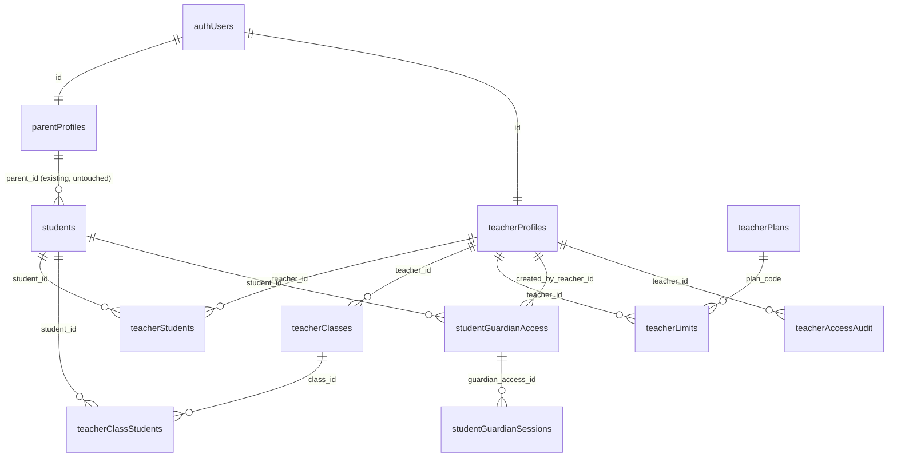

# Teacher Portal Master Plan (Planning-Only)

> This document is the Phase 0 deliverable for the Teacher Portal. It captures the architecture, data model, permission model, reporting strategy, phased implementation plan, risks, and full launch checklist. No product code, DB, RLS, routes, auth, or Hebrew/RTL UI is changed by this document. Architectural decisions are flagged as decided or deferred (with explicit comparison) where relevant.

## Status snapshot (last updated: 2026-05-24)

- **DONE — Phase 0** Master plan — [`docs/teacher-portal/TEACHER_PORTAL_MASTER_PLAN.md`](./TEACHER_PORTAL_MASTER_PLAN.md). *(L1 closed.)*
- **DONE — Phase 1** DB schema proposal — [`docs/teacher-portal/sql-proposals/019_teacher_portal_foundation.md`](./sql-proposals/019_teacher_portal_foundation.md). Markdown proposal only; no `.sql` file under `supabase/migrations/`. *(L2 closed.)*
- **DONE — Phase 2** RLS / Security proposal — [`docs/teacher-portal/RLS_SECURITY_PROPOSAL.md`](./RLS_SECURITY_PROPOSAL.md), plus appended sections in [`docs/security/SECURITY_RISK_REGISTER.md`](../security/SECURITY_RISK_REGISTER.md) and [`docs/security/AUTHORIZATION_AUDIT_PLAN.md`](../security/AUTHORIZATION_AUDIT_PLAN.md). *(L3 closed.)*
- **DONE — Phase 3** API contracts — [`docs/teacher-portal/API_CONTRACTS.md`](./API_CONTRACTS.md). *(L4 closed.)*
- **NEXT — Phase 4** Teacher login + session implementation. *Awaiting explicit owner approval before any work begins.*
- **PENDING** Phases 5, 6, 7, 8, 9. None approved. None started.

> All completed phases were created/updated locally only — **no commit, no push**. The owner commits manually. Approval of one phase does **not** approve the next.

## Decided up-front

- **Identity store (Q1 = C):** Reuse **Supabase Auth** for teachers, but as a **separate logical bucket** with a dedicated `/teacher/login` route, dedicated `teacher_profiles` table, dedicated role checks, and dedicated RLS. **Do not** build custom HMAC teacher auth. The current parent login flow stays untouched.
- **`students.parent_id` schema (Q2 = D):** Schema decision is **deferred** until a full impact audit of all current `parent_id` consumers (RLS, APIs, dashboards, reports, student-login). The plan below compares three options and recommends a long-term direction without applying it.

---

## No-execution boundary (in force right now)

This document is planning-only. While reading or refining this plan, the assistant **must not**:

- Implement any code (no JS/TS edits to product files).
- Apply any database change (no SQL run, no migration file added under `supabase/migrations/`).
- Add or modify any RLS policy.
- Create any new route under `pages/` or `pages/api/`.
- Create or modify any API endpoint.
- Modify any parent flow, student flow, copilot flow, report flow, or auth flow.
- Modify any Hebrew text, RTL layout, design, copy, label, or visible UI string anywhere in the product.
- Run `git commit`, `git push`, or any non-readonly tool.

The only file changes allowed in this phase are markdown documents under `docs/teacher-portal/` and the plan file in `.cursor/plans/`. Even those are **created/updated locally only — no commit, no push**. The owner commits manually when satisfied.

## Hard approval rule

- **Every phase requires separate, explicit owner approval before any execution begins.** Approval of this master plan does **not** approve any phase below.
- Owner approval must be specific: e.g. "approve Phase 1 schema proposal" — generic "looks good" comments do not count as approval.
- Phases must be executed strictly in order: Phase 0 → 1 → 2 → 3 → 4 → 5 → 6 → 7 → 8 → 9. No skipping, no parallel execution, no premature merging across phases.
- Each phase ends with a deliverable file and a stop-and-wait gate. The next phase begins only after the owner approves the previous phase's deliverable in writing.

---

## A. Product goals

- Add a teacher persona alongside parent/student — one teacher manages many students and (later) many classes.
- Initial limit: 20 students per teacher, configurable per teacher/plan, expandable to 50/100/school plans without code changes.
- Teacher can grant a parent/guardian a child-scoped, view-only window onto a single student's learning state — even if that parent never created a regular parent account on the site.
- Re-use the existing diagnostic/report engine for teacher-facing reports and class-level aggregation.
- Zero regressions to: parent auth, parent dashboard, student dashboard, student login, parent reports, Parent Copilot, parent 3-child cap, QA `admin@admin.com` cap of 50, RLS, and Hebrew/RTL UI.

## B. Supported teacher types

- **Private teacher** (default plan = `teacher_basic_20`): manages 1..N individual students; may also organize them into informal groups.
- **Classroom/school teacher**: same identity, with active class/group rosters; gets class-level aggregation in reports.
- **Future school/admin account** (Phase ≥10): tenancy at the school level, multi-teacher org, billing tier — **out of scope** for the initial build but forward-compatible (see Section D, `school_id` column reservations).

## C. Proposed routes

- `/teacher/login` — new page; same UX shell as `/parent/login` but completely independent.
- `/teacher/dashboard` — landing area: overview cards, "my students", "my classes".
- `/teacher/class/[classId]` — class roster + class-level report.
- `/teacher/student/[studentId]` — single-student deep view + report.
- `/teacher/access/[studentId]` — manage teacher-issued parent/guardian access for that student (revoke, rotate PIN, view audit log).
- `/teacher/reports` — (optional, Phase 7+) cross-class report index.
- `/parent/login` — **unchanged in every phase of this plan.** No UI text, layout, label, or behavior of `/parent/login` is modified by Phases 0–9. Any future "access provided by teacher" / "teacher-issued guardian access" login mode on `/parent/login` is **out of scope** until the owner explicitly approves it in a separate, named follow-up phase (tentatively Phase 10). Until that explicit approval, guardian-session sign-in (Section F) does **not** appear on `/parent/login` at all and is reachable only from a separate non-public route that the owner controls.

Routing/auth posture mirrors current site: client-side guards on `/teacher/*` pages (Supabase session check + role check), no Next.js middleware introduced.

## D. Proposed data model

All new tables prefixed `teacher_*` (or `student_guardian_access` to avoid colliding with future generic guardian concepts). New migration file: `supabase/migrations/019_teacher_portal_foundation.sql` (not applied in this phase).

- **`teacher_profiles`** — mirrors `parent_profiles`:
  - `id uuid PK references auth.users(id) on delete cascade`
  - `display_name text`, `preferred_language text`, `timestamps`
  - `school_id uuid null` (reserved for future school accounts; nullable until then)
  - `is_active boolean not null default true`
  - Auto-provisioned on signup via trigger **only if** the `auth.users.app_metadata.role === 'teacher'` flag is set (so a parent signup never accidentally creates a teacher profile). Decision point: choose between (a) trigger gated by `app_metadata`, or (b) explicit server-side insert from a `/api/teacher/onboard` route called after a special signup flow. **Recommend (b)** to keep the existing parent trigger untouched.

- **`teacher_students`** — explicit teacher↔student links, the *non-owning* relation:
  - `id uuid PK`, `teacher_id`, `student_id`, `relationship text` (`primary_teacher`, `subject_teacher`, `tutor`), `created_at`, `archived_at null`, `notes text null`
  - Unique on `(teacher_id, student_id)`.
  - This table never replaces `students.parent_id`.

- **`teacher_classes`**:
  - `id`, `teacher_id`, `name text`, `grade_level text null`, `subject_focus text null`, `is_archived boolean`, timestamps.

- **`teacher_class_students`**:
  - `id`, `class_id`, `student_id`, `joined_at`, `removed_at null`. Unique active membership per (class, student).

- **`teacher_plans`** — plan catalogue:
  - `code text PK` (`teacher_basic_20`, `teacher_pro_50`, `teacher_school_unlimited`, ...)
  - `student_limit int`, `class_limit int`, `description text`, `is_active boolean`.
  - Seeded once; no per-row teacher data here.

- **`teacher_limits`** — per-teacher overrides (optional):
  - `teacher_id PK/FK`, `plan_code FK`, `student_limit_override int null`, `class_limit_override int null`, `effective_until timestamptz null`.
  - Resolution helper `resolveTeacherStudentLimit(teacherId)` precedence: override → plan → default 20. Mirrors `resolveParentStudentLimit` in [`lib/parent-server/parent-student-limit.server.js`](../../lib/parent-server/parent-student-limit.server.js).

- **`student_guardian_access`** — teacher-issued, child-scoped guardian credential:
  - `id uuid PK`, `student_id uuid FK students(id) on delete cascade`
  - `created_by_teacher_id uuid FK teacher_profiles(id)`
  - `login_username text` (unique-active globally, enforced like `student_access_codes.login_username`)
  - `code_hash text`, `pin_hash text` (HMAC-SHA256, identical pattern to [`student_access_codes`](../../supabase/migrations/001_learning_core_foundation.sql))
  - `is_active boolean`, `revoked_at`, `expires_at null`, `created_at`, `updated_at`
  - `delivery_channel text` (`code`, `magic_link`, `email_invite`)
  - `notes text null`
  - **Hard invariant:** exactly one student per row. Never references multiple students. Never grants access to anything other than that student's report.

- **`student_guardian_sessions`** — runtime session for teacher-issued guardian login (mirrors `student_sessions`):
  - `id`, `guardian_access_id`, `session_token_hash`, `created_at`, `expires_at`, `revoked_at null`, `user_agent text null`, `ip_hash text null`.

- **`teacher_access_audit`** — append-only audit:
  - `id`, `teacher_id`, `student_id`, `action text` (`grant_created`, `grant_revoked`, `pin_rotated`, `username_rotated`, `viewed_report`, `magic_link_sent`, `guardian_login_success`, `guardian_login_failed`), `actor_role text`, `metadata jsonb`, `created_at`.

- **(Optional) `teacher_access_invitations`** — short-lived magic-link tokens that bootstrap a `student_guardian_access` row:
  - `id`, `student_id`, `teacher_id`, `token_hash`, `expires_at`, `consumed_at null`, `created_at`.

- **No changes** to `students`, `parent_profiles`, `student_access_codes`, `student_sessions`, `learning_sessions`, `answers`, `student_learning_state`, or `parent_policy_acceptances` in this phase. See Section J for the deferred decision on `students.parent_id` nullability.

### Diagram

## E. Permission model

- Teacher can **read** only students that exist in `teacher_students` for their `teacher_id`, OR are members of a class in `teacher_classes` they own.
- Teacher can **write** student management ops (link/unlink, class membership, class CRUD, guardian-access CRUD) only on their own teacher↔student/class rows.
- Teacher **never** sees `parent_profiles.id`, `auth.users.email` for parents, or any other student's data outside the linked set.
- Parent reports remain unchanged: parent JWT continues to satisfy `students_parent_full_access` RLS via `parent_id = auth.uid()`.
- Student progress remains unified — teacher views aggregate the **same** `learning_sessions`/`answers` rows the parent already sees. No duplicate student records, no shadow learning history.
- Teacher-issued guardian sessions can only `SELECT` report data for the **single** `student_id` listed in their `student_guardian_access` row. They cannot list other students, cannot create access codes, cannot use Parent Copilot, cannot edit the student profile.
- Revocation: teacher can revoke a guardian access at any time → flips `is_active=false`, `revoked_at=now()`, also invalidates all `student_guardian_sessions` rows for that access.
- Audit: every grant, revoke, PIN/username rotate, and guardian-login attempt writes a row to `teacher_access_audit`.

### RLS sketch (planning-only — to be hardened in Phase 2)

- `teacher_profiles`: select/update own row by `id = auth.uid()` (mirrors parent).
- `teacher_students`, `teacher_classes`, `teacher_class_students`, `teacher_limits`: full CRUD on rows where `teacher_id = auth.uid()`.
- `students` (existing): **no policy change**. Teacher API access uses **service-role + manual gate** by joining `teacher_students`/`teacher_class_students`. This intentionally mirrors how student-side APIs already work today (RLS-on, service-role + app-checks).
- `student_guardian_access`, `teacher_access_audit`, `student_guardian_sessions`: RLS enabled, **no client policies** — server-only, service-role-mediated (matches `student_learning_state` and `parent_policy_acceptances` pattern in [`017`](../../supabase/migrations/017_student_learning_state.sql) and [`018`](../../supabase/migrations/018_parent_policy_acceptances.sql)).

## F. Parent access via teacher (the new requirement)

### Lifecycle

1. **Create:** teacher opens `/teacher/student/[studentId]`, clicks "create parent access". Backend (`POST /api/teacher/student-access/create`) validates `teacher_students` link → inserts `student_guardian_access` row → returns username + plaintext PIN **shown once**. Same UX/security pattern as [`pages/api/parent/create-student-access-code.js`](../../pages/api/parent/create-student-access-code.js).
2. **Deliver:** teacher communicates credentials to parent out-of-band (paper, secure messaging, optional email magic-link). The optional `teacher_access_invitations` table supports a tokenized URL that auto-fills the username on first login.
3. **Login:** the guardian visits a dedicated, owner-controlled route (e.g. `/guardian/login`, *not* `/parent/login`) and authenticates against `student_guardian_access` (not `auth.users`) via `POST /api/guardian/login`. On success, the server issues a separate cookie-based session **`liosh_guardian_session`** (HMAC, mirrors `liosh_student_session` in [`lib/learning-supabase/student-auth.js`](../../lib/learning-supabase/student-auth.js)). `/parent/login` is **not** touched. A future merge of guardian sign-in into `/parent/login` is a separate, owner-approved future phase (Phase 10) and is *not* part of Phase 8.
4. **View:** the guardian session can ONLY hit `GET /api/guardian/student/[studentId]/report-data` where `studentId === guardian_access.student_id`. Anything else → 403.
5. **Revoke / rotate / expire:** teacher dashboard exposes "revoke" (sets `revoked_at`, kills sessions) and "rotate PIN/username". Optional `expires_at` for time-boxed access (e.g. parent–teacher conference week).
6. **Audit:** every step writes to `teacher_access_audit`.

### What guardian-session sees / does not see

- **Sees:** the assigned student's read-only report (read-only adapter of [`pages/api/parent/students/[studentId]/report-data.js`](../../pages/api/parent/students/[studentId]/report-data.js) — *same data, different auth gate*).
- **Does NOT see:** other students, parent dashboard, parent profile, copilot Q&A, child management UI, coin/inventory mutations, teacher tools, classes.
- **Does NOT become** a parent account in `auth.users`. Cannot upgrade to a parent account automatically; if the same human later creates a real parent account, it is unrelated until product explicitly designs a merge flow (out of scope here).

### Credential mechanism — recommendation

- Phase 8 ships **username + 4-digit PIN** + optional **single-use magic-link bootstrap** (signed token, 7-day expiry, single consumption). Both flows materialize the **same** `student_guardian_access` row.
- Reasons: matches existing student-credential primitive; works without parent email; magic-link supports easy onboarding for parents who do have email.
- No password reset emails because there is no email-of-record by default; reset = teacher rotates PIN.

### Disambiguation from real parent accounts

- Separate login URL (`/guardian/login`) — never on `/parent/login`. Any future merge into `/parent/login` requires explicit owner approval (Phase 10).
- Different cookie name (`liosh_guardian_session`) and a different session table (`student_guardian_sessions`).
- Different rendered shell: a stripped report-only page (e.g. `/guardian/view`) without the parent dashboard chrome, child list, or copilot.
- A small "limited access" badge is planned for that shell, but the badge text — and any other guardian-shell UI string — is **kept hidden behind a feature flag that ships disabled** until the owner explicitly approves Hebrew copy for it. **No visible English placeholder UI is allowed on production.** If the flag is ever flipped on without approved Hebrew copy, the page must render no badge/labels rather than show English fallback text.
- Server-side role check on every guardian endpoint to reject any attempt to call `/api/parent/*` or `/api/teacher/*` routes.

## G. Reporting model

- **Teacher single-student report**: thin authorization adapter over the parent report aggregator. Reuses [`aggregateParentReportPayload`](../../lib/parent-server/report-data-aggregate.server.js) and the diagnostic stack (`utils/diagnostic-engine-v2/*`, `utils/parent-report-row-diagnostics.js`, `utils/learning-diagnostics/*`). New gate: ownership via `teacher_students` instead of `parent_id`.
- **Class/group report**: new `lib/teacher-server/class-report-aggregate.server.js` calls the per-student aggregator for each member, then merges into class-level summary fields (cohort accuracy, subject heatmap, mastery distribution, attention list).
- **Class-level aggregation**: cohort metrics — class accuracy, daily activity, subject coverage, weakness heatmap by topic, mastery distribution.
- **Subject/topic weakness map**: derived from existing `runDiagnosticEngineV2` per-student outputs aggregated by topic taxonomy.
- **Student risk/attention list**: rule-based ranking on top of diagnostic units (e.g. count of `weakness_high_priority` units, low-confidence + high-recurrence rows, inactivity > X days).
- **Teacher recommendations for next lesson**: derived from class weakness map + per-student top diagnostic units. Initial deterministic; LLM later (Section H).
- **Guardian-view report**: same shape as the parent report, served through guardian-session auth gate, with stripped header/UX. No copilot.

### Storage strategy

Compute on read in Phase 6/7 to avoid a new persistence layer. Add caching/materialized views only when measured class sizes (>30 students × ~10 classes) demand it (Phase 11+, out of scope here).

## H. Diagnostic engine integration

- **Reused as-is**: `utils/parent-report-v2.js`, `utils/detailed-parent-report.js`, `utils/parent-report-row-diagnostics.js`, `utils/diagnostic-engine-v2/*`, `utils/learning-diagnostics/*`, `utils/parent-report-insights/*`, the DB-input adapter [`lib/learning-supabase/report-data-adapter.js`](../../lib/learning-supabase/report-data-adapter.js), and the server-rebuild bridge [`lib/parent-server/db-input-to-detailed-report.server.js`](../../lib/parent-server/db-input-to-detailed-report.server.js).
- **New aggregation layer needed**: `lib/teacher-server/class-aggregate.server.js` (cohort rollups), `lib/teacher-server/teacher-recommendations.server.js` (instructional next-step heuristics).
- **Differences from Parent Copilot**:
  - Tone: instructional vs parental.
  - Action surface: lesson plans, group differentiation, intervention prioritization vs home practice.
  - Privacy boundary: teacher must NOT see other students; parent boundary stayed at single child.
  - Currently the [`runDeterministicCore`](../../utils/parent-copilot/index.js) explicitly rejects non-parent audiences (returns clarification). This means **Teacher Copilot needs new code paths**, not just a flag flip — a future phase, not Phase 1–8.
- **Teacher Copilot (Phase 12+, out of scope)**: reuse truth-packet/guardrail/router scaffolding, replace parent-language layer (`utils/parent-report-language/*`) with teacher-language layer, replace parent recommendation contracts with teacher recommendation contracts. Validator's hard fail on `audience !== "parent"` (line ~474 of `utils/parent-copilot/guardrail-validator.js`) must be relaxed/forked.
- **Teacher- vs parent-facing recommendations**: yes, they should differ. Parent recs target home environment + emotion + short routines; teacher recs target lesson sequencing, grouping, and intervention triage. Different language packs, different action codes.

## I. Step-by-step implementation phases

> Each phase below is gated. Owner approval is required before each phase begins. All phase deliverables are **created/updated locally only — no commit, no push**; the owner commits manually.

- **`[DONE 2026-05-24]` Phase 0 — Planning only (this doc).** No code/DB changes. Output **created/updated locally only — no commit, no push** to `docs/teacher-portal/`. Phase 0 ends when the owner approves the master plan. *Owner approval received; deliverable: [`TEACHER_PORTAL_MASTER_PLAN.md`](./TEACHER_PORTAL_MASTER_PLAN.md).*
- **`[DONE 2026-05-24]` Phase 1 — DB schema proposal.** Draft `019_teacher_portal_foundation.sql` as a *proposal file under `docs/teacher-portal/sql-proposals/`* (**not** under `supabase/migrations/`). Include: all `teacher_*` tables, `student_guardian_access`, `student_guardian_sessions`, `teacher_access_audit`, `teacher_access_invitations`, seed data for `teacher_plans`. Saved to repo for review only; **do not run against any environment**, **no commit, no push**. Stop and wait for owner approval. *Owner approval received; delivered as markdown proposal at [`sql-proposals/019_teacher_portal_foundation.md`](./sql-proposals/019_teacher_portal_foundation.md). The `.sql` filename remains reserved.*
- **`[DONE 2026-05-24]` Phase 2 — RLS/security proposal.** Per-table RLS policies, server-only patterns, service-role usage, audit posture written to a new `docs/teacher-portal/RLS_SECURITY_PROPOSAL.md`. Add a per-table threat-model entry to `docs/security/SECURITY_RISK_REGISTER.md` and update [`docs/security/AUTHORIZATION_AUDIT_PLAN.md`](../security/AUTHORIZATION_AUDIT_PLAN.md) with new persona bands `TEACHER` and `GUARDIAN_VIEW`. Doc edits **only** — no SQL applied. **No commit, no push.** Stop and wait for owner approval. *Owner approval received; deliverables: [`RLS_SECURITY_PROPOSAL.md`](./RLS_SECURITY_PROPOSAL.md), appended sections in [`SECURITY_RISK_REGISTER.md`](../security/SECURITY_RISK_REGISTER.md) and [`AUTHORIZATION_AUDIT_PLAN.md`](../security/AUTHORIZATION_AUDIT_PLAN.md).*
- **`[DONE 2026-05-24]` Phase 3 — APIs (proposal — docs only).** *Owner approval received; deliverable: [`API_CONTRACTS.md`](./API_CONTRACTS.md).*

  Original spec (preserved): Document every endpoint contract in `docs/teacher-portal/API_CONTRACTS.md`:
  - `/api/teacher/onboard`, `/api/teacher/me`, `/api/teacher/students`, `/api/teacher/students/link`, `/api/teacher/students/unlink`, `/api/teacher/students/[studentId]/report-data`, `/api/teacher/classes/*`, `/api/teacher/student-access/*`, `/api/teacher/audit`.
  - `/api/guardian/login`, `/api/guardian/logout`, `/api/guardian/me`, `/api/guardian/student/report-data`.
  - Inline-check pattern, no new framework, mirroring parent API style. Plan helpers `lib/teacher-server/teacher-session.server.js` (parallel to `lib/parent-server/policy-acceptance.server.js`'s `resolveAuthenticatedParentUserId`) and `lib/guardian-server/guardian-session.server.js` (parallel to [`lib/learning-supabase/student-auth.js`](../../lib/learning-supabase/student-auth.js)). **No code, no API files** in Phase 3 — contracts only. **No commit, no push.** Stop and wait for owner approval.
- **`[NEXT — awaiting approval]` Phase 4 — Teacher login/session (implementation).** Build `pages/teacher/login.js`, role-aware Supabase signup, `teacher_profiles` provisioning RPC, and a client-side redirect guard on `/teacher/*` mirroring the parent dashboard pattern. **All visible UI strings remain hidden behind a feature flag that ships disabled** until the owner approves Hebrew copy. No English placeholder text on production. **No commit, no push.** Stop and wait for owner approval.
- **Phase 5 — Teacher dashboard (implementation).** `pages/teacher/dashboard.js` listing students + classes; CRUD for `teacher_students`/`teacher_classes`. **Link-only** student management — teacher cannot create new student rows in this phase (see Section J: "Teacher-side student creation deferred"). Configurable limit honored (default 20). UI strings stay flag-gated until Hebrew approved. **No commit, no push.** Stop and wait for owner approval.
- **Phase 6 — Teacher single-student report (implementation).** `pages/teacher/student/[studentId].js` calling `/api/teacher/students/[studentId]/report-data`. Reuses parent report rendering components without modifying parent logic. UI strings stay flag-gated until Hebrew approved. **No commit, no push.** Stop and wait for owner approval.
- **Phase 7 — Class report (implementation).** `pages/teacher/class/[classId].js` + `lib/teacher-server/class-aggregate.server.js`. UI strings flag-gated. **No commit, no push.** Stop and wait for owner approval.
- **Phase 8 — Teacher-issued parent/guardian access (implementation).** Tables, APIs, magic-link bootstrap, audit, revoke flow, and a separate `/guardian/login` + `/guardian/view` shell. **`/parent/login` is not modified.** No Hebrew text and no visible English placeholder strings; the entire guardian shell ships behind a feature flag that is **disabled by default** until Hebrew copy is owner-approved. **No commit, no push.** Stop and wait for owner approval.
- **Phase 9 — QA / security gates.** Cross-tenant tests (teacher A ↔ teacher B, teacher ↔ parent, guardian-session ↔ other students), full regression sweep on parent + student dashboards, RLS unit tests, audit completeness checks, IDOR matrix. Consult [`docs/security/PARENT_STUDENT_OWNERSHIP_BOUNDARY_PLAN.md`](../security/PARENT_STUDENT_OWNERSHIP_BOUNDARY_PLAN.md) and [`docs/security/SUPABASE_RLS_SERVICE_ROLE_AUDIT_PLAN.md`](../security/SUPABASE_RLS_SERVICE_ROLE_AUDIT_PLAN.md). Sign-off written to a new `docs/security/TEACHER_PORTAL_SECURITY_PLAN.md`. **No commit, no push.** Stop and wait for owner approval.

## J. Risks and questions

- **Schema decision deferred (Q2 = D).** Three options for the case "teacher creates a student who has no parent account":
  - **Virtual parent (short-term bridge):** every onboarded teacher gets one system-owned `parent_profiles` + `auth.users` row; teacher-created students belong to that virtual parent. Pro: no schema change, all parent flows keep working. Con: `parent_id` no longer means "the human guardian"; `parent_profiles` becomes polluted; QA can confuse virtual and real parents.
  - **Nullable `parent_id` + `origin_teacher_id` (preferred long-term, requires audit):** make `students.parent_id NULLABLE`; add `students.origin_teacher_id uuid null`. Update `students_parent_full_access` RLS to use `parent_id = auth.uid()` (still works for null = no match), add a parallel `students_teacher_owned` policy gated through `teacher_students`. Pro: cleanest data model. Con: every consumer of `parent_id` must be re-audited — see [`pages/api/parent/list-students.js`](../../pages/api/parent/list-students.js), [`pages/api/parent/create-student.js`](../../pages/api/parent/create-student.js), [`pages/api/parent/students/[studentId]/report-data.js`](../../pages/api/parent/students/[studentId]/report-data.js), [`016_parent_delete_owned_student_rpc.sql`](../../supabase/migrations/016_parent_delete_owned_student_rpc.sql), all RLS in [`001_learning_core_foundation.sql`](../../supabase/migrations/001_learning_core_foundation.sql), and the legal copy constant `NORMAL_PARENT_CHILD_LIMIT` in `data/legal/sitePolicies.he.js`.
  - **Separate `teacher_only_students` table (last resort):** duplicate schema for teacher-created students. Pro: zero risk to existing tables. Con: enormous duplication — `learning_sessions`, `answers`, `student_learning_state`, `student_access_codes`, arcade FKs, gamification, all need union views. Effectively forbidden.
  - **Decision rule:** ship Phase 1–7 against **only existing students that already have parents** (so teachers initially can only link, not create). Defer the schema decision to Phase 8+ after the audit produces a concrete impact list.
- **Privacy / legal:** child PII flowing to a third party (the teacher). Need a teacher-side acceptance of an instructional-data-handling policy mirroring the parent policy in [`018_parent_policy_acceptances.sql`](../../supabase/migrations/018_parent_policy_acceptances.sql). Coordinate with `docs/legal/`.
- **Parent/guardian consent for teacher access:** when a teacher links a student that already has a parent account, should the parent be notified or asked to consent? Recommend: yes, with parent toggle on parent dashboard "allow teachers to link my children". Default off until product decides. **Open product question — do not assume.**
- **Student consent:** out of scope at the legal level — students are minors. Track in `docs/legal/` register.
- **Multiple teachers per student:** supported via many-to-many `teacher_students`. Audit logs must distinguish actor teacher.
- **Limit expansion:** all expansion done via `teacher_plans` + `teacher_limits` rows, no code changes. Ensure no limit constant ever ships hardcoded in API error strings (avoid the existing parent quirk where the error always says "3" even for QA's 50; see [`pages/api/parent/create-student.js`](../../pages/api/parent/create-student.js)).
- **Reporting performance:** class-of-30 calls 30× the per-student aggregator. Plan budget < 1500ms p50, < 4000ms p95 per class report. If exceeded, add a per-student cache keyed on `(student_id, max(answers.answered_at))` before adding materialized views.
- **Teacher-side student creation deferred (hard rule).** The first implementation (Phases 4–8) is **link-only**. A teacher cannot create new student rows; they can only link to students that already exist with a real parent owner. This stays in force until **all** of the following are complete and owner-approved: (1) full impact audit of every consumer of `students.parent_id` (RLS in [`001_learning_core_foundation.sql`](../../supabase/migrations/001_learning_core_foundation.sql), [`pages/api/parent/list-students.js`](../../pages/api/parent/list-students.js), [`pages/api/parent/create-student.js`](../../pages/api/parent/create-student.js), [`pages/api/parent/students/[studentId]/report-data.js`](../../pages/api/parent/students/[studentId]/report-data.js), [`016_parent_delete_owned_student_rpc.sql`](../../supabase/migrations/016_parent_delete_owned_student_rpc.sql), arcade auth, student auth, learning APIs, the legal-copy constant `NORMAL_PARENT_CHILD_LIMIT` in `data/legal/sitePolicies.he.js`); (2) explicit owner choice between virtual-parent / nullable-`parent_id` / `teacher_only_students`; (3) a separate, named follow-up phase plan with its own approval gate.
- **Avoiding regressions:** strict no-touch list — `pages/api/parent/*`, `lib/parent-server/*`, `pages/parent/*`, `lib/learning-supabase/student-auth.js`, [`utils/parent-copilot/*`](../../utils/parent-copilot/index.js) (audience guardrail), all current migrations, all Hebrew copy in `data/legal/sitePolicies.he.js`, `utils/parent-report-language/*`, `docs/PARENT_REPORT_HEBREW_STYLE_GUIDE.md`. New code lives in `lib/teacher-server/*`, `lib/guardian-server/*`, `pages/api/teacher/*`, `pages/api/guardian/*`, `pages/teacher/*`, `pages/parent/guardian-view/*`.
- **Cross-parent exposure:** explicit unit tests prove a guardian session can ONLY read its assigned student's report; a teacher session can ONLY read linked students' reports. Mirrors the existing IDOR matrix in [`docs/security/PARENT_STUDENT_OWNERSHIP_BOUNDARY_PLAN.md`](../security/PARENT_STUDENT_OWNERSHIP_BOUNDARY_PLAN.md).
- **Temporary vs permanent guardian access:** support both via `expires_at NULL = permanent`. Default UX picks "until revoked"; product can later switch the default to a 30-day expiry without a migration.

## K. Acceptance criteria for Phase 0 (this plan)

- No product code edited.
- No Hebrew text, RTL layout, label, copy, or visible UI string changed.
- No DB migration applied.
- No RLS policy changed.
- No route, API, or middleware created.
- No parent / student / copilot / report / auth flow modified.
- No commit, no push — markdown-only, **created/updated locally only**; the owner commits manually.
- Architecture clear for: teacher identity (Supabase Auth, separate logical role), teacher↔student model, classes, plans/limits, guardian access, audit.
- Phases 1–9 enumerated with concrete file paths, contract sketches, and per-phase approval gates.
- Risks list explicit, with named open questions and decision rules.
- QA plan referenced (Phase 9 hooks into existing security audit docs).
- Teacher-issued guardian access flow fully described as a separate flow from regular parent accounts, with no UI on `/parent/login`.
- Document **created/updated locally only — no commit, no push** at `docs/teacher-portal/TEACHER_PORTAL_MASTER_PLAN.md` after the owner explicitly approves the content.

## L. Full end-to-end launch checklist (start → final launch)

> Each item is a separate gate. The owner approves each one in writing before the next begins. No item may be skipped, batched, or auto-completed.

- [x] **L1. Architecture approval (this master plan).** Owner reviews and explicitly approves the master plan in `docs/teacher-portal/TEACHER_PORTAL_MASTER_PLAN.md`. *(Phase 0 exit gate.)* — **closed 2026-05-24.**
- [x] **L2. DB schema proposal approved.** `docs/teacher-portal/sql-proposals/019_teacher_portal_foundation.sql` reviewed; no application to any environment. *(Phase 1 exit gate.)* — **closed 2026-05-24.** Delivered as markdown proposal at [`docs/teacher-portal/sql-proposals/019_teacher_portal_foundation.md`](./sql-proposals/019_teacher_portal_foundation.md); the `.sql` filename remains reserved (no `019_*.sql` exists under `supabase/migrations/`).
- [x] **L3. RLS / security proposal approved.** `docs/teacher-portal/RLS_SECURITY_PROPOSAL.md` + updates to `docs/security/SECURITY_RISK_REGISTER.md` and `docs/security/AUTHORIZATION_AUDIT_PLAN.md` reviewed. *(Phase 2 exit gate.)* — **closed 2026-05-24.**
- [x] **L4. API contracts approved.** `docs/teacher-portal/API_CONTRACTS.md` reviewed; no API code written. *(Phase 3 exit gate.)* — **closed 2026-05-24.**
- [ ] **L5. Teacher login + session implemented & owner-approved.** `pages/teacher/login.js`, `teacher_profiles` provisioning, role guards. UI strings remain flag-gated/hidden. *(Phase 4 exit gate.)*
- [ ] **L6. Teacher dashboard (link-only) implemented & owner-approved.** Configurable limit (default 20). No teacher-side student creation. *(Phase 5 exit gate.)*
- [ ] **L7. Teacher single-student report implemented & owner-approved.** Reuses diagnostic engine; new ownership gate. *(Phase 6 exit gate.)*
- [ ] **L8. Class / group report implemented & owner-approved.** Cohort aggregation; no caching unless measured need. *(Phase 7 exit gate.)*
- [ ] **L9. Teacher-issued parent/guardian access implemented & owner-approved.** Tables, APIs, magic-link, revoke, audit, separate `/guardian/login` + `/guardian/view` shell behind a disabled feature flag. **`/parent/login` not modified.** *(Phase 8 exit gate.)*
- [ ] **L10. Legal / privacy review approved.** Teacher acceptance policy mirroring [`018_parent_policy_acceptances.sql`](../../supabase/migrations/018_parent_policy_acceptances.sql); guardian-access privacy posture; coordination with `docs/legal/`. Owner sign-off written to a new `docs/legal/TEACHER_PORTAL_LEGAL_PLAN.md`.
- [ ] **L11. Hebrew copy approved.** Owner approves all Hebrew strings for: `/teacher/login`, `/teacher/dashboard`, `/teacher/class/[classId]`, `/teacher/student/[studentId]`, `/teacher/access/[studentId]`, `/guardian/login`, `/guardian/view`, all teacher/guardian API error messages, all email/magic-link copy. **Only after this gate may any UI string be flipped from flag-disabled to visible.** No English placeholder UI is allowed on production at any prior step.
- [ ] **L12. QA / security gates passed.** Internal QA per `docs/security/TEACHER_PORTAL_SECURITY_PLAN.md`. *(Phase 9 exit gate.)*
- [ ] **L13. Parent / student regression suite passed.** Full re-run of parent dashboard, parent reports, Parent Copilot, student login, student dashboard, arcade, learning sessions, parent policy acceptance, student access codes — all unchanged behavior verified.
- [ ] **L14. Cross-tenant / IDOR tests passed.** Teacher A cannot read teacher B's students, classes, or audit. Teacher cannot read other teachers' guardian-access rows. Guardian-session cannot read any student other than its own. Parent cannot read teacher routes. Student cannot read teacher routes. Anonymous cannot read any of the above. Mirrors and extends the matrix in [`docs/security/PARENT_STUDENT_OWNERSHIP_BOUNDARY_PLAN.md`](../security/PARENT_STUDENT_OWNERSHIP_BOUNDARY_PLAN.md).
- [ ] **L15. Final owner sign-off → launch.** Owner explicitly approves production rollout. Only at this point does any feature flag get enabled in production. Final commit and push are performed manually by the owner.

---

## Phase 0 deliverable inventory

- Folder `docs/teacher-portal/` — created locally.
- File `docs/teacher-portal/TEACHER_PORTAL_MASTER_PLAN.md` — this document, in English, technical identifiers preserved.
- **Created/updated locally only — no commit, no push.** The owner commits manually.
- No other file changes anywhere.
