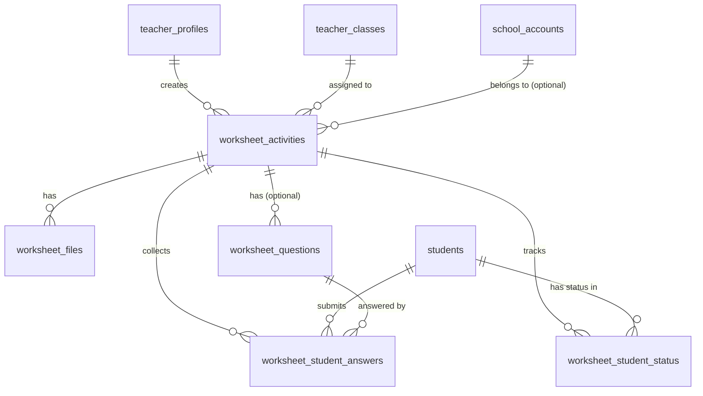

# Worksheet PDF Activities — Full Implementation Plan

**Status:** Ready for owner approval. All decisions are closed. No open questions remain as blockers.
**Date:** 2026-05-27
**Author:** AI assistant (Cursor)

---

## Workflow Rules (Mandatory — Apply After Owner Approval)

After owner approval, implement the full approved Worksheet PDF Activities scope from start to finish according to this plan. Phases are internal execution order only, not stop-and-wait approval gates. Complete implementation first, then run QA, fix issues, and produce a final closure report.

Additional rules that apply throughout implementation:
- SQL/migrations may be prepared as files, but must NOT be run by Cursor. The owner applies SQL manually in Supabase.
- No commit. No push. The owner commits manually after reviewing all changes.
- The existing automatic classroom activity system must not be changed in any way. Worksheet activities are a standalone separate type only.
- Do not attach PDFs to existing regular automatic activities. Do not modify existing activity routes, server modules, or DB tables.

---

## Table of Contents

1. [Product Summary](#1-product-summary)
2. [Final Decisions](#2-final-decisions)
3. [Explicit Non-Goals (First Implementation)](#3-explicit-non-goals)
4. [Current Repo Findings](#4-current-repo-findings)
5. [Existing Files/Modules Affected](#5-existing-filesmodules-affected)
6. [Proposed Data Model](#6-proposed-data-model)
7. [Proposed Storage Model](#7-proposed-storage-model)
8. [API Plan](#8-api-plan)
9. [UI/UX Flow Plan](#9-uiux-flow-plan)
10. [Permissions and Security Plan](#10-permissions-and-security-plan)
11. [Reporting Plan](#11-reporting-plan)
12. [Migration/SQL Plan](#12-migrationsql-plan)
13. [Implementation Phases (Execution Order)](#13-implementation-phases-execution-order)
14. [Proposed Hebrew UI Copy](#14-proposed-hebrew-ui-copy)
15. [QA and Acceptance Criteria](#15-qa-and-acceptance-criteria)
16. [Resolved Default Decisions](#16-resolved-default-decisions)
17. [Risks and Mitigations](#17-risks-and-mitigations)

---

## 1. Product Summary

A **Worksheet PDF Activity** (דף עבודה) is a new, standalone activity type that lives alongside — but completely separate from — the existing automatic classroom activities. A teacher uploads a PDF worksheet, sets a physical submission deadline, and sends it to a class. Students download/open the PDF, solve it physically, and optionally enter digital answers. The teacher can grade responses manually, apply an answer key for auto-gradable question types, and publish results to students after review.

The existing automatic activity system (question generation, auto-grading, live-lesson, guided-practice modes) is **not modified in any way**.

---

## 2. Final Decisions

| # | Decision | Rationale |
|---|----------|-----------|
| D1 | New separate `worksheet_activities` tables, not extending `classroom_activities` | Avoids any risk to existing activity flow, reports, and diagnostics |
| D2 | PDF-only Supabase Storage bucket (`worksheet-pdfs`), private | Supabase is already in use; no new storage provider needed |
| D3 | PDF only — no Word, ZIP, images, executables | Product requirement; validated server-side by content-type + magic bytes |
| D4 | Student does NOT upload files | Out of scope for first implementation |
| D5 | No automatic grade publishing | Teacher must explicitly publish/approve any result |
| D6 | Auto-grading only for: multiple_choice, true_false, numeric | Free text / explanation always requires manual review |
| D7 | Diagnostic engine NOT connected | Worksheet questions are not mapped to topic/subtopic in Phase 1–5 |
| D8 | RLS on all new tables: enabled, no client policies (service-role only) | Matches existing activity pattern exactly |
| D9 | All new API routes under `/api/teacher/worksheet-activities/*` and `/api/student/worksheet-activities/*` | Parallel to existing `/api/teacher/activities/*` structure |
| D10 | Worksheet activities appear in student report as a separate clearly-labelled section | Not mixed with diagnostic engine results |
| D11 | School manager can view worksheet activity summaries for their school (read-only) | Parallel to existing school activity visibility |
| D12 | `teacher_access_audit` action list extended in new migration (029) | Keeps audit consistent |
| D13 | Soft-delete only — archiving activity does not physically delete PDF | Preserves data integrity; physical deletion is a future explicit action |

---

## 3. Explicit Non-Goals

The following will NOT be implemented in any phase of this plan:

- Student uploading completed worksheet files back to the system
- OCR or handwriting recognition
- AI grading of free-text answers
- Editing, annotating, or drawing on PDFs in the browser
- Attaching PDFs to existing automatic classroom activities
- Converting any existing classroom activity into a worksheet activity
- Deep diagnostic engine integration (topic/subtopic/skill mapping for worksheet answers)
- Parent-facing worksheet feedback before teacher review is complete
- Public file links (all PDF access requires authentication + signed URLs)
- Full teacher file library or multi-PDF management
- Feature flags (no technical reason for them in this implementation)

---

## 4. Current Repo Findings

### 4.1 Stack

| Area | Finding |
|------|---------|
| Framework | Next.js 15, **Pages Router** (`pages/`), not App Router |
| Language | JavaScript (`.js`, `.jsx`) with JSDoc — minimal TypeScript |
| Database | Supabase Postgres, service-role API pattern |
| Auth | Teacher: JWT via `requireTeacherApiContext()`; Student: PIN session; School manager: `requireSchoolManagerApiContext()` |
| Storage | **Supabase Storage SDK installed as transitive dep but NOT used in any app code today** — zero `storage.from(...)` calls in `pages/` or `lib/` |
| PDF tools | `html2pdf.js`, `jspdf`, `jspdf-autotable` — used only for generating/exporting parent reports on the client side; NOT for serving or storing PDFs |
| File upload | Only pattern: student avatar image → localStorage (base64 JPEG data URL). No server-side upload infrastructure exists today |
| RLS | All activity tables: RLS ON, **no client-facing SELECT/INSERT policies**. All mutations via service-role in API routes |

### 4.2 Existing Activity Tables (migrations 024, 026)

```
classroom_activities               — classroom-scoped, JSONB question_set
classroom_activity_student_status  — per-student progress (not_started / in_progress / submitted / timed_out)
classroom_activity_attempts        — per-question answers (selected_answer, correct_answer, is_correct, …)

student_activities                 — individual (1:1) activities, same JSONB pattern
student_activity_status            — per-student progress
student_activity_attempts          — per-question answers
```

Key characteristics:
- Questions live in a JSONB `question_set` column — there are no separate `activity_questions` rows for existing activities
- `school_id` was added to both `classroom_activities` and `student_activities` in migration 027
- Statuses are small, fixed CHECK constraints

### 4.3 What the New Feature Shares With Existing Activities

| Shared concept | Existing table | Worksheet uses |
|----------------|---------------|----------------|
| Teacher ownership | `classroom_activities.teacher_id` | `worksheet_activities.teacher_id` (same FK) |
| Class assignment | `classroom_activities.class_id` | `worksheet_activities.class_id` (same FK) |
| School scope | `.school_id` (added 027) | `worksheet_activities.school_id` |
| Audit trail | `teacher_access_audit` | Extend action list in migration 029 |
| Student progress | `classroom_activity_student_status` | New `worksheet_student_status` table |
| Per-question answers | `classroom_activity_attempts` | New `worksheet_student_answers` table |

### 4.4 Docs Folder

Correct location for this plan: `docs/teacher-portal/` — consistent with existing planning docs.

---

## 5. Existing Files/Modules Affected

The following files will need **new additions only** (no behavior changes to existing logic):

| File | What changes |
|------|-------------|
| `lib/teacher-server/teacher-activities.server.js` | **No change** — worksheet activities use a new dedicated server module |
| `lib/classroom-activities/classroom-activities-shared.server.js` | **No change** — new `lib/worksheet-activities/worksheet-shared.server.js` parallels this |
| `pages/teacher/class/[classId]/activities/` | **No change** — worksheet gets its own `/worksheets/` sub-route |
| `pages/student/activity/[activityId].js` | **No change** — worksheet student page is `/student/worksheet/[worksheetId].js` |
| `pages/api/teacher/activities/` | **No change** — worksheet gets `/api/teacher/worksheet-activities/` |
| `pages/api/school/activities/index.js` | **No change.** Worksheet activities must NOT be added to this existing route. School manager worksheet visibility is served exclusively through the new dedicated routes: `/api/school/worksheet-activities` and `/api/school/worksheet-activities/[worksheetId]/report`. |
| `teacher_access_audit` (migration 028) | **Extended** with worksheet audit actions in migration 029 |
| `docs/teacher-portal/` | This plan document added |

The following files are **not affected at all**:

- All existing API handlers under `/api/teacher/activities/`
- All student activity play APIs
- School report aggregation
- Diagnostic engine / learning session logic
- Parent reports
- Arcade

---

## 6. Proposed Data Model

> SQL text is for planning and review only. Owner runs all SQL manually in Supabase.

### 6.1 Table Overview

```
worksheet_activities           — activity metadata (one per teacher/class)
worksheet_files                — PDF file metadata (points into Supabase Storage)
worksheet_questions            — optional question definitions for digital answer sheet
worksheet_student_status       — per-student lifecycle (opened, completed, submitted, graded)
worksheet_student_answers      — per-question student answers + grading
```

### 6.2 `worksheet_activities`

**Purpose:** Metadata for one worksheet activity assigned to a class.

```sql
create table if not exists public.worksheet_activities (
  id                    uuid        primary key default gen_random_uuid(),
  teacher_id            uuid        not null
                                    references public.teacher_profiles (id) on delete cascade,
  class_id              uuid        not null
                                    references public.teacher_classes (id) on delete cascade,
  school_id             uuid        null
                                    references public.school_accounts (id) on delete set null,
  title                 text        not null
                                    check (char_length(title) between 1 and 120),
  subject               text        not null
                                    check (char_length(subject) between 1 and 64),
  instructions          text        null
                                    check (instructions is null or char_length(instructions) <= 1000),
  worksheet_mode        text        not null default 'pdf_only'
                                    check (worksheet_mode in (
                                      'pdf_only',
                                      'digital_answers',
                                      'manual_grading'
                                    )),
  question_count        integer     null
                                    check (question_count is null or (question_count between 1 and 100)),
  physical_due_at       timestamptz null,
  status                text        not null default 'draft'
                                    check (status in (
                                      'draft',
                                      'active',
                                      'closed',
                                      'archived'
                                    )),
  has_answer_key        boolean     not null default false,
  activated_at          timestamptz null,
  closed_at             timestamptz null,
  archived_at           timestamptz null,
  created_at            timestamptz not null default now(),
  updated_at            timestamptz not null default now()
);

comment on table public.worksheet_activities is
  'Standalone worksheet/PDF activities created by teachers. Completely separate from classroom_activities.';

comment on column public.worksheet_activities.worksheet_mode is
  'pdf_only = PDF + completion button only. digital_answers = students enter answers per question. manual_grading = teacher grades per question.';

create index if not exists worksheet_activities_teacher_idx
  on public.worksheet_activities (teacher_id, created_at desc);

create index if not exists worksheet_activities_class_idx
  on public.worksheet_activities (class_id, status);

create index if not exists worksheet_activities_school_idx
  on public.worksheet_activities (school_id, status)
  where school_id is not null;

alter table public.worksheet_activities enable row level security;
```

**Relationships:**
- `teacher_id` → `teacher_profiles(id)` cascade
- `class_id` → `teacher_classes(id)` cascade
- `school_id` → `school_accounts(id)` set null on delete
- One worksheet activity → many `worksheet_files` (usually 1 PDF + optional answer key PDF)
- One worksheet activity → many `worksheet_questions` (only for digital_answers / manual_grading modes)
- One worksheet activity → many `worksheet_student_status` (one per enrolled student)

---

### 6.3 `worksheet_files`

**Purpose:** Metadata for uploaded PDF files. The actual binary lives in Supabase Storage. This table stores only path, size, type.

```sql
create table if not exists public.worksheet_files (
  id                      uuid        primary key default gen_random_uuid(),
  worksheet_activity_id   uuid        not null
                                      references public.worksheet_activities (id) on delete cascade,
  teacher_id              uuid        not null
                                      references public.teacher_profiles (id) on delete cascade,
  storage_path            text        not null
                                      check (char_length(storage_path) between 1 and 500),
  original_filename       text        not null
                                      check (char_length(original_filename) between 1 and 255),
  file_size_bytes         bigint      not null
                                      check (file_size_bytes > 0 and file_size_bytes <= 20971520), -- 20 MB hard limit
  content_type            text        not null default 'application/pdf'
                                      check (content_type = 'application/pdf'),
  file_role               text        not null default 'worksheet'
                                      check (file_role in ('worksheet', 'answer_key')),
  is_deleted              boolean     not null default false,
  deleted_at              timestamptz null,
  created_at              timestamptz not null default now()
);

comment on table public.worksheet_files is
  'Metadata for PDF files uploaded by teachers. Binary is in Supabase Storage bucket worksheet-pdfs.';

comment on column public.worksheet_files.storage_path is
  'Path inside the worksheet-pdfs Supabase Storage bucket. Format: {teacher_id}/{worksheet_activity_id}/{uuid}.pdf';

comment on column public.worksheet_files.file_role is
  'worksheet = student-facing PDF. answer_key = teacher-only answer key PDF (not visible to students).';

create index if not exists worksheet_files_activity_idx
  on public.worksheet_files (worksheet_activity_id, file_role, is_deleted);

alter table public.worksheet_files enable row level security;
```

**Key design notes:**
- `is_deleted` + `deleted_at` = soft delete. Physical deletion in storage must be a deliberate separate step.
- `content_type` CHECK enforces PDF only at the DB level (API also validates before insert).
- `file_size_bytes` CHECK adds a DB-level 20 MB hard cap (API enforces earlier, but DB is the final gate).
- `storage_path` is structured: `{teacher_id}/{worksheet_activity_id}/{uuid}.pdf` — no collisions, easy permission scoping.

---

### 6.4 `worksheet_questions`

**Purpose:** Defines the question structure for the digital answer sheet. Only populated when `worksheet_mode` is `digital_answers` or `manual_grading`.

```sql
create table if not exists public.worksheet_questions (
  id                    uuid        primary key default gen_random_uuid(),
  worksheet_activity_id uuid        not null
                                    references public.worksheet_activities (id) on delete cascade,
  question_index        integer     not null
                                    check (question_index >= 1),
  question_type         text        not null
                                    check (question_type in (
                                      'multiple_choice',
                                      'true_false',
                                      'numeric',
                                      'short_answer',
                                      'free_text'
                                    )),
  points                numeric(6,2) null
                                    check (points is null or points > 0),
  choices               jsonb       null,
  correct_answer        jsonb       null,
  is_auto_gradable      boolean     not null default false,
  created_at            timestamptz not null default now(),
  updated_at            timestamptz not null default now(),
  unique (worksheet_activity_id, question_index)
);

comment on table public.worksheet_questions is
  'Question definitions for the digital answer sheet. Only used in digital_answers and manual_grading modes.';

comment on column public.worksheet_questions.choices is
  'JSONB array of choice strings for multiple_choice type. Null for other types.';

comment on column public.worksheet_questions.correct_answer is
  'JSONB correct answer for auto-gradable questions. Null if teacher has not entered an answer key yet.';

comment on column public.worksheet_questions.is_auto_gradable is
  'Set by API based on question_type: multiple_choice / true_false / numeric = true. free_text / short_answer = false.';

create index if not exists worksheet_questions_activity_idx
  on public.worksheet_questions (worksheet_activity_id, question_index);

alter table public.worksheet_questions enable row level security;
```

**Auto-gradable rules (enforced in API, not just DB):**
- `multiple_choice` → auto-gradable when `correct_answer` is set
- `true_false` → auto-gradable when `correct_answer` is set
- `numeric` → auto-gradable when `correct_answer` is set; matching is exact by default (no tolerance). Teacher can override any auto result.
- `short_answer` → NOT auto-gradable (teacher must review)
- `free_text` → NOT auto-gradable

---

### 6.5 `worksheet_student_status`

**Purpose:** Tracks the full lifecycle for one student in one worksheet activity. One row per (worksheet_activity_id, student_id).

```sql
create table if not exists public.worksheet_student_status (
  id                        uuid          primary key default gen_random_uuid(),
  worksheet_activity_id     uuid          not null
                                          references public.worksheet_activities (id) on delete cascade,
  student_id                uuid          not null
                                          references public.students (id) on delete cascade,
  pdf_first_opened_at       timestamptz   null,
  pdf_last_opened_at        timestamptz   null,
  pdf_open_count            integer       not null default 0
                                          check (pdf_open_count >= 0),
  marked_completed_at       timestamptz   null,
  digital_submitted_at      timestamptz   null,
  grading_status            text          not null default 'not_submitted'
                                          check (grading_status in (
                                            'not_submitted',
                                            'submitted',
                                            'pending_review',
                                            'partially_checked',
                                            'checked',
                                            'published'
                                          )),
  auto_score_pct            numeric(5,2)  null
                                          check (auto_score_pct is null or (auto_score_pct >= 0 and auto_score_pct <= 100)),
  final_score_pct           numeric(5,2)  null
                                          check (final_score_pct is null or (final_score_pct >= 0 and final_score_pct <= 100)),
  teacher_checked_at        timestamptz   null,
  teacher_published_at      timestamptz   null,
  created_at                timestamptz   not null default now(),
  updated_at                timestamptz   not null default now(),
  unique (worksheet_activity_id, student_id)
);

comment on table public.worksheet_student_status is
  'Per-student lifecycle for a worksheet activity. One row per (activity, student).';

comment on column public.worksheet_student_status.grading_status is
  'not_submitted: student has not submitted digital answers (or pdf_only mode with no completion).
   submitted: digital answers submitted, auto-grading pending or complete.
   pending_review: teacher must review/grade (manual questions exist or override needed).
   partially_checked: teacher graded some but not all questions.
   checked: teacher has graded all questions, not yet published to student.
   published: teacher approved and student can see result.';

comment on column public.worksheet_student_status.final_score_pct is
  'Teacher-approved final score. Null until teacher publishes. Never calculated and shown to student automatically.';

create index if not exists worksheet_student_status_activity_idx
  on public.worksheet_student_status (worksheet_activity_id, grading_status);

create index if not exists worksheet_student_status_student_idx
  on public.worksheet_student_status (student_id, grading_status);

alter table public.worksheet_student_status enable row level security;
```

---

### 6.6 `worksheet_student_answers`

**Purpose:** One row per (worksheet_activity_id, student_id, question_index). Stores student answer, auto-result, teacher grade, and optional comment.

```sql
create table if not exists public.worksheet_student_answers (
  id                      uuid          primary key default gen_random_uuid(),
  worksheet_activity_id   uuid          not null
                                        references public.worksheet_activities (id) on delete cascade,
  student_id              uuid          not null
                                        references public.students (id) on delete cascade,
  question_index          integer       not null
                                        check (question_index >= 1),
  answer_value            jsonb         null,
  submitted_at            timestamptz   null,
  auto_is_correct         boolean       null,
  auto_score              numeric(6,2)  null,
  teacher_score           numeric(6,2)  null,
  teacher_comment         text          null
                                        check (teacher_comment is null or char_length(teacher_comment) <= 500),
  teacher_override        boolean       not null default false,
  teacher_graded_at       timestamptz   null,
  created_at              timestamptz   not null default now(),
  updated_at              timestamptz   not null default now(),
  unique (worksheet_activity_id, student_id, question_index)
);

comment on table public.worksheet_student_answers is
  'Per-question student answers and teacher grading for worksheet digital answer sheets.';

comment on column public.worksheet_student_answers.answer_value is
  'JSONB: student answer. For multiple_choice: selected option string. For true_false: true/false string. For numeric: number string. For free_text/short_answer: text string.';

comment on column public.worksheet_student_answers.teacher_override is
  'True if teacher changed the auto-graded result (e.g. accepted an answer the system marked wrong).';

create index if not exists worksheet_student_answers_activity_idx
  on public.worksheet_student_answers (worksheet_activity_id, student_id);

alter table public.worksheet_student_answers enable row level security;
```

### 6.7 Entity Relationship Diagram



---

## 7. Proposed Storage Model

### 7.1 Bucket

| Property | Value |
|----------|-------|
| Bucket name | `worksheet-pdfs` |
| Type | **Private** (no public access) |
| Allowed MIME types | `application/pdf` only |
| Max file size | 20 MB (enforced in both API and bucket policy) |
| Access pattern | Signed URLs with short expiry (15 minutes for student download, 30 minutes for teacher management) |

### 7.2 Path Convention

```
worksheet-pdfs/
  {teacher_id}/
    {worksheet_activity_id}/
      {uuid}.pdf              ← student-facing worksheet
      answer-key-{uuid}.pdf   ← teacher-only answer key (optional)
```

This path structure means:
- Scoped by teacher: teacher can only sign/access paths under their own `teacher_id`
- Scoped by activity: activity deletion leads to a clearly identifiable folder

### 7.3 Bucket Creation SQL

```sql
-- Run inside Supabase SQL editor (service role required)
insert into storage.buckets (id, name, public, file_size_limit, allowed_mime_types)
values (
  'worksheet-pdfs',
  'worksheet-pdfs',
  false,
  20971520,   -- 20 MB in bytes
  array['application/pdf']
)
on conflict (id) do nothing;
```

### 7.4 Storage Security (Server-side Signed URLs)

All access to PDFs goes through signed URLs generated server-side:

```
GET /api/teacher/worksheet-activities/[worksheetId]/pdf-url
  → validates teacher owns worksheet
  → generates 30-minute signed URL from service role
  → returns { signedUrl }

GET /api/student/worksheet-activities/[worksheetId]/pdf-url
  → validates student is enrolled in the worksheet's class
  → validates worksheet is active
  → records pdf_first_opened_at / pdf_last_opened_at in worksheet_student_status
  → generates 15-minute signed URL
  → returns { signedUrl }
```

Students never see the raw storage path. The signed URL is fetched on demand and used to open/download the PDF.

### 7.5 File Upload Flow (Teacher)

```
Teacher clicks "Upload PDF"
  → Client: validates file type (PDF) and size (<20 MB) before sending
  → POST /api/teacher/worksheet-activities/[worksheetId]/upload-pdf (multipart/form-data)
  → API:
      1. Validates teacher owns worksheet
      2. Re-validates content-type header = application/pdf
      3. Re-validates file magic bytes (first 4 bytes = %PDF)
      4. Generates storage path: {teacher_id}/{worksheetId}/{uuid}.pdf
      5. Uploads to worksheet-pdfs bucket via service-role supabase.storage
      6. Inserts row into worksheet_files
      7. Returns { fileId, originalFilename }
  → Client: shows success / filename preview
```

---

## 8. API Plan

All routes follow the existing patterns in `pages/api/teacher/activities/` and `pages/api/student/activities/`.

### 8.1 Teacher API Routes

```
POST   /api/teacher/worksheet-activities
       Body: { classId, title, subject, instructions, worksheetMode, physicalDueAt }
       → Creates worksheet_activities row (status: draft)
       → Audit: worksheet_activity_created

GET    /api/teacher/worksheet-activities?classId={id}
       → Lists worksheet activities for a class (teacher-owned)

GET    /api/teacher/worksheet-activities/[worksheetId]
       → Full activity detail + question list + file info

PATCH  /api/teacher/worksheet-activities/[worksheetId]
       Body: partial update (title, instructions, physicalDueAt, questionCount…)
       → Cannot update if status = active (or must close first)

DELETE /api/teacher/worksheet-activities/[worksheetId]
       → Soft archive only (status → archived, archived_at = now())
       → Does NOT delete storage files

POST   /api/teacher/worksheet-activities/[worksheetId]/upload-pdf
       Content-Type: multipart/form-data
       → Validates, uploads to Supabase Storage, inserts worksheet_files row
       → Max 20 MB, PDF only

DELETE /api/teacher/worksheet-activities/[worksheetId]/files/[fileId]
       → Soft delete only (is_deleted = true)
       → Physical storage deletion: separate manual process

POST   /api/teacher/worksheet-activities/[worksheetId]/questions
       Body: { questions: [{ questionIndex, questionType, points, choices, correctAnswer }] }
       → Upserts worksheet_questions rows (replaces all questions for this activity)

PATCH  /api/teacher/worksheet-activities/[worksheetId]/status
       Body: { status: 'active' | 'closed' | 'archived' }
       → Validates transitions (draft→active, active→closed, closed→archived)
       → Requires at least one non-deleted worksheet file before activating
       → Audit: worksheet_activity_activated / worksheet_activity_closed / worksheet_activity_archived

GET    /api/teacher/worksheet-activities/[worksheetId]/pdf-url
       → Returns signed URL (30 min) for teacher to view/download PDF

GET    /api/teacher/worksheet-activities/[worksheetId]/report
       → Returns: activity metadata + per-student status summary
       → student list: pdf_open_count, marked_completed_at, digital_submitted_at, grading_status, final_score_pct
       → class aggregate: open%, submitted%, checked%

GET    /api/teacher/worksheet-activities/[worksheetId]/students/[studentId]/answers
       → Returns: student's answers + auto_is_correct + teacher scores if any

POST   /api/teacher/worksheet-activities/[worksheetId]/students/[studentId]/grade
       Body: { grades: [{ questionIndex, teacherScore, teacherComment, teacherOverride }] }
       → Upserts teacher grading into worksheet_student_answers
       → Updates grading_status: partially_checked | checked (if all questions graded)

POST   /api/teacher/worksheet-activities/[worksheetId]/students/[studentId]/publish
       → Sets grading_status = 'published', teacher_published_at = now()
       → Student can now see their result
       → Audit: worksheet_result_published
```

### 8.2 Student API Routes

```
GET    /api/student/worksheet-activities
       → Lists active worksheet activities assigned to student's enrolled classes

GET    /api/student/worksheet-activities/[worksheetId]
       → Activity detail (title, subject, instructions, physicalDueAt, worksheetMode)
       → Does NOT include correct answers or answer key PDF path

GET    /api/student/worksheet-activities/[worksheetId]/pdf-url
       → Validates enrollment + active status
       → Records open event in worksheet_student_status
       → Returns { signedUrl } (15 min expiry)

POST   /api/student/worksheet-activities/[worksheetId]/mark-complete
       → Only valid for pdf_only mode
       → Sets marked_completed_at = now()
       → Sets grading_status = 'submitted' (for pdf_only, no actual grading — teacher sees it as done)

POST   /api/student/worksheet-activities/[worksheetId]/submit
       → Only valid for digital_answers / manual_grading modes
       → Body: { answers: [{ questionIndex, answerValue }] }
       → Validates question indices match worksheet_questions
       → Upserts worksheet_student_answers
       → Runs auto-grading for auto-gradable questions where correct_answer is set
       → Sets digital_submitted_at = now()
       → Sets grading_status:
           - if any manual questions → 'pending_review'
           - if all auto-gradable and answer key exists → 'submitted' (teacher still approves before 'published')
       → Returns { submitted: true, hasManualQuestions: bool }
```

### 8.3 School API Routes (read-only, additive)

```
GET    /api/school/worksheet-activities?classId={id}
       → School manager: list worksheet activities for a class in their school
       → Reuses requireSchoolManagerApiContext() pattern

GET    /api/school/worksheet-activities/[worksheetId]/report
       → School manager: read-only report summary (no grading access)
```

---

## 9. UI/UX Flow Plan

### 9.1 Teacher: Create Worksheet Activity

**Route:** `/teacher/class/[classId]/worksheets/new`

Step flow (single page, multi-section form):

```
Section 1 — Basics
  - Title (required)
  - Subject (dropdown, same allowlist as classroom activities)
  - Instructions to students (textarea, optional)
  - Physical submission due date/time (date picker, optional)

Section 2 — Mode
  - Radio group:
    ◉ PDF only (פעילות דף עבודה בלבד)
    ○ PDF + Digital answer sheet (גיליון תשובות דיגיטלי)
    ○ PDF + Digital answers + Grading (כולל ציון ידני)

Section 3 — Upload PDF
  - Drag-and-drop or browse
  - Validates: PDF only, max 20 MB, single file
  - Shows filename + size after upload
  - Optional: Upload answer key PDF (teacher-only, not visible to students)

Section 4 — Questions (only shown if mode ≠ pdf_only)
  - Dynamic question builder:
    - Set question count (1–100)
    - Per question: question type, points, multiple-choice options (if MC)
    - Optional correct answer (for auto-gradable types)

Section 5 — Review and Activate
  - Summary review
  - "Save as Draft" button → status = draft
  - "Activate and Send to Class" button → status = active, students see it
```

**Notes:**
- Worksheet can be saved as draft before uploading PDF
- PDF must be uploaded before activation (validated server-side)
- RTL layout throughout (same as existing teacher portal)

---

### 9.2 Teacher: Worksheet Activity List

**Route:** `/teacher/class/[classId]/worksheets`

- Separate tab or section alongside "Activities" on the class page
- Shows: title, subject, status, due date, open%, submitted%, checked% counts
- Links to: manage (edit/view), report, grade

---

### 9.3 Teacher: Worksheet Report

**Route:** `/teacher/class/[classId]/worksheets/[worksheetId]/report`

Table of all enrolled students:

| Column | Details |
|--------|---------|
| Student name | Masked per existing teacher portal pattern |
| Opened PDF | ✓ timestamp / — |
| Marked complete | ✓ timestamp / — (pdf_only mode) |
| Submitted answers | ✓ timestamp / — (digital modes) |
| Grading status | Badge: not_submitted / submitted / pending_review / partially_checked / checked / published |
| Score | Shown only if published; otherwise — |
| Action | "Grade" button → `/worksheets/[worksheetId]/grade/[studentId]` |

Summary cards at top:
- Did not open: N
- Opened but not submitted: N
- Pending review: N
- Checked (unpublished): N
- Published: N
- Class average (only shown when ≥1 score is published)

---

### 9.4 Teacher: Manual Grading Screen

**Route:** `/teacher/class/[classId]/worksheets/[worksheetId]/grade/[studentId]`

```
Header: Student name | Submitted: [timestamp]

For each question:
  ┌─────────────────────────────────────────────────────────┐
  │ שאלה 1 (multiple_choice — 2 נקודות)                    │
  │ תשובת התלמיד: B                                         │
  │ תוצאה אוטומטית: ✓ נכון (auto-graded)                   │
  │ ציון מורה: [2] [override button if different from auto] │
  │ הערת מורה: _________________________ (optional)        │
  └─────────────────────────────────────────────────────────┘

  ┌─────────────────────────────────────────────────────────┐
  │ שאלה 3 (free_text — 5 נקודות)                          │
  │ תשובת התלמיד: [multi-line text from student]            │
  │ תוצאה אוטומטית: — (ידני בלבד)                          │
  │ ציון מורה: [  ] out of 5 (required)                     │
  │ הערת מורה: _________________________ (optional)        │
  └─────────────────────────────────────────────────────────┘

Footer buttons:
  [שמור התקדמות]   [סמן כנבדק]   [פרסם לתלמיד]
```

- "Save progress" → saves partial grades, does not change grading_status
- "Mark as checked" → sets grading_status = 'checked' (all questions must have a score)
- "Publish to student" → sets grading_status = 'published'

---

### 9.5 Student: Worksheet Activity View

**Route:** `/student/worksheet/[worksheetId]`

```
┌─────────────────────────────────────────────────────────────┐
│  דף עבודה: [Title]                             [Subject]   │
│  מורה: [Teacher name]                                       │
│  מועד הגשה פיזית: [Date]                                    │
│                                                             │
│  הוראות: [Instructions]                                     │
│                                                             │
│  [כפתור: פתח/הורד את דף העבודה]                            │
│   ↳ Opens PDF in new tab (signed URL, auto-expires)         │
│   ↳ Records open event automatically                        │
│                                                             │
│  — — — — — — — — — — — —                                   │
│  [IF pdf_only mode:]                                        │
│  [כפתור: סיימתי את דף העבודה]                              │
│   ↳ Confirmation prompt before submitting                   │
│   ↳ After click: "ההגשה נקלטה. אנא הגש פיזית למורה."      │
│                                                             │
│  [IF digital_answers / manual_grading mode:]               │
│  גיליון תשובות:                                             │
│    שאלה 1: [answer input per question_type]                │
│    שאלה 2: [answer input]                                   │
│    ...                                                      │
│  [כפתור: הגש תשובות]                                       │
│                                                             │
│  [IF submitted and auto-graded only:]                       │
│   ממתין לאישור המורה                                        │
│                                                             │
│  [IF published:]                                            │
│   ציון: [score]%  [Teacher comment if any]                 │
└─────────────────────────────────────────────────────────────┘
```

---

### 9.6 Student: Worksheet in Home/Assignments List

On `/student/home`, show active worksheet activities in a separate section:
- "דפי עבודה" section (separate from regular activities)
- Each entry: title, subject, due date, status badge (לא נפתח / נפתח / הוגש / נבדק)

---

### 9.7 School Manager: Worksheet Visibility

On school dashboard / class drill-down:
- Worksheet activities appear in the class activity list (alongside regular activities)
- Clearly labeled as "דף עבודה" type
- Read-only summary: title, status, open%, submitted%
- No grading access for school manager (teacher-only)

---

## 10. Permissions and Security Plan

### 10.1 Authorization Matrix

| Actor | Create | Upload PDF | View PDF | View Report | Grade | Publish | View Results |
|-------|--------|-----------|---------|-------------|-------|---------|--------------|
| Teacher (owns worksheet) | ✓ | ✓ | ✓ | ✓ | ✓ | ✓ | ✓ |
| Teacher (other class) | ✗ | ✗ | ✗ | ✗ | ✗ | ✗ | ✗ |
| Student (enrolled in class) | ✗ | ✗ | ✓ (student PDF only) | ✗ | ✗ | ✗ | ✓ (own, if published) |
| Student (other class) | ✗ | ✗ | ✗ | ✗ | ✗ | ✗ | ✗ |
| School manager (same school) | ✗ | ✗ | ✗ | ✓ (summary only) | ✗ | ✗ | ✗ |
| Admin | service role | service role | service role | service role | ✗ | ✗ | ✗ |

### 10.2 RLS Strategy

All new tables follow the **existing activity table pattern**:
- `alter table ... enable row level security`
- **No client-facing RLS policies** (no `authenticated` role policies)
- All access is via API routes that use the Supabase **service role** client
- Authorization is enforced in API route handlers before any DB call

This is the **safest pattern** for this project. No Postgres-level security risk is added.

### 10.3 Storage Security

Supabase Storage bucket `worksheet-pdfs` must be:
- `public = false`
- No public read policies
- No anonymous access
- Access only via service-role signed URL generation in API routes

Storage RLS policy (minimal, belt-and-suspenders):
```sql
-- Only service role can write to worksheet-pdfs
-- (service role bypasses RLS; no authenticated policies needed)
-- No authenticated client-side access to this bucket
```

### 10.4 File Validation (Defense in Depth)

Three layers:
1. **Client-side** (UX only, not security): `accept="application/pdf"` on `<input type="file">`, size check before upload
2. **API server**: Validate `Content-Type` header = `application/pdf`, validate file size ≤ 20 MB
3. **Magic bytes check** in API: Read first 4 bytes of stream — must be `%PDF`. Reject anything else even if content-type header says PDF.

### 10.5 Student Enrollment Check

Before serving a signed URL to a student:
```
API checks:
  1. Student session is valid (PIN auth)
  2. worksheet_activities.status = 'active'
  3. Student is in teacher_class_students for the worksheet's class_id
  4. worksheet_files.is_deleted = false AND file_role = 'worksheet' (NOT answer_key)
```

Answer key PDF is **never** accessible to students.

---

## 11. Reporting Plan

### 11.1 Worksheet Activity Report (Teacher View)

Computed in `lib/worksheet-activities/worksheet-report.server.js` (new file, parallel to school-reports.server.js).

Aggregates from:
- `worksheet_student_status` — open/completion tracking, grading status, final score
- `worksheet_student_answers` — per-question answer data
- `teacher_class_students` — enrolled students (to identify missing students)

Report shape:
```json
{
  "activityId": "...",
  "title": "...",
  "subject": "...",
  "worksheetMode": "pdf_only | digital_answers | manual_grading",
  "physicalDueAt": "...",
  "status": "active | closed",
  "totalStudents": 28,
  "pdfOpenedCount": 22,
  "markedCompleteCount": 18,
  "digitalSubmittedCount": 15,
  "pendingReviewCount": 8,
  "checkedCount": 5,
  "publishedCount": 3,
  "classAveragePct": 74.5,
  "studentsNeedingAttention": [
    { "studentId": "...", "reason": "did_not_open" },
    { "studentId": "...", "reason": "did_not_submit" },
    { "studentId": "...", "reason": "pending_review" }
  ],
  "studentRows": [
    {
      "studentId": "...",
      "pdfOpenedAt": "...",
      "markedCompletedAt": null,
      "digitalSubmittedAt": "...",
      "gradingStatus": "pending_review",
      "finalScorePct": null
    }
  ]
}
```

### 11.2 Student Report Integration (Phase 5)

In the student report page (`/teacher/student/[studentId]`), worksheet activities appear as a separate section:

```
דפי עבודה
─────────
[Title] | [Subject] | [Date] | [Status badge] | [Score if published]
```

Rules:
- Only show `final_score_pct` if `grading_status = 'published'`
- Show "ממתין לבדיקת מורה" if `grading_status IN ('submitted', 'pending_review', 'partially_checked', 'checked')`
- Show "לא הוגש" if `grading_status = 'not_submitted'` and due date has passed
- Never show `auto_score_pct` to students (only teacher-published `final_score_pct` counts)
- Do NOT feed worksheet scores into the diagnostic engine

### 11.3 School Manager View (Phase 5)

Summary only at school/class level:
- Count of active worksheet activities per class
- Aggregate open% and submitted% per worksheet activity
- No individual student scores visible to school manager (only teacher has that)

---

## 12. Migration/SQL Plan

> Owner applies all SQL manually in Supabase SQL editor. The agent does NOT run SQL.

### 12.1 Migration Files to Create

| File | Content |
|------|---------|
| `supabase/migrations/029_worksheet_activities.sql` | `worksheet_activities`, `worksheet_files`, `worksheet_questions`, `worksheet_student_status`, `worksheet_student_answers`; extend `teacher_access_audit` action CHECK; create `worksheet-pdfs` storage bucket |

### 12.2 Full Migration 029 (Proposed SQL)

```sql
-- 029_worksheet_activities.sql
-- Worksheet PDF Activities feature (Phase 1–5 schema).
-- Owner must apply manually in Supabase SQL editor.
-- Do NOT run via agent or CI.
-- Requires migrations 001-028 applied first (especially 019, 024, 027).

begin;

-- ─────────────────────────────────────────────────────────────────────
-- 1. worksheet_activities
-- ─────────────────────────────────────────────────────────────────────
create table if not exists public.worksheet_activities (
  id                    uuid        primary key default gen_random_uuid(),
  teacher_id            uuid        not null
                                    references public.teacher_profiles (id) on delete cascade,
  class_id              uuid        not null
                                    references public.teacher_classes (id) on delete cascade,
  school_id             uuid        null
                                    references public.school_accounts (id) on delete set null,
  title                 text        not null
                                    check (char_length(title) between 1 and 120),
  subject               text        not null
                                    check (char_length(subject) between 1 and 64),
  instructions          text        null
                                    check (instructions is null or char_length(instructions) <= 1000),
  worksheet_mode        text        not null default 'pdf_only'
                                    check (worksheet_mode in (
                                      'pdf_only',
                                      'digital_answers',
                                      'manual_grading'
                                    )),
  question_count        integer     null
                                    check (question_count is null or (question_count between 1 and 100)),
  physical_due_at       timestamptz null,
  status                text        not null default 'draft'
                                    check (status in ('draft', 'active', 'closed', 'archived')),
  has_answer_key        boolean     not null default false,
  activated_at          timestamptz null,
  closed_at             timestamptz null,
  archived_at           timestamptz null,
  created_at            timestamptz not null default now(),
  updated_at            timestamptz not null default now()
);

create index if not exists worksheet_activities_teacher_idx
  on public.worksheet_activities (teacher_id, created_at desc);
create index if not exists worksheet_activities_class_idx
  on public.worksheet_activities (class_id, status);
create index if not exists worksheet_activities_school_idx
  on public.worksheet_activities (school_id, status)
  where school_id is not null;

alter table public.worksheet_activities enable row level security;

-- ─────────────────────────────────────────────────────────────────────
-- 2. worksheet_files
-- ─────────────────────────────────────────────────────────────────────
create table if not exists public.worksheet_files (
  id                    uuid        primary key default gen_random_uuid(),
  worksheet_activity_id uuid        not null
                                    references public.worksheet_activities (id) on delete cascade,
  teacher_id            uuid        not null
                                    references public.teacher_profiles (id) on delete cascade,
  storage_path          text        not null
                                    check (char_length(storage_path) between 1 and 500),
  original_filename     text        not null
                                    check (char_length(original_filename) between 1 and 255),
  file_size_bytes       bigint      not null
                                    check (file_size_bytes > 0 and file_size_bytes <= 20971520),
  content_type          text        not null default 'application/pdf'
                                    check (content_type = 'application/pdf'),
  file_role             text        not null default 'worksheet'
                                    check (file_role in ('worksheet', 'answer_key')),
  is_deleted            boolean     not null default false,
  deleted_at            timestamptz null,
  created_at            timestamptz not null default now()
);

create index if not exists worksheet_files_activity_idx
  on public.worksheet_files (worksheet_activity_id, file_role, is_deleted);

alter table public.worksheet_files enable row level security;

-- ─────────────────────────────────────────────────────────────────────
-- 3. worksheet_questions
-- ─────────────────────────────────────────────────────────────────────
create table if not exists public.worksheet_questions (
  id                    uuid          primary key default gen_random_uuid(),
  worksheet_activity_id uuid          not null
                                      references public.worksheet_activities (id) on delete cascade,
  question_index        integer       not null check (question_index >= 1),
  question_type         text          not null
                                      check (question_type in (
                                        'multiple_choice', 'true_false', 'numeric',
                                        'short_answer', 'free_text'
                                      )),
  points                numeric(6,2)  null check (points is null or points > 0),
  choices               jsonb         null,
  correct_answer        jsonb         null,
  is_auto_gradable      boolean       not null default false,
  created_at            timestamptz   not null default now(),
  updated_at            timestamptz   not null default now(),
  unique (worksheet_activity_id, question_index)
);

create index if not exists worksheet_questions_activity_idx
  on public.worksheet_questions (worksheet_activity_id, question_index);

alter table public.worksheet_questions enable row level security;

-- ─────────────────────────────────────────────────────────────────────
-- 4. worksheet_student_status
-- ─────────────────────────────────────────────────────────────────────
create table if not exists public.worksheet_student_status (
  id                    uuid          primary key default gen_random_uuid(),
  worksheet_activity_id uuid          not null
                                      references public.worksheet_activities (id) on delete cascade,
  student_id            uuid          not null
                                      references public.students (id) on delete cascade,
  pdf_first_opened_at   timestamptz   null,
  pdf_last_opened_at    timestamptz   null,
  pdf_open_count        integer       not null default 0 check (pdf_open_count >= 0),
  marked_completed_at   timestamptz   null,
  digital_submitted_at  timestamptz   null,
  grading_status        text          not null default 'not_submitted'
                                      check (grading_status in (
                                        'not_submitted', 'submitted', 'pending_review',
                                        'partially_checked', 'checked', 'published'
                                      )),
  auto_score_pct        numeric(5,2)  null
                                      check (auto_score_pct is null or (auto_score_pct between 0 and 100)),
  final_score_pct       numeric(5,2)  null
                                      check (final_score_pct is null or (final_score_pct between 0 and 100)),
  teacher_checked_at    timestamptz   null,
  teacher_published_at  timestamptz   null,
  created_at            timestamptz   not null default now(),
  updated_at            timestamptz   not null default now(),
  unique (worksheet_activity_id, student_id)
);

create index if not exists worksheet_student_status_activity_idx
  on public.worksheet_student_status (worksheet_activity_id, grading_status);
create index if not exists worksheet_student_status_student_idx
  on public.worksheet_student_status (student_id, grading_status);

alter table public.worksheet_student_status enable row level security;

-- ─────────────────────────────────────────────────────────────────────
-- 5. worksheet_student_answers
-- ─────────────────────────────────────────────────────────────────────
create table if not exists public.worksheet_student_answers (
  id                    uuid          primary key default gen_random_uuid(),
  worksheet_activity_id uuid          not null
                                      references public.worksheet_activities (id) on delete cascade,
  student_id            uuid          not null
                                      references public.students (id) on delete cascade,
  question_index        integer       not null check (question_index >= 1),
  answer_value          jsonb         null,
  submitted_at          timestamptz   null,
  auto_is_correct       boolean       null,
  auto_score            numeric(6,2)  null,
  teacher_score         numeric(6,2)  null,
  teacher_comment       text          null check (teacher_comment is null or char_length(teacher_comment) <= 500),
  teacher_override      boolean       not null default false,
  teacher_graded_at     timestamptz   null,
  created_at            timestamptz   not null default now(),
  updated_at            timestamptz   not null default now(),
  unique (worksheet_activity_id, student_id, question_index)
);

create index if not exists worksheet_student_answers_activity_idx
  on public.worksheet_student_answers (worksheet_activity_id, student_id);

alter table public.worksheet_student_answers enable row level security;

-- ─────────────────────────────────────────────────────────────────────
-- 6. Extend teacher_access_audit action CHECK
-- ─────────────────────────────────────────────────────────────────────
alter table public.teacher_access_audit
  drop constraint if exists teacher_access_audit_action_chk;

alter table public.teacher_access_audit
  add constraint teacher_access_audit_action_chk check (action in (
    -- existing actions (from migration 028) --
    'grant_created', 'grant_revoked', 'grant_expired', 'pin_rotated',
    'username_rotated', 'magic_link_sent', 'magic_link_consumed', 'magic_link_expired',
    'guardian_login_success', 'guardian_login_failed', 'guardian_logout',
    'teacher_link_created', 'teacher_link_archived', 'teacher_onboarded',
    'class_created', 'class_archived', 'class_updated',
    'class_member_added', 'class_member_removed',
    'viewed_student_report', 'viewed_class_report',
    'link_created', 'link_archived', 'link_consent_failed', 'link_limit_reached',
    'consent_issued', 'consent_revoked', 'magic_link_issued',
    'student_created_by_teacher', 'student_name_updated',
    'activity_created', 'activity_activated', 'activity_paused',
    'activity_closed', 'activity_archived',
    'school_subject_granted', 'school_subject_revoked',
    'school_student_enrolled', 'school_student_unenrolled',
    'school_class_viewed', 'school_student_report_viewed',
    'school_student_class_transferred', 'school_class_teacher_reassigned',
    'school_class_archived',
    -- new worksheet actions --
    'worksheet_activity_created',
    'worksheet_activity_activated',
    'worksheet_activity_closed',
    'worksheet_activity_archived',
    'worksheet_pdf_uploaded',
    'worksheet_result_published'
  ));

-- ─────────────────────────────────────────────────────────────────────
-- 7. Supabase Storage bucket for worksheet PDFs
-- ─────────────────────────────────────────────────────────────────────
insert into storage.buckets (id, name, public, file_size_limit, allowed_mime_types)
values (
  'worksheet-pdfs',
  'worksheet-pdfs',
  false,
  20971520,
  array['application/pdf']
)
on conflict (id) do nothing;

commit;
```

### 12.3 Rollback Plan

All 5 new tables + 1 storage bucket + audit constraint extension.

Rollback (if needed after mistaken apply):
```sql
-- ONLY USE IF NEEDED: drops all new worksheet tables and reverts audit constraint
begin;

drop table if exists public.worksheet_student_answers cascade;
drop table if exists public.worksheet_student_status cascade;
drop table if exists public.worksheet_questions cascade;
drop table if exists public.worksheet_files cascade;
drop table if exists public.worksheet_activities cascade;

-- Revert audit constraint to migration 028 state (re-paste 028 constraint list here)
alter table public.teacher_access_audit
  drop constraint if exists teacher_access_audit_action_chk;
-- (re-add 028 version of the constraint)

-- Storage bucket: delete via Supabase dashboard, or:
delete from storage.buckets where id = 'worksheet-pdfs';

commit;
```

### 12.4 Migration Dependencies

```
001 ← 019 ← 024 ← 027 ← 028 ← 029 (new)
```

Migration 029 requires:
- `teacher_profiles` (019)
- `teacher_classes` (019)
- `school_accounts` (025)
- `students` (001)
- `teacher_access_audit` (019, extended in 021, 024, 028)
- `storage.buckets` (Supabase built-in)

---

## 13. Implementation Phases (Execution Order)

> Phases are internal execution order only. They are NOT approval gates.
> After owner approves this plan, implement all phases from start to finish without stopping.
> See [Workflow Rules](#workflow-rules-mandatory--apply-after-owner-approval) at the top of this document.

### Phase 1 — Basic Worksheet Activity (PDF-only mode)

**Goal:** Teacher can create a worksheet, upload a PDF, activate it, and students can open it and mark it complete.

**New files:**
```
lib/worksheet-activities/worksheet-shared.server.js
lib/worksheet-activities/worksheet-teacher.server.js
lib/worksheet-activities/worksheet-student.server.js
lib/worksheet-activities/worksheet-storage.server.js
pages/api/teacher/worksheet-activities/index.js
pages/api/teacher/worksheet-activities/[worksheetId].js
pages/api/teacher/worksheet-activities/[worksheetId]/status.js
pages/api/teacher/worksheet-activities/[worksheetId]/upload-pdf.js
pages/api/teacher/worksheet-activities/[worksheetId]/pdf-url.js
pages/api/teacher/worksheet-activities/[worksheetId]/report.js
pages/api/student/worksheet-activities/index.js
pages/api/student/worksheet-activities/[worksheetId].js
pages/api/student/worksheet-activities/[worksheetId]/pdf-url.js
pages/api/student/worksheet-activities/[worksheetId]/mark-complete.js
pages/teacher/class/[classId]/worksheets/index.js
pages/teacher/class/[classId]/worksheets/new.js
pages/teacher/class/[classId]/worksheets/[worksheetId]/index.js
pages/teacher/class/[classId]/worksheets/[worksheetId]/report.js
pages/student/worksheet/[worksheetId].js
components/worksheet-activities/TeacherWorksheetList.jsx
components/worksheet-activities/TeacherWorksheetForm.jsx
components/worksheet-activities/TeacherWorksheetReport.jsx
components/worksheet-activities/StudentWorksheetView.jsx
components/worksheet-activities/PdfUploader.jsx
```

**Existing files modified (additive only):**
```
pages/teacher/class/[classId].js — add "Worksheets" tab/link
pages/student/home.js            — add worksheet activities section
```

**DB:** Migration 029 applied (all tables needed even in Phase 1 to avoid future migrations on existing tables).

**Phase 1 acceptance:**
- Teacher creates worksheet (pdf_only mode), uploads PDF, activates
- Student sees worksheet on home page
- Student opens PDF → signed URL served, open event recorded
- Student clicks "סיימתי" → grading_status = 'submitted'
- Teacher report shows open count, completed count

---

### Phase 2 — Digital Answer Sheet

**Goal:** Teacher defines questions; students enter answers per question and submit digitally.

**New files:**
```
pages/api/teacher/worksheet-activities/[worksheetId]/questions.js
pages/api/student/worksheet-activities/[worksheetId]/submit.js
components/worksheet-activities/TeacherQuestionBuilder.jsx
components/worksheet-activities/StudentAnswerSheet.jsx
```

**Phase 2 acceptance:**
- Teacher can add/edit questions for a worksheet
- Student sees answer fields per question type
- Student submits answers
- Teacher report shows digital_submitted_at per student
- No grading yet, just answer collection

---

### Phase 3 — Manual Grading

**Goal:** Teacher can open a student's submission, review answers, enter scores, and mark as checked.

**New files:**
```
pages/api/teacher/worksheet-activities/[worksheetId]/students/[studentId]/answers.js
pages/api/teacher/worksheet-activities/[worksheetId]/students/[studentId]/grade.js
pages/teacher/class/[classId]/worksheets/[worksheetId]/grade/[studentId].js
components/worksheet-activities/TeacherGradingScreen.jsx
components/worksheet-activities/TeacherStudentAnswerRow.jsx
```

**Phase 3 acceptance:**
- Teacher can view any student's submitted answers
- Teacher enters score per question
- Teacher can add comment per question
- "Mark as checked" sets grading_status = 'checked'
- Student still sees "ממתין לבדיקת מורה" (score not yet shown)

---

### Phase 4 — Answer Key and Auto-Grading

**Goal:** Teacher can enter correct answers; system auto-grades safe question types; teacher can override and then publish.

**New files/changes:**
```
lib/worksheet-activities/worksheet-grading.server.js  — auto-grading logic
pages/api/teacher/worksheet-activities/[worksheetId]/students/[studentId]/publish.js
```

**Phase 4 acceptance:**
- Teacher can enter correct answers before or after submission
- On submission (or when answer key added post-submission), auto_is_correct is set for auto-gradable questions
- Teacher can override auto result
- "Publish" sends final_score_pct to student
- Student sees score only after publish
- Manual questions always require teacher score before publish

---

### Phase 5 — Reports Integration

**Goal:** Worksheet activities appear in student report and school summary.

**Files changed (additive):**
```
pages/teacher/student/[studentId].js        — add worksheet activities section
pages/api/teacher/students/[studentId]/report-data.js — include worksheet data
pages/api/school/worksheet-activities/index.js        — school manager read-only
pages/api/school/worksheet-activities/[worksheetId]/report.js
lib/worksheet-activities/worksheet-report.server.js
```

**Phase 5 acceptance:**
- Student report shows worksheet activities separately
- Scores shown only when published
- School manager can see summary counts

---

## 14. Proposed Hebrew UI Copy

> Hebrew copy below is the approved default. Owner may request wording adjustments after reviewing the built UI, but these labels are sufficient to begin implementation without further sign-off.

| Key | Proposed Hebrew |
|-----|----------------|
| Activity type label | דף עבודה |
| Nav/tab label | דפי עבודה |
| Create button | יצירת דף עבודה חדש |
| Page title (create) | פעילות דף עבודה |
| Upload section label | העלאת דף עבודה PDF |
| Due date label | מועד הגשה פיזית |
| Instructions label | הוראות לתלמידים |
| Open PDF button | פתח/הורד את דף העבודה |
| Completion button (pdf_only) | סיימתי את דף העבודה |
| Completion confirmation (pdf_only) | ההגשה נקלטה. אנא הגש פיזית למורה עד המועד הנקוב. |
| Submit answers button | הגש תשובות |
| Pending review badge | ממתין לבדיקת מורה |
| Checked badge | נבדק על ידי המורה |
| Published badge | ציון פורסם |
| Teacher score label | ציון מורה |
| Manual grading label | בדיקה ידנית |
| Student answers label | תשובות התלמידים |
| Student answer col | תשובת התלמיד |
| Auto result col | תוצאה אוטומטית |
| Teacher override label | עקוף תוצאה אוטומטית |
| Mark as checked button | סמן כנבדק |
| Publish to student button | פרסם לתלמיד |
| Did not open | לא פתח |
| Did not submit | לא הגיש |
| Class average | ממוצע כיתה |
| Answer key label | מחוון / שקף מורה |
| Student-facing manual confirmation | כל הכבוד, ההגשה נקלטה ותיבדק על ידי המורה. |
| Score field label | ציון |
| Out of | מתוך |
| Teacher comment label | הערת מורה |
| Question N label | שאלה {N} |
| Activity mode: pdf_only | PDF בלבד |
| Activity mode: digital_answers | גיליון תשובות דיגיטלי |
| Activity mode: manual_grading | ציון ידני |
| Status: not_submitted | לא הוגש |
| Status: submitted | הוגש |
| Status: pending_review | ממתין לבדיקה |
| Status: partially_checked | נבדק חלקית |
| Status: checked | נבדק |
| Status: published | פורסם |
| File too large error | הקובץ גדול מדי. גודל מקסימלי: 20MB |
| Not PDF error | ניתן להעלות קבצי PDF בלבד |

---

## 15. QA and Acceptance Criteria

### 15.1 Regression Tests — Existing Activities Must Not Break

- [ ] Create a new classroom activity (existing type) — all existing flows work
- [ ] Student plays a regular activity — question generation, answer, scoring unchanged
- [ ] Teacher views classroom activity report — all data present
- [ ] School manager views class activity summary — unchanged
- [ ] Student report shows regular activities correctly
- [ ] Parent report PDF export works
- [ ] Diagnostic engine results unchanged

### 15.2 Worksheet PDF Upload

- [ ] Teacher can upload a valid PDF (< 20 MB) — success
- [ ] Upload of .docx file is blocked with clear error
- [ ] Upload of .zip file is blocked
- [ ] Upload of .exe file is blocked
- [ ] Upload of a file with a spoofed `application/pdf` Content-Type but non-PDF magic bytes is blocked
- [ ] Upload of a PDF > 20 MB is blocked with clear error
- [ ] Teacher cannot upload to another teacher's worksheet activity

### 15.3 Student Access and Tracking

- [ ] Student enrolled in the correct class can open the PDF (gets signed URL)
- [ ] Student from a different class gets 403/404 — cannot access PDF
- [ ] Student from a different school/class gets 403/404
- [ ] Opening the PDF records `pdf_first_opened_at` and increments `pdf_open_count`
- [ ] Second open updates `pdf_last_opened_at` and increments `pdf_open_count` again
- [ ] Answer key PDF is never served to students (even if they guess the worksheet ID)

### 15.4 Student Completion (PDF-only mode)

- [ ] Student sees "סיימתי את דף העבודה" button
- [ ] After clicking, `marked_completed_at` is set and `grading_status = 'submitted'`
- [ ] Button is disabled/hidden after submission (cannot double-submit)
- [ ] Teacher report shows student as completed

### 15.5 Digital Answer Sheet (Phase 2+)

- [ ] Student sees answer fields matching question types
- [ ] Multiple choice shows radio buttons / option list
- [ ] True/false shows two options
- [ ] Numeric shows numeric input
- [ ] Free text shows textarea
- [ ] Student can submit answers
- [ ] `digital_submitted_at` is set after submission
- [ ] Student cannot re-submit after submitting (re-submission is blocked; a second POST to `/submit` returns 409 if already submitted)

### 15.6 Manual Grading (Phase 3+)

- [ ] Teacher opens student answers — all questions and answer values shown
- [ ] Teacher can enter score per question
- [ ] Teacher can add comment per question
- [ ] Teacher can save partial progress (partially_checked)
- [ ] "Mark as checked" requires all questions to have a teacher score
- [ ] After marking checked: student still sees "ממתין לבדיקת מורה" (not published yet)

### 15.7 Auto-Grading (Phase 4+)

- [ ] multiple_choice with correct_answer set → auto_is_correct calculated correctly
- [ ] true_false with correct_answer set → auto_is_correct calculated correctly
- [ ] numeric with correct_answer set → auto_is_correct calculated correctly
- [ ] free_text question → auto_is_correct is always null (never auto-graded)
- [ ] short_answer question → auto_is_correct is always null
- [ ] Teacher can enter answer key after students have already submitted → system recalculates draft auto results (but does NOT publish automatically)
- [ ] Teacher can override any auto result → teacher_override = true
- [ ] Overridden result is used in final score, not auto result

### 15.8 Score Publishing

- [ ] Student does NOT see score before teacher publishes
- [ ] Score is visible to student only after grading_status = 'published'
- [ ] Teacher publishes → student sees final_score_pct and any comments
- [ ] Teacher can see scores before publishing (in grading screen)
- [ ] auto_score_pct is never exposed to students (only final_score_pct after publish)

### 15.9 Permissions

- [ ] School manager can see worksheet activity list for their school's classes
- [ ] School manager CANNOT grade or publish
- [ ] Teacher from another school cannot view worksheets
- [ ] Admin (service role) can access all tables

### 15.10 Hebrew UI

- [ ] No raw English field keys visible to teachers or students
- [ ] All status badges display Hebrew text
- [ ] RTL layout correct on all new pages
- [ ] Mobile: all flows usable on mobile viewport

### 15.11 Build and Test Checks

- [ ] `next build` passes with no TypeScript/lint errors after Phase 1 implementation
- [ ] Playwright e2e smoke test added for worksheet activity creation and student open flow
- [ ] No SQL was run by agent/CI
- [ ] No commits or pushes were made without owner approval

---

## 16. Resolved Default Decisions

All previously open questions have been resolved with recommended defaults below. No open questions remain as implementation blockers. Owner may override any of these decisions before approving the plan; once the plan is approved, these defaults are final for this implementation.

| # | Original Question | Default Decision (Closed) |
|---|-------------------|--------------------------|
| D-OQ1 | Separate "Worksheets" tab on the class page, or integrated into "Activities" with type filter? | **Separate tab.** Worksheet activities get their own `/teacher/class/[classId]/worksheets` route and a "דפי עבודה" tab on the class page. This isolates them visually and technically from the existing Activities tab. |
| D-OQ2 | For pdf_only mode, should `grading_status` become `'submitted'` when student clicks "finished", or require teacher to close first? | **Student action sets status immediately.** When a student clicks "סיימתי את דף העבודה", `marked_completed_at` and `grading_status = 'submitted'` are set right away. Teacher does not need to close the activity first. This is the simplest and most useful flow. |
| D-OQ3 | Can a student re-submit digital answers after the first submission? | **No re-submission.** Once a student submits the digital answer sheet, re-submission is blocked. The API returns 409 on a second POST to `/submit`. This prevents accidental overwrites and keeps the teacher's grading view stable. |
| D-OQ4 | Numeric answer matching: exact only, or configurable tolerance? | **Exact match only.** Numeric auto-grading uses exact string match on the normalized number value. Teacher can always override any auto result, so a wrong-by-tolerance case is handled by teacher review, not by adding tolerance logic in Phase 1–5. Tolerance can be added in a future phase if needed. |
| D-OQ5 | File size limit: 10 MB or 20 MB? | **20 MB.** School worksheets are often multi-page scanned PDFs. 20 MB provides a practical ceiling. This limit is enforced at client, API, and DB level. |
| D-OQ6 | Should school managers see per-student `grading_status` in their school report, or only aggregate counts? | **Aggregate counts only.** School managers see: open%, submitted%, checked%, and published% per worksheet activity. They do not see individual student grading_status or scores. Only the owning teacher sees per-student detail. |
| D-OQ7 | Should there be a notification/reminder for students who have not opened the worksheet near the due date? | **Out of scope for this implementation.** No notification system is planned. The teacher's report shows "did not open" students clearly, and the teacher can remind them directly. Notifications can be added in a future dedicated notification phase. |
| D-OQ8 | When teacher publishes a result, does the student receive an in-system notification? | **No push notification.** Students see the published result the next time they visit their worksheet page or home screen. No in-system notification mechanism is triggered. Consistent with how the rest of the product works today. |
| D-OQ9 | Is there any parent-facing worksheet result in Phase 1–5? | **No parent-facing worksheet data in Phase 1–5.** The parent/guardian report continues to show only learning session data. Worksheet results are not exposed to parents in this implementation. |
| D-OQ10 | Answer key PDF: separate upload, or same file with teacher choosing pages? | **Separate upload.** The teacher uploads a separate PDF file with `file_role = 'answer_key'`. This is simpler to implement, requires no PDF page selection UI, and keeps the student-facing and teacher-only files cleanly separated in storage. |
| D-OQ11 | Should teacher define questions before or after uploading the PDF? | **Any order.** The worksheet creation form allows PDF upload and question definition in any order. Both are optional at the draft stage. The only hard gate is: a non-deleted worksheet PDF must exist before the activity can be activated. |
| D-OQ12 | What happens to student data when a teacher archives a worksheet activity? | **Student data is retained. PDF is soft-deleted.** Archiving sets `worksheet_activities.status = 'archived'` and `worksheet_files.is_deleted = true`. All `worksheet_student_status` and `worksheet_student_answers` rows are kept. Physical storage deletion is a separate deliberate action performed manually by the owner if ever needed. |
| D-OQ13 | Should `digital_answers` and `manual_grading` be distinct `worksheet_mode` values, or combined into one mode with per-question flags? | **Three distinct modes kept as designed.** `pdf_only`, `digital_answers`, and `manual_grading` are clear product tiers. The mode determines the teacher's creation flow, the student's submission UI, and the grading workflow. Combining them into one mode with per-question flags adds complexity without a UX benefit at this stage. Per-question auto/manual flags are already handled via `is_auto_gradable` in `worksheet_questions`. |

---

## 17. Risks and Mitigations

| # | Risk | Severity | Mitigation |
|---|------|----------|-----------|
| R1 | **Existing activity system affected** | High | All new code in separate files, separate DB tables, separate routes. No existing activity code modified. Regression tests required before merging. |
| R2 | **Supabase Storage not currently configured** | Medium | Storage SDK is present as transitive dep. Bucket creation is in migration 029. A short integration test (upload + signed URL + download) should be run in dev before Phase 1 is considered complete. |
| R3 | **File upload security bypass (PDF spoofing)** | High | Three-layer validation: client, API content-type header, API magic-bytes check. DB CHECK constraint on content_type as final layer. |
| R4 | **Student accessing another class's PDF** | High | Student enrollment check in API before generating signed URL. Signed URL has short TTL (15 min). Paths are not guessable (UUID-based). |
| R5 | **Teacher accidentally publishes grades prematurely** | Medium | Explicit "Publish" action required. Grade is not visible to student at any point before publish. Confirmation prompt in UI. |
| R6 | **Auto-grading produces wrong results** | Medium | Auto-grading is conservative (only MC, T/F, numeric). Teacher can override any result. Final score is only published after explicit teacher approval. |
| R7 | **School report regression** | Medium | Worksheet activities are completely separate DB tables. School aggregation queries for regular activities are untouched. |
| R8 | **Migration 029 alters existing audit constraint** | Low-Medium | The constraint alter re-lists all existing actions exactly. Before applying, owner should verify the list in 028 matches what is in the alter statement in 029. A diff check is recommended. |
| R9 | **Large PDF causes memory issues in API upload route** | Low-Medium | API route should stream multipart upload directly to Supabase Storage, not buffer entire file in memory. Use `supabase.storage.from().upload()` with stream. |
| R10 | **Hebrew copy inconsistency** | Low | All proposed Hebrew copy listed in Section 14 for owner review. No Hebrew is changed without explicit approval. |

---

## Appendix A: New File Structure Summary

```
lib/worksheet-activities/
  worksheet-shared.server.js         — constants (WORKSHEET_MODES, GRADING_STATUSES, etc.)
  worksheet-teacher.server.js        — teacher CRUD, report, grading logic
  worksheet-student.server.js        — student view, open tracking, submission
  worksheet-storage.server.js        — upload, signed URL, soft-delete helpers
  worksheet-grading.server.js        — auto-grading logic (Phase 4)
  worksheet-report.server.js         — report aggregation (Phase 5)

pages/api/teacher/worksheet-activities/
  index.js                           — GET list, POST create
  [worksheetId].js                   — GET detail, PATCH update, DELETE (archive)
  [worksheetId]/status.js            — PATCH status transitions
  [worksheetId]/upload-pdf.js        — POST multipart upload
  [worksheetId]/pdf-url.js           — GET signed URL (teacher)
  [worksheetId]/questions.js         — POST upsert questions
  [worksheetId]/report.js            — GET activity report
  [worksheetId]/students/[studentId]/answers.js — GET student answers
  [worksheetId]/students/[studentId]/grade.js   — POST teacher grades
  [worksheetId]/students/[studentId]/publish.js — POST publish result

pages/api/student/worksheet-activities/
  index.js                           — GET list for student's classes
  [worksheetId].js                   — GET activity detail
  [worksheetId]/pdf-url.js           — GET signed URL (student, records open)
  [worksheetId]/mark-complete.js     — POST mark done (pdf_only)
  [worksheetId]/submit.js            — POST submit answers (digital modes)

pages/api/school/worksheet-activities/
  index.js                           — GET list (school manager, read-only)
  [worksheetId]/report.js            — GET summary report (school manager)

pages/teacher/class/[classId]/worksheets/
  index.js                           — Worksheet list for a class
  new.js                             — Create worksheet form
  [worksheetId]/index.js             — Manage worksheet
  [worksheetId]/report.js            — Teacher report
  [worksheetId]/grade/[studentId].js — Grading screen

pages/student/worksheet/
  [worksheetId].js                   — Student worksheet view + answer sheet

components/worksheet-activities/
  TeacherWorksheetList.jsx
  TeacherWorksheetForm.jsx
  TeacherWorksheetReport.jsx
  TeacherGradingScreen.jsx
  TeacherStudentAnswerRow.jsx
  TeacherQuestionBuilder.jsx
  StudentWorksheetView.jsx
  StudentAnswerSheet.jsx
  PdfUploader.jsx

supabase/migrations/
  029_worksheet_activities.sql       — All new tables + audit extension + storage bucket

docs/teacher-portal/
  WORKSHEET_PDF_ACTIVITIES_PLAN.md   — This document
```

---

*End of plan. All decisions are closed. Plan is ready for owner approval. Implementation begins in full after approval — no intermediate gates.*
